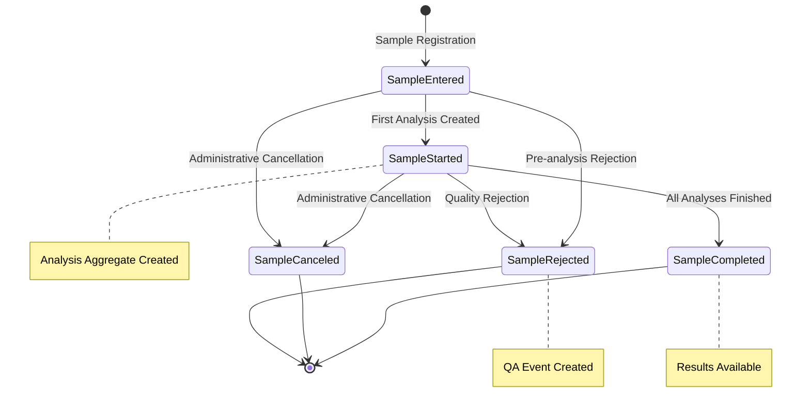
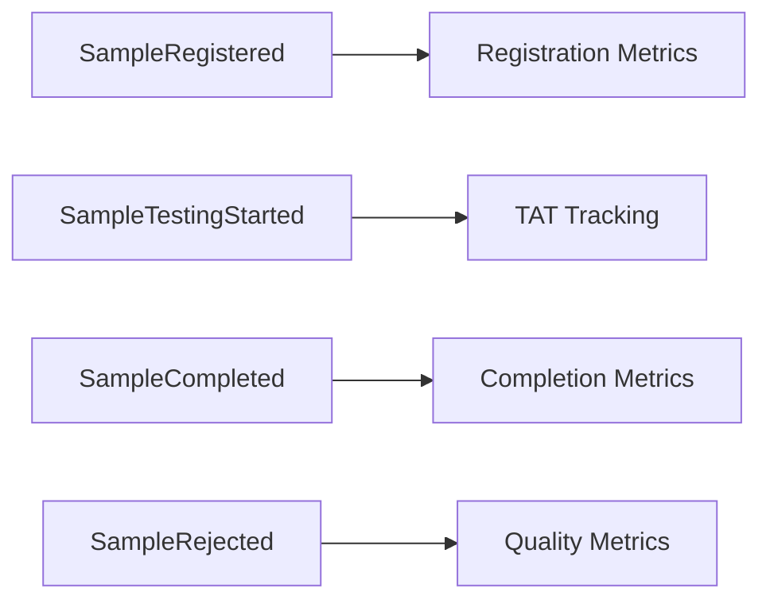

# Sample Aggregate Lifecycle Documentation

## Overview

The Sample Aggregate is the core laboratory specimen management entity in OpenELIS-Global-2. It manages the complete lifecycle from sample collection through analysis and final disposition. This documentation is extracted from the existing audit trail system and status management patterns.

## Aggregate Components

### Core Entities
- **Sample** (`org.openelisglobal.sample.valueholder.Sample`)
  - Root aggregate entity
  - Tracks accession number, collection details, priority
  - References: Patient, Organization, Provider
  
- **SampleItem** (`org.openelisglobal.sampleitem.valueholder.SampleItem`)
  - Physical specimen containers
  - Links to specific tests and analyses
  - Manages container types and specimen details

- **StatusOfSample** (`org.openelisglobal.sample.valueholder.StatusOfSample`)
  - Status definitions and valid transitions
  - Controls workflow progression

## State Machine



## Domain Events

### Primary Events

| Event | Trigger | State Transition | Audit Trail Location |
|-------|---------|------------------|---------------------|
| **SampleRegistered** | Sample entry in system | null → SampleEntered | `history.activity = 'I'` |
| **SampleTestingStarted** | First analysis created | SampleEntered → SampleStarted | `history.activity = 'U'` |
| **SampleCompleted** | All analyses finished | SampleStarted → SampleCompleted | `history.activity = 'U'` |
| **SampleRejected** | QA rejection | Any → SampleRejected | `history.activity = 'U'` |
| **SampleCanceled** | Administrative action | Any → SampleCanceled | `history.activity = 'U'` |

### Secondary Events

| Event | Description | Cross-Aggregate Impact |
|-------|-------------|------------------------|
| **SamplePriorityChanged** | Priority escalation | Analysis scheduling affected |
| **SampleCollectionUpdated** | Collection details modified | Patient notification triggered |
| **SampleItemAdded** | Additional specimen | New analyses may be created |
| **SampleBarcodeGenerated** | Label printing | Tracking system updated |

## Business Rules

### State Transition Rules

1. **Sample Registration**
   - Requires valid patient assignment
   - Must have unique accession number
   - Collection date cannot be in future
   - Provider must be active

2. **Testing Initiation**
   - At least one analysis must be created
   - Sample status automatically transitions to SampleStarted
   - Cannot start if sample is rejected

3. **Sample Completion**
   - All analyses must be in final state (Finalized/Rejected)
   - Automatic transition when last analysis completes
   - Triggers result transmission workflows

4. **Sample Rejection**
   - Can occur at any stage before completion
   - Creates mandatory QA event
   - Blocks further testing
   - Requires rejection reason

### Validation Constraints

- **Accession Number**: Unique, auto-generated, format validated
- **Collection Date**: Must be ≤ current date, ≥ patient birth date
- **Priority**: Valid enum (ROUTINE, ASAP, STAT, TIMED, FUTURE_STAT)
- **Status**: Must follow valid state transitions

## Integration Points

### Upstream Dependencies
- **Patient Aggregate**: Sample requires existing patient
- **Order Aggregate**: May be created from electronic orders
- **Organization**: Collection facility must exist

### Downstream Dependencies
- **Analysis Aggregate**: Sample state affects analysis availability
- **QA Aggregate**: Rejections create QA events
- **Reporting**: Sample completion triggers reports

## Audit Trail Coverage

### Tracked Fields
- Status changes with timestamps
- Priority modifications
- Collection details updates
- User attribution for all changes
- Cross-reference updates

### Audit Implementation
```java
// From AuditableBaseObjectServiceImpl
@Override
@Transactional
public String insert(Sample sample) {
    String id = super.insert(sample);
    // Automatic audit logging via AuditTrailService
    return id;
}
```

## Event Sourcing Mapping

### Aggregate Root
**Sample** serves as the aggregate root with strong consistency boundaries around:
- Sample metadata and status
- Associated sample items
- Collection and handling information

### Event Stream Structure
```
SampleStream-{accessionNumber}:
  1. SampleRegistered
  2. SampleItemAdded
  3. SampleTestingStarted
  4. SamplePriorityChanged (optional)
  5. SampleCompleted | SampleRejected | SampleCanceled
```

### Snapshot Strategy
- Snapshot every 10 events
- Include current status, priority, and item count
- Preserve audit trail references

## Metrics and Analytics

### Key Performance Indicators
- Sample registration rate
- Time to testing initiation
- Sample rejection rates by reason
- Priority distribution patterns
- Collection facility performance

### Event-Driven Analytics


## Technical Implementation Notes

### Current Status Management
```java
// StatusOfSampleService.java
public class StatusOfSampleServiceImpl implements StatusOfSampleService {
    // Centralized status management
    // Audit trail integration
    // State validation logic
}
```

### Recommended Event Store Schema
```sql
-- Event store table for Sample aggregate
CREATE TABLE sample_events (
    aggregate_id VARCHAR(50) NOT NULL,    -- accession_number
    sequence_number BIGINT NOT NULL,
    event_type VARCHAR(100) NOT NULL,
    event_data JSONB NOT NULL,
    metadata JSONB,
    created_at TIMESTAMP NOT NULL,
    created_by VARCHAR(50) NOT NULL,
    PRIMARY KEY (aggregate_id, sequence_number)
);
```

## Migration Strategy

### Phase 1: Dual Write
- Continue current persistence
- Add event publishing to existing services
- Build read models from events

### Phase 2: Event Store Integration
- Replace repository implementations
- Migrate historical data from audit trails
- Validate event stream consistency

### Phase 3: Legacy Cleanup
- Remove JPA entities
- Cleanup database schema
- Update integration points