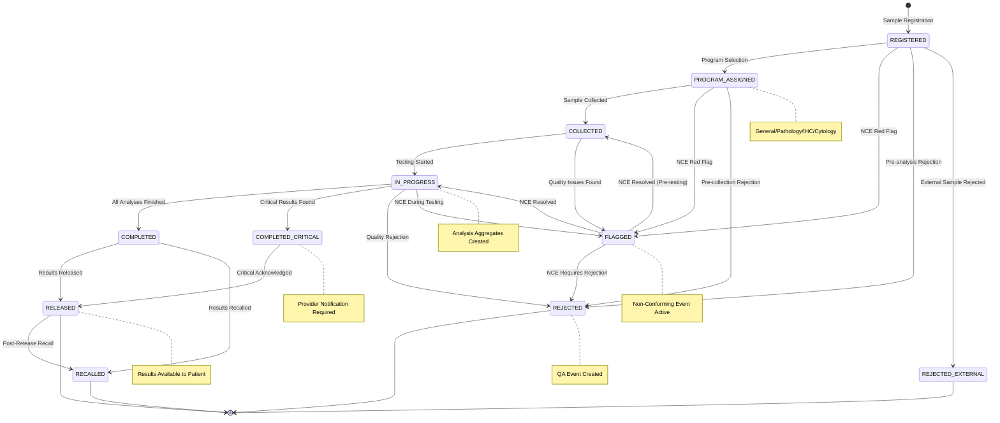
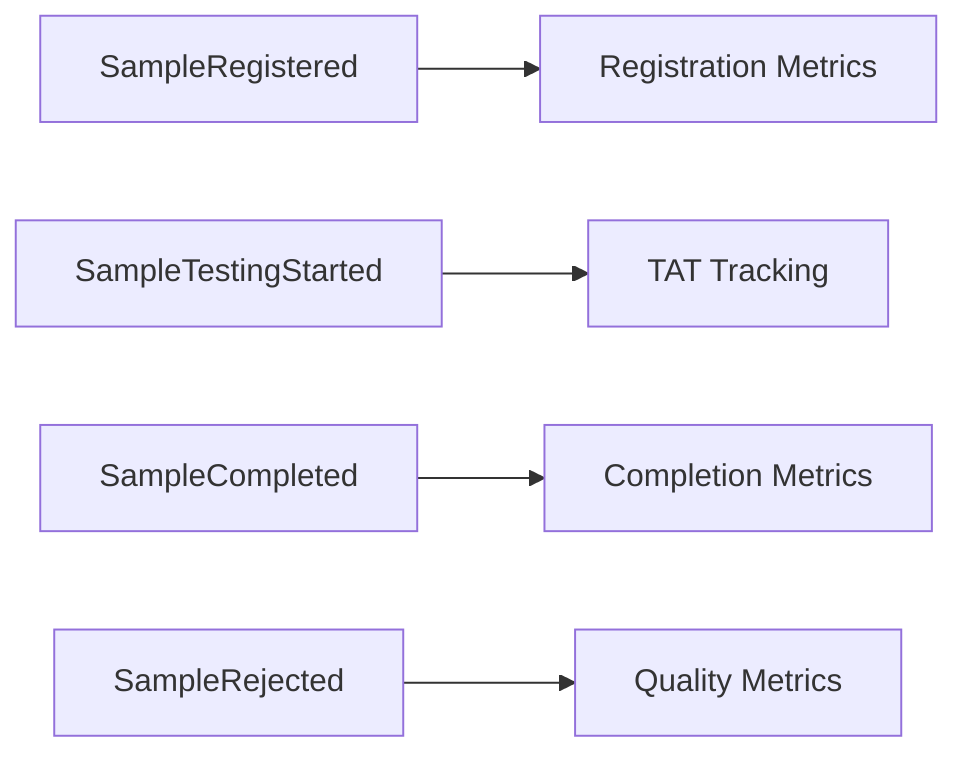

# Sample Aggregate Lifecycle Documentation

## Overview

The Sample Aggregate is the core laboratory specimen management entity in OpenELIS-Global-2. It manages the complete lifecycle from sample collection through analysis and final disposition. This documentation is extracted from the existing audit trail system and status management patterns.

## Aggregate Components

### Core Entities
- **Sample** (`org.openelisglobal.sample.valueholder.Sample`)
  - Root aggregate entity
  - Tracks accession number, collection details, priority
  - References: Patient, Organization, Provider
  
- **SampleItem** (`org.openelisglobal.sampleitem.valueholder.SampleItem`)
  - Physical specimen containers
  - Links to specific tests and analyses
  - Manages container types and specimen details

- **StatusOfSample** (`org.openelisglobal.sample.valueholder.StatusOfSample`)
  - Status definitions and valid transitions
  - Controls workflow progression

## State Machine



## Domain Events

### Primary Events

| Event | Trigger | State Transition | Business Rules | User Story |
|-------|---------|------------------|----------------|------------|
| **SampleRegistered** | Sample entry in system | null → REGISTERED | Unique accession number, valid patient ID, collection date validation | **SAM-001**: As a lab technician I want to register a new sample so that testing can begin |
| **STATSampleAlert** | STAT priority sample registered | REGISTERED (STAT alert) | Priority = STAT, supervisor notification | **SAM-001**: STAT priority branch triggers immediate alerts |
| **SampleAssignedToGeneral** | Sample assigned to general laboratory | REGISTERED → PROGRAM_ASSIGNED | Standard laboratory workflow, routine tests | **SAM-002**: As a lab technician I want to assign samples to general laboratory program |
| **SampleAssignedToPathology** | Sample assigned to pathology program | REGISTERED → PROGRAM_ASSIGNED | Pathology workflow, tissue analysis | **SAM-002**: Pathology branch with specialized workflow templates |
| **SampleAssignedToIHC** | Sample assigned to immunohistochemistry | REGISTERED → PROGRAM_ASSIGNED | IHC-specific tests, antibody staining | **SAM-002**: IHC branch with specialized test procedures |
| **SampleAssignedToCytology** | Sample assigned to cytology program | REGISTERED → PROGRAM_ASSIGNED | Cytology classification, screening workflow | **SAM-002**: Cytology branch with classification systems |
| **SampleCollected** | Physical collection completed | PROGRAM_ASSIGNED → COLLECTED | Collector assigned, collection timestamp, barcode generated | **SAM-003**: As a sample collector I want to mark sample as collected |
| **SampleBarcodeGenerated** | Label printing triggered | Collection workflow | Unique barcode, tracking enabled | **SAM-003**: Barcode branch enables tracking |
| **SampleFlagged** | NCE quality issue identified | Any → FLAGGED | Red flag visible in UI, blocks progression until resolved | **SAM-004**: As a quality officer I want to flag non-conforming samples |
| **SampleNCEResolved** | Quality issue resolved | FLAGGED → Previous State | NCE closed, sample workflow resumes | **SAM-004**: NCE resolution branch allows workflow continuation |
| **SampleTestingStarted** | First analysis created | COLLECTED → IN_PROGRESS | Sample must be collected, at least one analysis created | **SAM-005**: As a lab technician I want to start testing so that analyses can be performed |
| **SampleCompleted** | All analyses finished (normal) | IN_PROGRESS → COMPLETED | All analyses completed, no critical results | **SAM-006**: As a lab supervisor I want to complete sample processing |
| **SampleCompletedWithCriticals** | All analyses finished (critical) | IN_PROGRESS → COMPLETED_CRITICAL | Critical results present, provider notification required | **SAM-006**: Critical results branch requires special handling |
| **SampleRejected** | Internal quality rejection | Any → REJECTED | Valid rejection reason, recollection flag set | **SAM-007**: As a sample receiver I want to reject unsuitable samples |
| **ExternalSampleRejected** | External referral rejection | Any → REJECTED_EXTERNAL | External sample, referring lab notification | **SAM-007**: External sample branch with referral notification |
| **SampleResultsReleased** | Electronic results release | COMPLETED → RELEASED | Electronic delivery, patient portal update | **SAM-008**: As a result validator I want to release sample results |
| **SampleResultsPrinted** | Paper/fax results release | COMPLETED → RELEASED | Paper delivery, HIPAA compliance | **SAM-008**: Manual delivery branch with compliance tracking |
| **SampleRecalled** | Results recall | RELEASED → RECALLED | Post-release error correction, provider notification | **SAM-009**: As a lab director I want to recall released results |

### Priority and Workflow Events

| Event | Description | Branching Condition | Cross-Aggregate Impact |
|-------|-------------|--------------------|-----------------------|
| **SamplePriorityUpdated** | Priority change | Standard priority change | Analysis scheduling affected |
| **SampleEscalatedToSTAT** | Escalated to STAT priority | STAT escalation with authorization | Lab alerts, queue jumping, TAT changes |
| **SampleNoteAdded** | Regular documentation | Standard note | Audit trail updated |
| **SampleCriticalNoteAdded** | Critical/safety note | Critical note flagged | Supervisors alerted, work paused |

### Collection and Handling Events

| Event | Description | State Impact | Integration Points |
|-------|-------------|--------------|-------------------|
| **SampleCollected** | Physical collection completed | Collection status updated | Collection facility tracking |
| **SampleReceived** | Received in laboratory | Receiving timestamp recorded | Chain of custody tracking |
| **SampleItemAdded** | Additional specimen container | Container count updated | New analyses may be created |
| **SampleBarcodeGenerated** | Label printing | Tracking system updated | LIMS integration |

## Business Rules

### State Transition Rules

1. **Sample Registration**
   - Requires valid patient assignment
   - Must have unique accession number
   - Collection date cannot be in future
   - Provider must be active

2. **Testing Initiation**
   - At least one analysis must be created
   - Sample status automatically transitions to SampleStarted
   - Cannot start if sample is rejected

3. **Sample Completion**
   - All analyses must be in final state (Finalized/Rejected)
   - Automatic transition when last analysis completes
   - Triggers result transmission workflows

4. **Sample Rejection**
   - Can occur at any stage before completion
   - Creates mandatory QA event
   - Blocks further testing
   - Requires rejection reason

### Validation Constraints

- **Accession Number**: Unique, auto-generated, format validated
- **Collection Date**: Must be ≤ current date, ≥ patient birth date
- **Priority**: Valid enum (ROUTINE, ASAP, STAT, TIMED, FUTURE_STAT)
- **Status**: Must follow valid state transitions

## Integration Points

### Upstream Dependencies
- **Patient Aggregate**: Sample requires existing patient
- **Order Aggregate**: May be created from electronic orders
- **Organization**: Collection facility must exist

### Downstream Dependencies
- **Analysis Aggregate**: Sample state affects analysis availability
- **QA Aggregate**: Rejections create QA events
- **Reporting**: Sample completion triggers reports

## Audit Trail Coverage

### Tracked Fields
- Status changes with timestamps
- Priority modifications
- Collection details updates
- User attribution for all changes
- Cross-reference updates

### Audit Implementation
```java
// From AuditableBaseObjectServiceImpl
@Override
@Transactional
public String insert(Sample sample) {
    String id = super.insert(sample);
    // Automatic audit logging via AuditTrailService
    return id;
}
```

## Event Sourcing Mapping

### Aggregate Root
**Sample** serves as the aggregate root with strong consistency boundaries around:
- Sample metadata and status
- Associated sample items
- Collection and handling information

### Event Stream Structure
```
SampleStream-{accessionNumber}:
  1. SampleRegistered
      → STATSampleAlert (if STAT priority)
  2. SampleItemAdded (optional, multiple)
  3. SampleTestingStarted
  4. SamplePriorityUpdated (optional)
      → SampleEscalatedToSTAT (if escalated to STAT)
  5. SampleNoteAdded (optional, multiple)
      → SampleCriticalNoteAdded (if critical/safety)
  6. SampleCompleted | SampleCompletedWithCriticals
  7. SampleResultsReleased | SampleResultsPrinted
  8. SampleRecalled (optional)
      
Alternative paths:
  - SampleRejected | ExternalSampleRejected (at any point)
```

### Snapshot Strategy
- Snapshot every 10 events
- Include current status, priority, and item count
- Preserve audit trail references

## Metrics and Analytics

### Key Performance Indicators
- Sample registration rate (from SampleRegistered events)
- STAT sample response time (STATSampleAlert to completion)
- Time to testing initiation (SampleRegistered to SampleTestingStarted)
- Sample rejection rates by reason (SampleRejected events)
- Critical result handling time (SampleCompletedWithCriticals to acknowledgment)
- Priority distribution patterns (priority tracking across events)
- Collection facility performance (collection events by facility)
- Recall frequency and reasons (SampleRecalled events)
- Release method distribution (electronic vs paper)

### Event-Driven Analytics


## Technical Implementation Notes

### Current Status Management
```java
// StatusOfSampleService.java
public class StatusOfSampleServiceImpl implements StatusOfSampleService {
    // Centralized status management
    // Audit trail integration
    // State validation logic
}
```

### Recommended Event Store Schema
```sql
-- Event store table for Sample aggregate
CREATE TABLE sample_events (
    aggregate_id VARCHAR(50) NOT NULL,    -- accession_number
    sequence_number BIGINT NOT NULL,
    event_type VARCHAR(100) NOT NULL,
    event_data JSONB NOT NULL,
    metadata JSONB,
    created_at TIMESTAMP NOT NULL,
    created_by VARCHAR(50) NOT NULL,
    PRIMARY KEY (aggregate_id, sequence_number)
);
```

## Migration Strategy

### Phase 1: Dual Write
- Continue current persistence
- Add event publishing to existing services
- Build read models from events

### Phase 2: Event Store Integration
- Replace repository implementations
- Migrate historical data from audit trails
- Validate event stream consistency

### Phase 3: Legacy Cleanup
- Remove JPA entities
- Cleanup database schema
- Update integration points