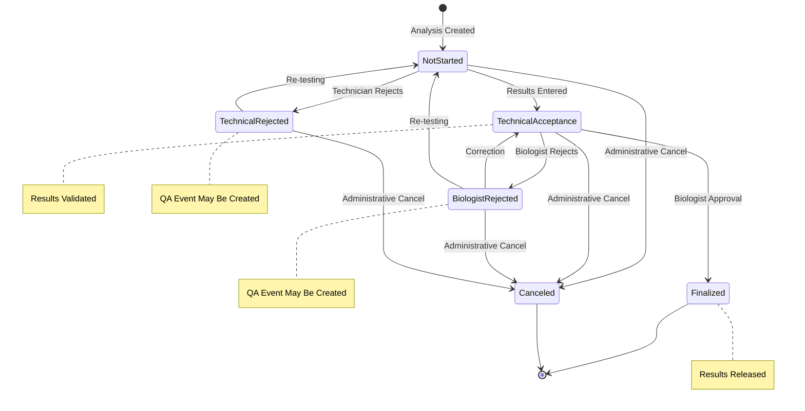
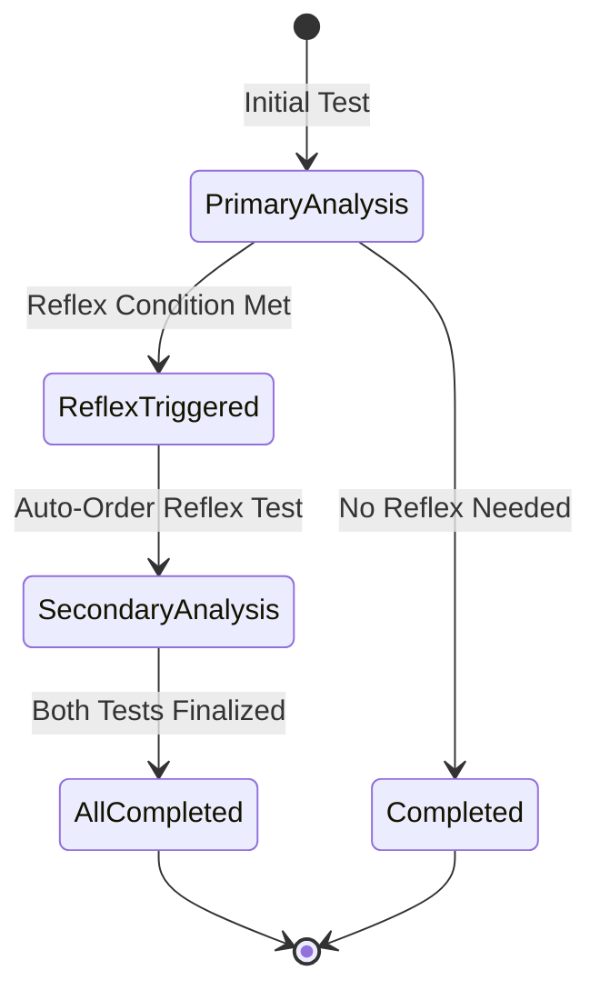
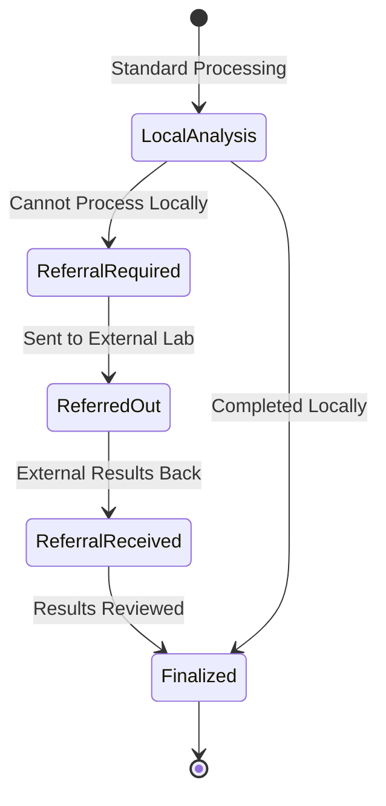
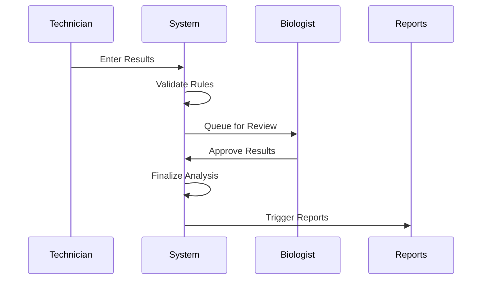
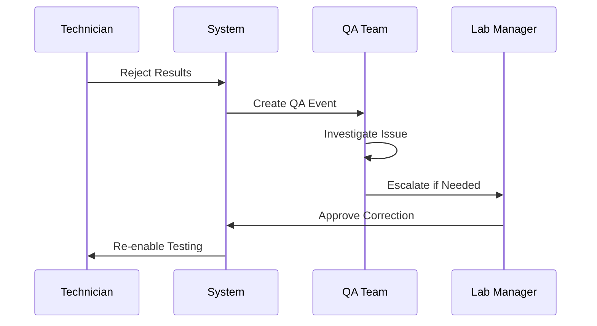
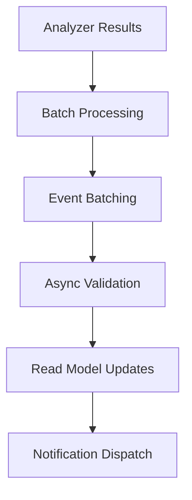
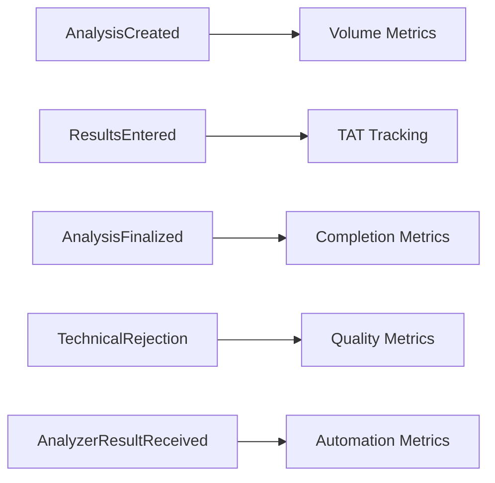

# Analysis Aggregate Lifecycle Documentation

## Overview

The Analysis Aggregate manages the core laboratory testing workflow in OpenELIS-Global-2. It represents individual test analyses performed on sample items, including result entry, validation, and approval processes. This documentation is extracted from the existing audit trail system covering analysis status transitions and result validation workflows.

## Aggregate Components

### Core Entities
- **Analysis** (`org.openelisglobal.analysis.valueholder.Analysis`)
  - Root aggregate entity
  - Links test definition to sample item
  - Manages analysis lifecycle and status
  
- **Result** (`org.openelisglobal.result.valueholder.Result`)
  - Test result values and interpretations
  - Supports multiple result types (numeric, dictionary, multiselect)
  - Includes validation flags and reference ranges

- **AnalyzerResults** (`org.openelisglobal.analyzerresults.valueholder.AnalyzerResults`)
  - Automated instrument results
  - Raw data before validation
  - Supports multiple analyzer types

## State Machine



## Complex Workflow States

### Reflex Testing Flow


### Referral Integration


## Domain Events

### Primary Analysis Events

| Event | Trigger | State Transition | Audit Trail Location |
|-------|---------|------------------|---------------------|
| **AnalysisCreated** | Test ordered on sample | null → NotStarted | `history.activity = 'I'` |
| **ResultsEntered** | Manual/analyzer input | NotStarted → TechnicalAcceptance | `history.activity = 'U'` |
| **TechnicalValidation** | Technician approval | (status maintained) | `history.activity = 'U'` |
| **BiologistApproval** | Final approval | TechnicalAcceptance → Finalized | `history.activity = 'U'` |
| **AnalysisFinalized** | Results released | (status maintained) | `history.activity = 'U'` |
| **TechnicalRejection** | Technician rejects | NotStarted → TechnicalRejected | `history.activity = 'U'` |
| **BiologistRejection** | Biologist rejects | TechnicalAcceptance → BiologistRejected | `history.activity = 'U'` |
| **AnalysisCanceled** | Administrative action | Any → Canceled | `history.activity = 'U'` |

### Result Management Events

| Event | Description | Trigger Conditions |
|-------|-------------|-------------------|
| **ResultValueChanged** | Result value updated | During validation process |
| **ResultValidated** | Result passes validation | Range/rule checks pass |
| **ResultFlagged** | Abnormal result detected | Outside reference ranges |
| **ResultCommented** | Comment added | Manual annotation |
| **ResultCorrected** | Value correction | Post-release correction |

### Analyzer Integration Events

| Event | Description | Impact |
|-------|-------------|---------|
| **AnalyzerResultReceived** | Automated result import | Triggers validation workflow |
| **AnalyzerResultValidated** | Import validation passed | Ready for technical review |
| **AnalyzerResultRejected** | Import validation failed | Manual intervention required |
| **AnalyzerCalibrationChanged** | QC calibration update | May affect result interpretation |

## Business Rules

### Analysis Creation Rules
1. **Sample Dependency**: Must reference valid sample item
2. **Test Configuration**: Test must be active and properly configured
3. **Panel Handling**: Panel tests create multiple analyses
4. **Priority Inheritance**: Inherits sample priority by default

### Result Entry Rules
1. **Value Validation**: Must conform to test result type
2. **Reference Ranges**: Automatic flagging for out-of-range values
3. **Required Fields**: Certain tests require mandatory result components
4. **Precision Control**: Numeric results respect significant digits

### Status Transition Rules
1. **Sequential Validation**: Cannot skip TechnicalAcceptance for critical tests
2. **Rejection Handling**: Rejections may trigger QA events
3. **Reflex Testing**: Automatic secondary test ordering
4. **External Dependencies**: Referrals block local completion

### Quality Control Rules
1. **QC Requirements**: Some tests require QC before patient results
2. **Calibration Currency**: Results invalid if calibration expired
3. **Competency Checking**: Technician authorization for specific tests
4. **Critical Value Handling**: Immediate notification for panic values

## Integration Points

### Upstream Dependencies
- **Sample Aggregate**: Analysis requires valid sample item
- **Test Catalog**: Test configuration and methodology
- **QC Aggregate**: Quality control requirements
- **User Management**: Technician and biologist authorization

### Downstream Dependencies
- **QA Aggregate**: Rejections may create QA events
- **Reporting**: Finalized results trigger reports
- **Patient Notification**: Critical values require alerts
- **Billing**: Completed analyses trigger charges

## Workflow Patterns

### Standard Validation Workflow


### Quality Exception Workflow


## Audit Trail Coverage

### Status Tracking
- All status transitions with timestamps
- User attribution for each change
- Rejection reasons and comments
- Cross-reference maintenance

### Result Audit
- Original vs. corrected values
- Validation rule applications
- Reference range evaluations
- Critical value notifications

### Analyzer Integration Audit
- Import timestamps and sources
- Validation outcomes
- Error handling and retries
- Calibration references

## Event Sourcing Mapping

### Aggregate Root
**Analysis** serves as the aggregate root with strong consistency boundaries around:
- Analysis status and workflow progression
- Associated results and validation
- Quality control linkages

### Event Stream Structure
```
AnalysisStream-{analysisId}:
  1. AnalysisCreated
  2. ResultsEntered (multiple possible)
  3. TechnicalValidation
  4. BiologistApproval | BiologistRejection | TechnicalRejection
  5. AnalysisFinalized | AnalysisCanceled
```

### Snapshot Strategy
- Snapshot every 15 events
- Include current status, results summary, and validation state
- Preserve quality flags and critical indicators

## Performance Considerations

### High-Volume Scenarios
- Analyzer batch imports (1000+ results/hour)
- Panel test processing (10+ analyses per sample)
- Reflex testing cascades
- QC validation workflows

### Optimization Strategies


## Technical Implementation Notes

### Current Status Management
```java
// AnalysisService.java
@Transactional
public Analysis update(Analysis analysis) {
    // Status validation
    validateStatusTransition(analysis);
    // Audit trail logging
    Analysis updated = super.update(analysis);
    // Event publishing (to be added)
    return updated;
}
```

### Recommended Event Store Schema
```sql
-- Event store table for Analysis aggregate
CREATE TABLE analysis_events (
    aggregate_id VARCHAR(50) NOT NULL,    -- analysis_id
    sequence_number BIGINT NOT NULL,
    event_type VARCHAR(100) NOT NULL,
    event_data JSONB NOT NULL,
    metadata JSONB,
    correlation_id VARCHAR(50),           -- for batch operations
    created_at TIMESTAMP NOT NULL,
    created_by VARCHAR(50) NOT NULL,
    PRIMARY KEY (aggregate_id, sequence_number)
);

-- Index for correlation (batch) queries
CREATE INDEX idx_analysis_events_correlation 
ON analysis_events(correlation_id, created_at);
```

## Metrics and Analytics

### Key Performance Indicators
- Analysis turnaround time by test type
- Validation rejection rates
- Critical value response times
- Analyzer import success rates
- Technician/biologist productivity

### Event-Driven Analytics


## Migration Strategy

### Phase 1: Event Publishing
- Add event publishing to existing services
- Maintain current persistence
- Build analytics read models

### Phase 2: Workflow Engine Integration
- Implement Dapr workflows for complex validation
- Add compensation patterns for rejections
- Integrate with external systems

### Phase 3: Event Store Migration
- Replace JPA persistence with event sourcing
- Migrate historical analysis data
- Implement projection rebuilding