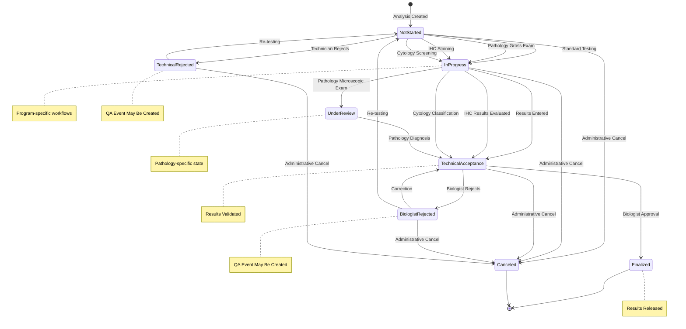
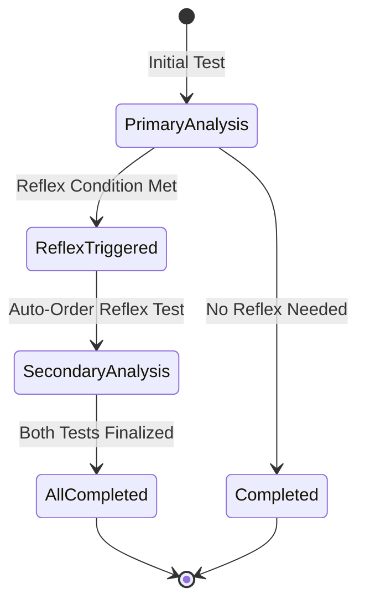
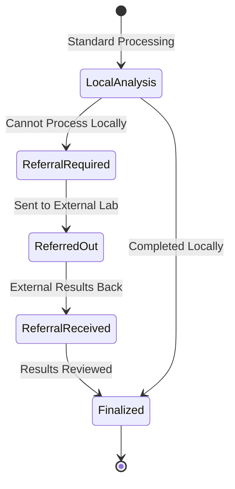
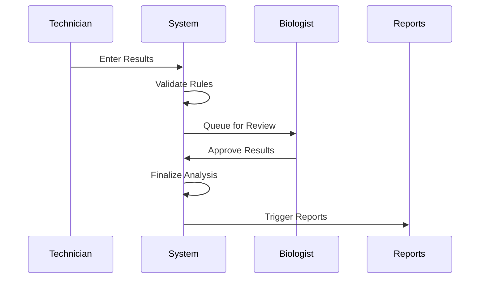
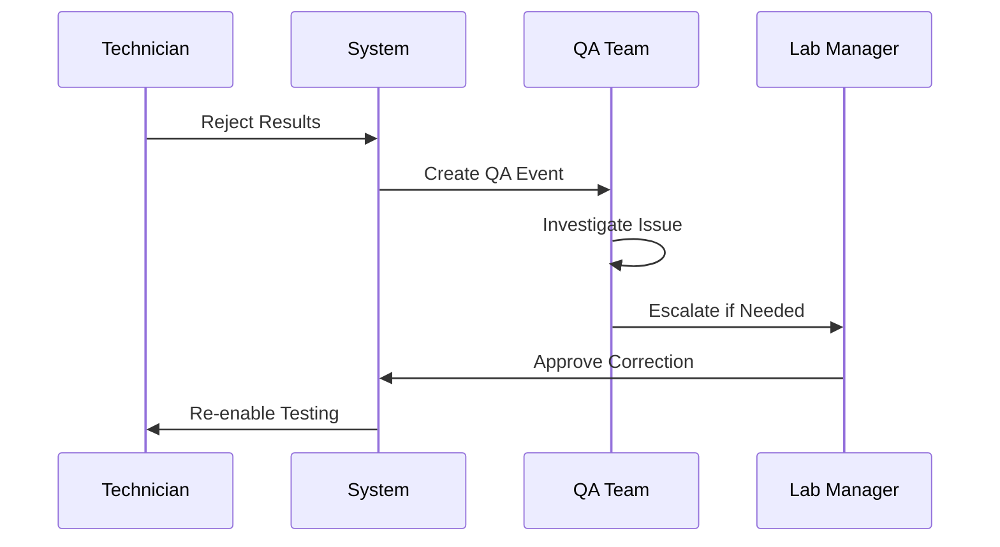
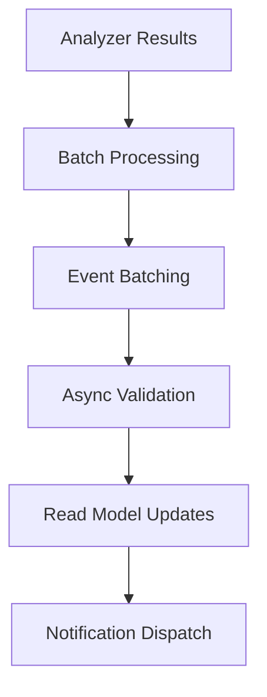
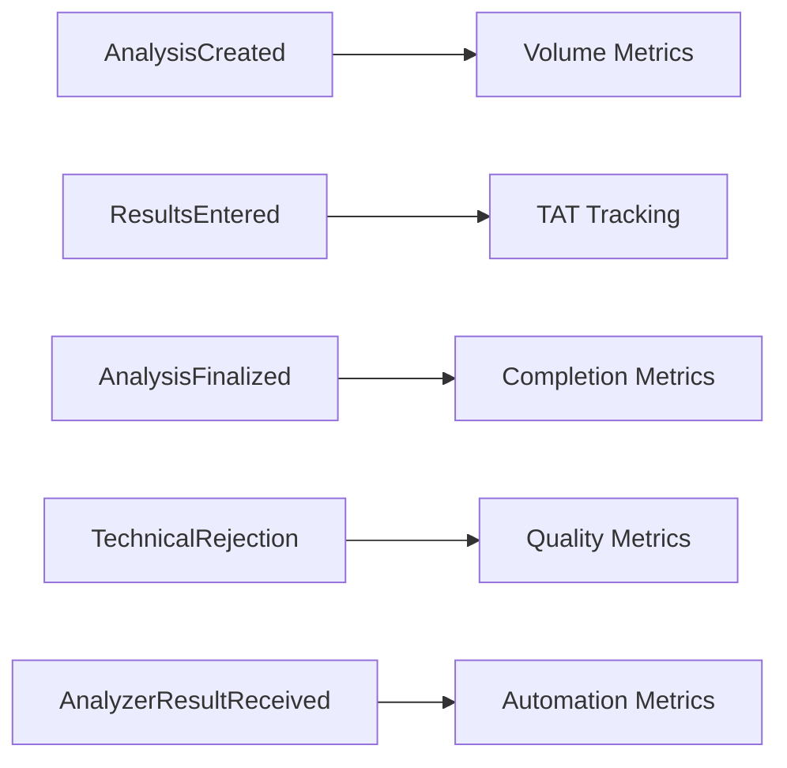

# Analysis Aggregate Lifecycle Documentation

## Overview

The Analysis Aggregate manages the core laboratory testing workflow in OpenELIS-Global-2. It represents individual test analyses performed on sample items, including result entry, validation, and approval processes. This documentation is extracted from the existing audit trail system covering analysis status transitions and result validation workflows.

## Aggregate Components

### Core Entities
- **Analysis** (`org.openelisglobal.analysis.valueholder.Analysis`)
  - Root aggregate entity
  - Links test definition to sample item
  - Manages analysis lifecycle and status
  
- **Result** (`org.openelisglobal.result.valueholder.Result`)
  - Test result values and interpretations
  - Supports multiple result types (numeric, dictionary, multiselect)
  - Includes validation flags and reference ranges

- **AnalyzerResults** (`org.openelisglobal.analyzerresults.valueholder.AnalyzerResults`)
  - Automated instrument results
  - Raw data before validation
  - Supports multiple analyzer types

## State Machine



## Complex Workflow States

### Reflex Testing Flow


### Referral Integration


## Domain Events

### Primary Analysis Events

| Event | Trigger | State Transition | Business Rules | User Story |
|-------|---------|------------------|----------------|------------|
| **AnalysisCreated** | Standard test ordered | null → NotStarted | Valid sample item, active test configuration | **ANA-001**: As a lab technician I want to create analyses for ordered tests |
| **PathologyAnalysisCreated** | Pathology case analysis | null → NotStarted | Pathology sample, tissue analysis | **ANA-001**: Pathology branch with specialized workflow |
| **IHCAnalysisCreated** | Immunohistochemistry analysis | null → NotStarted | IHC sample, antibody testing | **ANA-001**: IHC branch with specialized procedures |
| **CytologyAnalysisCreated** | Cytology analysis created | null → NotStarted | Cytology sample, screening workflow | **ANA-001**: Cytology branch with classification requirements |
| **ResultsEnteredByUnit** | Unit-based result entry | NotStarted → TechnicalAcceptance | Laboratory unit validation, batch processing | **ANA-002**: As a technician I want to enter results by laboratory unit |
| **ResultsEnteredByPatient** | Patient-based result entry | NotStarted → TechnicalAcceptance | Patient-specific view, complete test profile | **ANA-002**: Patient-focused branch for comprehensive care |
| **ResultsEnteredByOrder** | Order-based result entry | NotStarted → TechnicalAcceptance | Order-centric workflow, accession number lookup | **ANA-002**: Order-focused branch for workflow efficiency |
| **ResultsEnteredByRange** | Range-based bulk entry | NotStarted → TechnicalAcceptance | Range validation, bulk processing authorization | **ANA-002**: Bulk processing branch for high-volume operations |
| **ResultsEnteredByDate** | Date-filtered result entry | NotStarted → TechnicalAcceptance | Date range validation, filtering by test status | **ANA-002**: Date-based branch for time-organized workflows |
| **TechnicalValidation** | Technician approval | (status maintained) | Competency validation, test-specific authorization | **ANA-003**: As a technician I want to validate my results |
| **BiologistApproval** | Final approval | TechnicalAcceptance → Finalized | Biologist authorization, critical value review | **ANA-004**: As a biologist I want to approve results for release |
| **BatchValidationNormal** | Save All Normal results | TechnicalAcceptance → Finalized | All results within normal ranges | **ANA-005**: As a validator I want to batch approve normal results |
| **BatchValidationAll** | Save All Results | TechnicalAcceptance → Finalized | Bulk approval authorization, quality override | **ANA-005**: Bulk approval branch with supervisor authorization |
| **BatchRetesting** | Retest All Results | TechnicalAcceptance → NotStarted | Quality concerns, systematic retest authorization | **ANA-006**: As a supervisor I want to retest batch results |
| **TechnicalRejection** | Technician rejects | NotStarted → TechnicalRejected | Rejection reason required, QA event creation | **ANA-007**: As a technician I want to reject problematic analyses |
| **BiologistRejection** | Biologist rejects | TechnicalAcceptance → BiologistRejected | Professional review, QA escalation | **ANA-008**: As a biologist I want to reject unacceptable results |
| **AnalysisCanceled** | Administrative action | Any → Canceled | Administrative authorization, cancellation reason | **ANA-009**: As an administrator I want to cancel analyses when needed |

### Specialized Program Workflow Events

| Event | Trigger | State Transition | Business Rules | User Story |
|-------|---------|------------------|----------------|------------|
| **PathologyGrossExamination** | Gross examination performed | NotStarted → InProgress | Pathology analysis, tissue examination | **ANA-010**: As a pathologist I want to perform gross examination |
| **PathologyMicroscopicExam** | Microscopic examination started | InProgress → UnderReview | Histological preparation complete | **ANA-011**: As a pathologist I want to perform microscopic examination |
| **PathologyDiagnosisEntered** | Final pathology diagnosis | UnderReview → TechnicalAcceptance | Diagnostic interpretation complete | **ANA-012**: As a pathologist I want to enter final diagnosis |
| **IHCStainingPerformed** | IHC staining completed | NotStarted → InProgress | Antibody staining protocol | **ANA-013**: As an IHC technician I want to perform immunostaining |
| **IHCResultsEvaluated** | IHC interpretation done | InProgress → TechnicalAcceptance | Staining pattern evaluation | **ANA-014**: As a pathologist I want to interpret IHC results |
| **CytologyScreeningPerformed** | Cytology screening done | NotStarted → InProgress | Slide examination complete | **ANA-015**: As a cytotechnologist I want to screen cytology slides |
| **CytologyClassificationAssigned** | Classification determined | InProgress → TechnicalAcceptance | Classification system applied | **ANA-016**: As a cytopathologist I want to assign final classification |

### Result Management Events

| Event | Description | Branching Condition | Validation Impact |
|-------|-------------|--------------------|-----------------|
| **NumericResultEntered** | Numeric value with validation | Result type = Numeric | Range validation, significant digits |
| **TextResultEntered** | Qualitative text result | Result type = Text | Format validation, standardized terms |
| **DropdownResultSelected** | Coded result selection | Result type = Dictionary | Valid code validation, mapping verification |
| **MultiSelectResultChosen** | Multiple choice result | Result type = MultiSelect | Selection combination validation |
| **ResultNoteAdded** | Standard comment/annotation | Comment entry | Documentation tracking |
| **ResultCriticalNoteAdded** | Critical safety note | Critical flag annotation | Safety alert, supervisor notification |
| **ResultAcceptanceToggled** | Accept checkbox status | Acceptance workflow | Validation state changed |
| **CurrentResultDisplayed** | Previous value shown | Historical comparison | Context for validation |
| **NormalRangeValidated** | Range check performed | Reference range comparison | Flag if outside normal |
| **CriticalValueAlerted** | Panic value detected | Critical threshold exceeded | Immediate provider notification |
| **ResultRedFlagged** | Quality issue flagged | NCE integration | Sample/result blocking |
| **AnalyzerResultImported** | Instrument data received | Analyzer interface | Import timestamp, source tracking |

### Quality Control Events

| Event | Description | QC Impact | Workflow Effect |
|-------|-------------|-----------|----------------|
| **QCCheckPassed** | Quality control verified | QC current | Results valid |
| **QCCheckFailed** | Quality control failed | QC expired | Results blocked |
| **CalibrationUpdated** | Analyzer calibrated | New baseline | Previous results reviewed |
| **MaintenanceAlert** | Service required | Analyzer flagged | Results questioned |
| **BatchProcessingStarted** | Batch analysis begun | Multiple samples | Efficiency tracking |
| **BatchProcessingCompleted** | Batch analysis finished | All samples processed | Batch metrics calculated |

## Business Rules

### Analysis Creation Rules
1. **Sample Dependency**: Must reference valid sample item
2. **Test Configuration**: Test must be active and properly configured
3. **Panel Handling**: Panel tests create multiple analyses
4. **Priority Inheritance**: Inherits sample priority by default

### Result Entry Rules
1. **Value Validation**: Must conform to test result type
2. **Reference Ranges**: Automatic flagging for out-of-range values
3. **Required Fields**: Certain tests require mandatory result components
4. **Precision Control**: Numeric results respect significant digits

### Status Transition Rules
1. **Sequential Validation**: Cannot skip TechnicalAcceptance for critical tests
2. **Rejection Handling**: Rejections may trigger QA events
3. **Reflex Testing**: Automatic secondary test ordering
4. **External Dependencies**: Referrals block local completion

### Quality Control Rules
1. **QC Requirements**: Some tests require QC before patient results
2. **Calibration Currency**: Results invalid if calibration expired
3. **Competency Checking**: Technician authorization for specific tests
4. **Critical Value Handling**: Immediate notification for panic values

## Integration Points

### Upstream Dependencies
- **Sample Aggregate**: Analysis requires valid sample item
- **Test Catalog**: Test configuration and methodology
- **QC Aggregate**: Quality control requirements
- **User Management**: Technician and biologist authorization

### Downstream Dependencies
- **QA Aggregate**: Rejections may create QA events
- **Reporting**: Finalized results trigger reports
- **Patient Notification**: Critical values require alerts
- **Billing**: Completed analyses trigger charges

## Workflow Patterns

### Standard Validation Workflow


### Quality Exception Workflow


## Audit Trail Coverage

### Status Tracking
- All status transitions with timestamps
- User attribution for each change
- Rejection reasons and comments
- Cross-reference maintenance

### Result Audit
- Original vs. corrected values
- Validation rule applications
- Reference range evaluations
- Critical value notifications

### Analyzer Integration Audit
- Import timestamps and sources
- Validation outcomes
- Error handling and retries
- Calibration references

## Event Sourcing Mapping

### Aggregate Root
**Analysis** serves as the aggregate root with strong consistency boundaries around:
- Analysis status and workflow progression
- Associated results and validation
- Quality control linkages

### Event Stream Structure
```
AnalysisStream-{analysisId}:
  1. AnalysisCreated
  2. ResultsEntered (multiple possible)
  3. TechnicalValidation
  4. BiologistApproval | BiologistRejection | TechnicalRejection
  5. AnalysisFinalized | AnalysisCanceled
```

### Snapshot Strategy
- Snapshot every 15 events
- Include current status, results summary, and validation state
- Preserve quality flags and critical indicators

## Performance Considerations

### High-Volume Scenarios
- Analyzer batch imports (1000+ results/hour)
- Panel test processing (10+ analyses per sample)
- Reflex testing cascades
- QC validation workflows

### Optimization Strategies


## Technical Implementation Notes

### Current Status Management
```java
// AnalysisService.java
@Transactional
public Analysis update(Analysis analysis) {
    // Status validation
    validateStatusTransition(analysis);
    // Audit trail logging
    Analysis updated = super.update(analysis);
    // Event publishing (to be added)
    return updated;
}
```

### Recommended Event Store Schema
```sql
-- Event store table for Analysis aggregate
CREATE TABLE analysis_events (
    aggregate_id VARCHAR(50) NOT NULL,    -- analysis_id
    sequence_number BIGINT NOT NULL,
    event_type VARCHAR(100) NOT NULL,
    event_data JSONB NOT NULL,
    metadata JSONB,
    correlation_id VARCHAR(50),           -- for batch operations
    created_at TIMESTAMP NOT NULL,
    created_by VARCHAR(50) NOT NULL,
    PRIMARY KEY (aggregate_id, sequence_number)
);

-- Index for correlation (batch) queries
CREATE INDEX idx_analysis_events_correlation 
ON analysis_events(correlation_id, created_at);
```

## Metrics and Analytics

### Key Performance Indicators
- Analysis turnaround time by test type
- Validation rejection rates
- Critical value response times
- Analyzer import success rates
- Technician/biologist productivity

### Event-Driven Analytics


## Migration Strategy

### Phase 1: Event Publishing
- Add event publishing to existing services
- Maintain current persistence
- Build analytics read models

### Phase 2: Workflow Engine Integration
- Implement Dapr workflows for complex validation
- Add compensation patterns for rejections
- Integrate with external systems

### Phase 3: Event Store Migration
- Replace JPA persistence with event sourcing
- Migrate historical analysis data
- Implement projection rebuilding