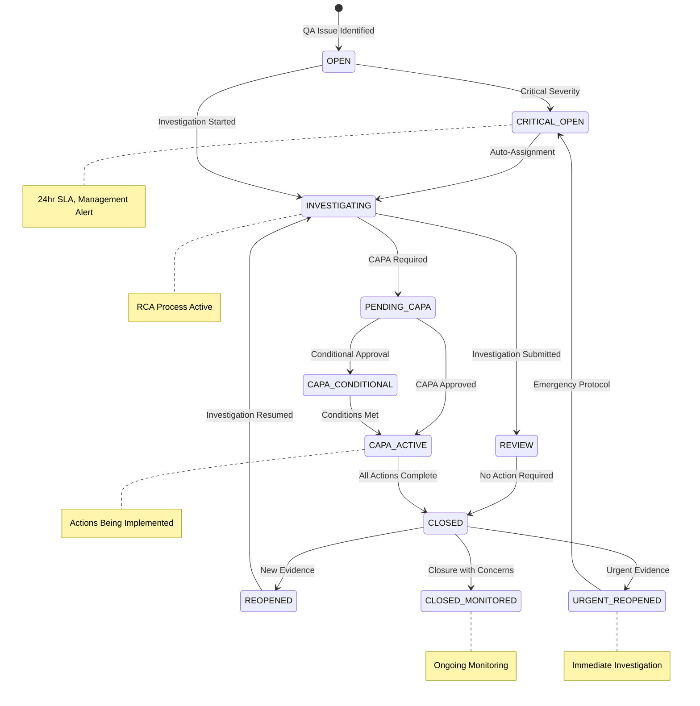
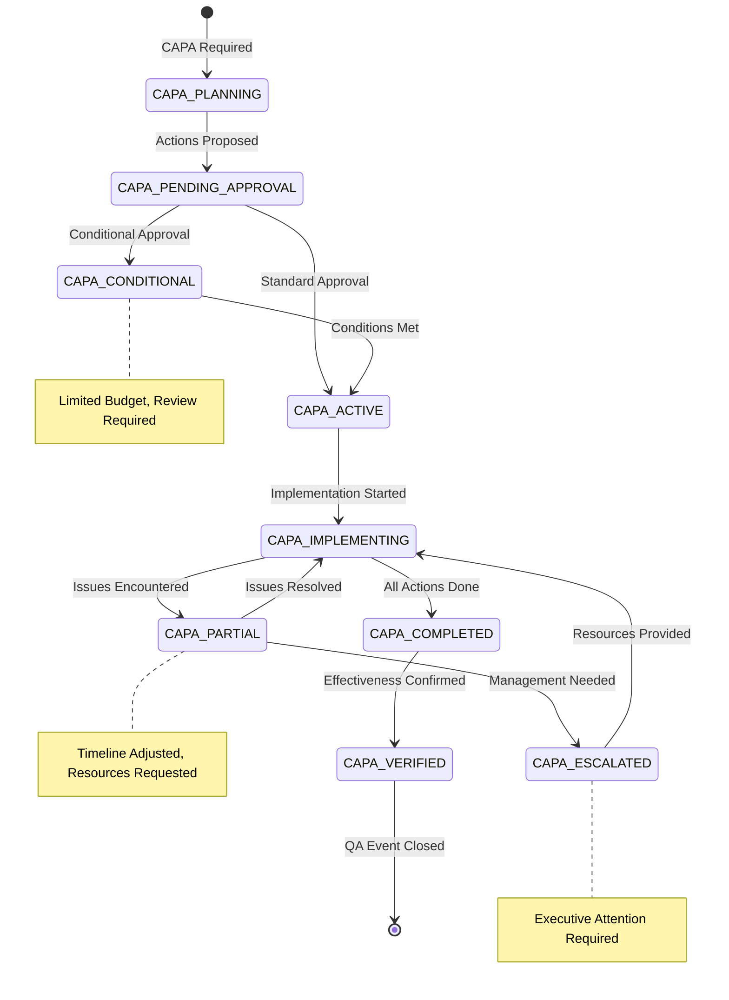
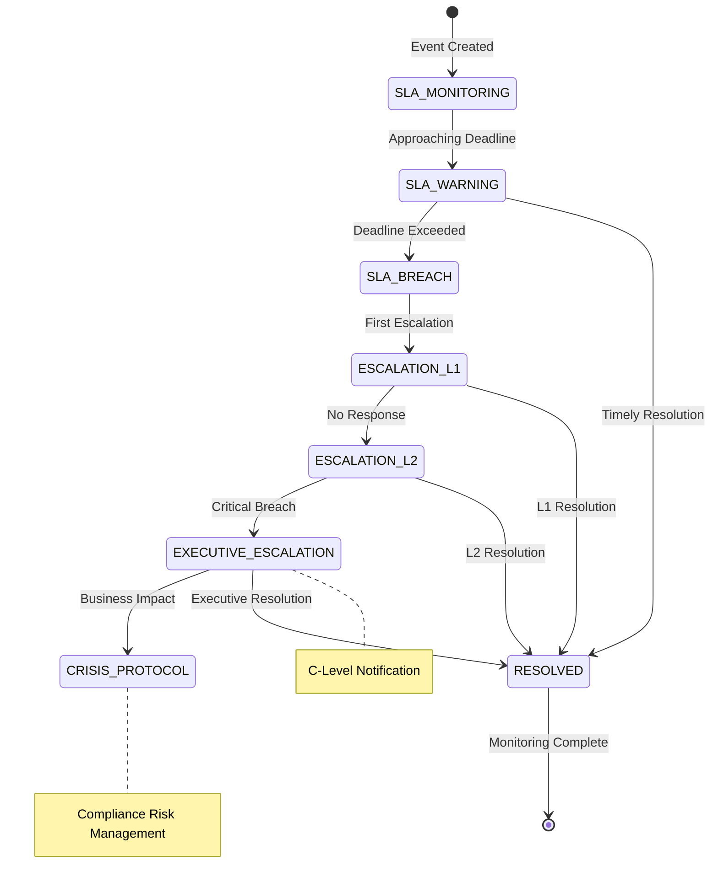
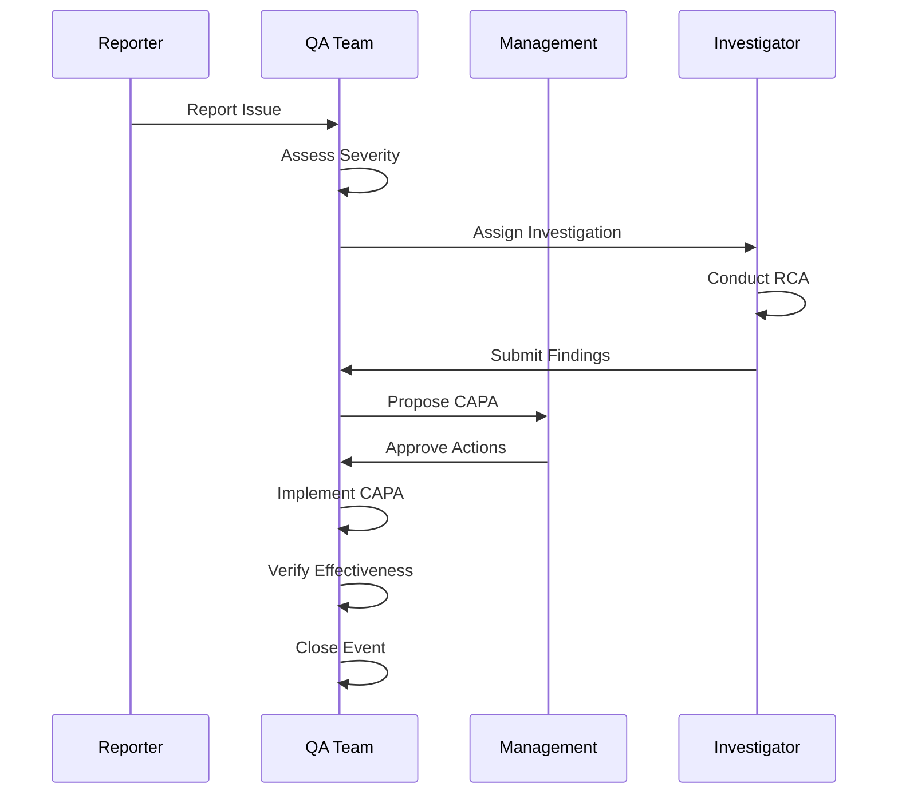
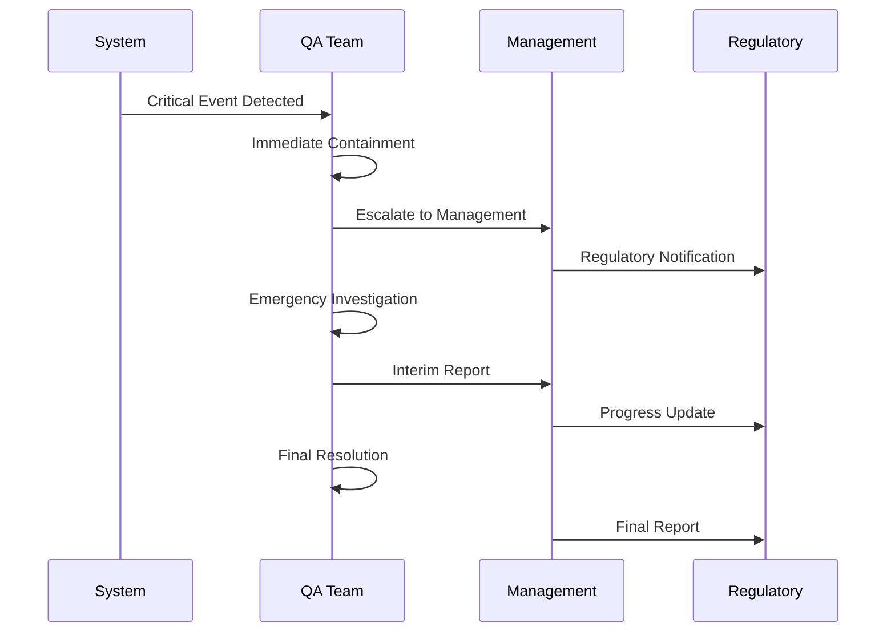
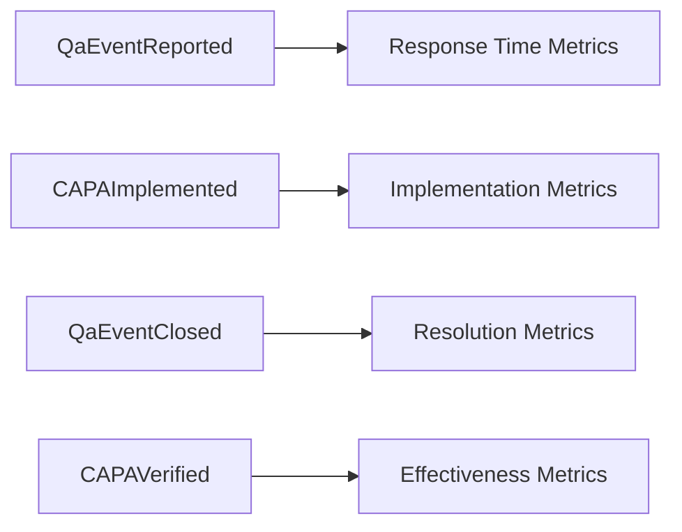
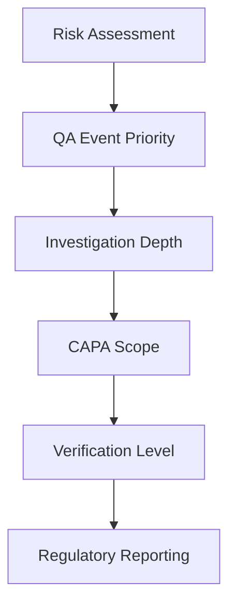

# Quality Assurance (QA) Aggregate Lifecycle Documentation

## Overview

The QA Aggregate manages the complete quality assurance lifecycle in OpenELIS-Global-2, including non-conforming events (NCE), corrective and preventive actions (CAPA), and quality observations. This system ensures compliance with laboratory quality standards and provides comprehensive audit trails for regulatory requirements.

## Aggregate Components

### Core Entities
- **QaEvent** (`org.openelisglobal.qaevent.valueholder.QaEvent`)
  - Root aggregate entity
  - Represents quality assurance incidents
  - Links to samples, analyses, or observations
  
- **NcEvent** (`org.openelisglobal.qaevent.valueholder.NcEvent`)
  - Non-conforming events
  - Tracks deviations from standard procedures
  - Manages CAPA workflows

- **QaObservation** (`org.openelisglobal.qaevent.valueholder.QaObservation`)
  - Quality observations and findings
  - Documents quality issues and resolutions
  - Links to specific laboratory processes

- **SampleQaEvent** (`org.openelisglobal.sampleqaevent.valueholder.SampleQaEvent`)
  - Sample-specific quality events
  - Tracks sample handling issues
  - Manages sample rejection workflows

## State Machine



## Enhanced CAPA Workflow



## Escalation and Monitoring Workflow



## Domain Events

### Primary QA Events

| Event | Trigger | State Transition | Business Rules | User Story |
|-------|---------|------------------|----------------|------------|
| **QAEventCreated** | Minor/Major severity | null → OPEN | Valid QA category, associated entity exists | **QA-001**: As a lab technician I want to report quality issues |
| **CriticalQAEventCreated** | Critical severity | null → CRITICAL_OPEN | Auto-assignment to senior, 24hr SLA | **QA-001**: Critical severity branch with emergency protocol |
| **InvestigatorAssigned** | Investigation assignment | OPEN → INVESTIGATING | Qualified investigator, workload balancing | **QA-002**: As a QA manager I want to assign investigators |
| **InvestigationSubmitted** | Investigation complete (no CAPA) | INVESTIGATING → REVIEW | Root cause documented, no actions needed | **QA-003**: As a QA investigator I want to submit findings |
| **InvestigationWithCAPA** | Investigation complete (CAPA required) | INVESTIGATING → PENDING_CAPA | Actions proposed, risk assessment complete | **QA-003**: CAPA required branch with action planning |
| **CAPAApproved** | Standard CAPA approval | PENDING_CAPA → CAPA_ACTIVE | Manager approval, budget allocated | **QA-004**: As a QA manager I want to approve CAPA actions |
| **CAPAConditionallyApproved** | Conditional CAPA approval | PENDING_CAPA → CAPA_CONDITIONAL | Conditions documented, limited budget | **QA-004**: Conditional approval branch with review schedule |
| **CAPAActionImplemented** | Standard implementation | CAPA_ACTIVE → CAPA_ACTIVE | Evidence recorded, effectiveness pending | **QA-005**: As a process owner I want to implement CAPA actions |
| **CAPAActionPartiallyImplemented** | Implementation with issues | CAPA_ACTIVE → CAPA_ACTIVE | Issues documented, timeline revised | **QA-005**: Implementation issues branch requiring escalation |
| **QAEventEscalated** | Standard escalation | Any → (same with escalation) | SLA exceeded, next level notified | **QA-006**: As a QA supervisor I want to escalate overdue events |
| **QAEventExecutiveEscalation** | Executive escalation | Any → (same with executive alert) | Compliance risk, business impact noted | **QA-006**: Executive escalation with crisis protocol |
| **QAEventClosed** | Standard closure | CAPA_ACTIVE/REVIEW → CLOSED | All actions complete, effectiveness verified | **QA-007**: As a QA manager I want to close completed events |
| **QAEventClosedWithConcerns** | Closure with monitoring | CAPA_ACTIVE/REVIEW → CLOSED_MONITORED | Concerns documented, monitoring required | **QA-007**: Closure with ongoing monitoring concerns |
| **QAEventReopened** | Standard reopen | CLOSED → REOPENED | Valid reason, new evidence provided | **QA-008**: As a QA investigator I want to reopen closed events |
| **QAEventUrgentReopen** | Urgent reopen | CLOSED → URGENT_REOPENED | Potential harm, immediate actions required | **QA-008**: Urgent reopen with immediate investigation |
| **CAPAVerified** | Verification passed | AwaitingVerification → Closed | `history.activity = 'U'` |
| **QaEventClosed** | Issue resolved | Any → Closed | `history.activity = 'U'` |

### User Interface Integration Events

| Event | Description | UI Impact | Workflow Effect |
|-------|-------------|-----------|----------------|
| **RedFlagActivated** | NCE red flag displayed | Visual indicator throughout UI | Sample/result progression blocked |
| **RedFlagCleared** | NCE red flag removed | Visual indicator cleared | Workflow progression resumed |
| **NCEWorkflowBlocked** | Workflow halted | Process steps disabled | User guided to NCE resolution |
| **NCENotificationSent** | System notification triggered | Alert message displayed | User action required |
| **NCECategorySelected** | Event type classification | Category-specific workflows enabled | Investigation procedures defined |
| **NCETimelineUpdated** | Due date management | Progress indicators updated | SLA monitoring active |

### Sample QA Events

| Event | Description | Impact on Sample |
|-------|-------------|------------------|
| **SampleRejected** | Sample fails acceptance criteria | Sample status → Rejected |
| **SampleContainerIssue** | Container problem identified | May require recollection |
| **SampleStorageIssue** | Storage condition violation | Results may be invalidated |
| **SampleLabelingError** | Identification problem | Identity verification required |

### Analysis QA Events

| Event | Description | Impact on Analysis |
|-------|-------------|-------------------|
| **AnalysisRejected** | Results fail validation | Analysis status → Rejected |
| **QCFailure** | Quality control failure | Testing halted pending investigation |
| **EquipmentMalfunction** | Instrument problem | Affected results quarantined |
| **ProcedureDeviation** | Protocol not followed | Results validity questioned |

## Business Rules

### QA Event Creation Rules
1. **Mandatory Fields**: Reporter, date, description, severity
2. **Classification**: Must be categorized by type and severity
3. **Immediate Actions**: Critical issues require immediate containment
4. **Notification**: Stakeholders notified based on severity

### Investigation Rules
1. **Assignment**: Must be assigned to qualified investigator
2. **Timeline**: Investigation deadlines based on severity
3. **Documentation**: All investigation steps must be documented
4. **Root Cause**: Must identify root cause before closure

### CAPA Rules
1. **Approval**: Action plans require management approval
2. **Timeline**: Implementation deadlines must be set
3. **Resources**: Required resources must be identified
4. **Effectiveness**: Actions must be verified for effectiveness

### Closure Rules
1. **Verification**: Independent verification required for critical issues
2. **Documentation**: Complete documentation required
3. **Lessons Learned**: Knowledge sharing for similar issues
4. **Metrics**: Closure updates quality metrics

## Integration Points

### Upstream Dependencies
- **Sample Aggregate**: Sample issues trigger QA events
- **Analysis Aggregate**: Analysis rejections create QA events
- **User Management**: QA personnel and role assignments
- **Equipment Management**: Equipment issues tracked

### Downstream Dependencies
- **Reporting**: QA metrics and regulatory reports
- **Training**: Issues may trigger training requirements
- **Process Improvement**: Trends drive process changes
- **Regulatory Compliance**: Audit trail for inspections

## Workflow Patterns

### Standard QA Investigation


### Critical Event Response


## Quality Metrics and Analytics

### Key Performance Indicators
- Mean time to closure by severity
- CAPA effectiveness rates
- Recurring issue patterns
- QA event trends by department
- Regulatory compliance scores

### Event-Driven Metrics


## Audit Trail Coverage

### Comprehensive Tracking
- All status transitions with timestamps
- User attribution for each action
- Document attachments and references
- Cross-reference to affected entities

### Regulatory Compliance
- Complete audit trail for inspections
- Evidence of investigation thoroughness
- CAPA effectiveness documentation
- Trend analysis and preventive actions

### Quality Documentation
```java
// QA audit trail implementation
@Override
@Transactional
public void updateQaEventStatus(QaEvent event, QaEventStatus newStatus) {
    QaEventStatus oldStatus = event.getStatus();
    event.setStatus(newStatus);
    event.setLastModified(new Date());
    
    // Comprehensive audit logging
    auditTrailService.saveHistory(event, "QA_EVENT", "Status Change", 
        String.format("Status changed from %s to %s", oldStatus, newStatus));
}
```

## Event Sourcing Mapping

### Aggregate Root
**QaEvent** serves as the aggregate root with strong consistency boundaries around:
- QA event lifecycle and status progression
- Associated investigations and findings
- CAPA planning and implementation
- Verification and closure activities

### Event Stream Structure
```
QAEventStream-{qaEventId}:
  1. QaEventReported
  2. QaInvestigationStarted
  3. RootCauseIdentified
  4. CAPAPlanned
  5. CAPAImplemented
  6. CAPAVerified
  7. QaEventClosed
```

### Snapshot Strategy
- Snapshot every 20 events
- Include current status, investigation findings, and CAPA status
- Preserve regulatory documentation references

## Technical Implementation Notes

### Current QA Management
```java
// NonConformingEventWorkerImpl.java
public class NonConformingEventWorkerImpl implements NonConformingEventWorker {
    // Status management
    // Investigation workflow
    // CAPA tracking
    // Audit integration
}
```

### Recommended Event Store Schema
```sql
-- Event store table for QA aggregate
CREATE TABLE qa_events (
    aggregate_id VARCHAR(50) NOT NULL,    -- qa_event_id
    sequence_number BIGINT NOT NULL,
    event_type VARCHAR(100) NOT NULL,
    event_data JSONB NOT NULL,
    metadata JSONB,
    severity VARCHAR(20),                 -- for filtering critical events
    regulatory_flag BOOLEAN DEFAULT FALSE,
    created_at TIMESTAMP NOT NULL,
    created_by VARCHAR(50) NOT NULL,
    PRIMARY KEY (aggregate_id, sequence_number)
);

-- Index for regulatory queries
CREATE INDEX idx_qa_events_regulatory 
ON qa_events(regulatory_flag, created_at);

-- Index for severity-based queries
CREATE INDEX idx_qa_events_severity 
ON qa_events(severity, created_at);
```

## Regulatory Compliance Features

### FDA 21 CFR Part 820 Compliance
- Quality system procedures
- Corrective and preventive action requirements
- Management responsibility tracking
- Risk management integration

### ISO 15189 Laboratory Requirements
- Quality management system
- Nonconforming work management
- Continual improvement processes
- Management review inputs

### CLIA Compliance
- Quality assurance requirements
- Personnel competency tracking
- Equipment maintenance records
- Proficiency testing compliance

## Migration Strategy

### Phase 1: Enhanced Audit
- Strengthen existing QA audit trails
- Add event publishing capabilities
- Build regulatory reporting views

### Phase 2: Workflow Integration
- Implement Dapr workflows for CAPA processes
- Add automated escalation patterns
- Integrate with external regulatory systems

### Phase 3: Complete Event Sourcing
- Migrate to event-sourced QA aggregate
- Implement real-time compliance monitoring
- Add predictive quality analytics

## Advanced Features

### Risk-Based QA Management


### Automated Quality Monitoring
- Real-time anomaly detection
- Predictive quality indicators
- Automated escalation triggers
- Continuous compliance monitoring