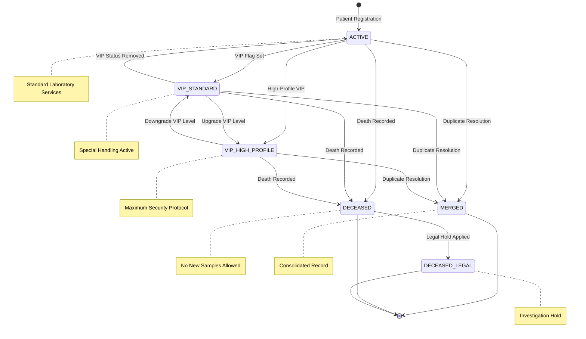
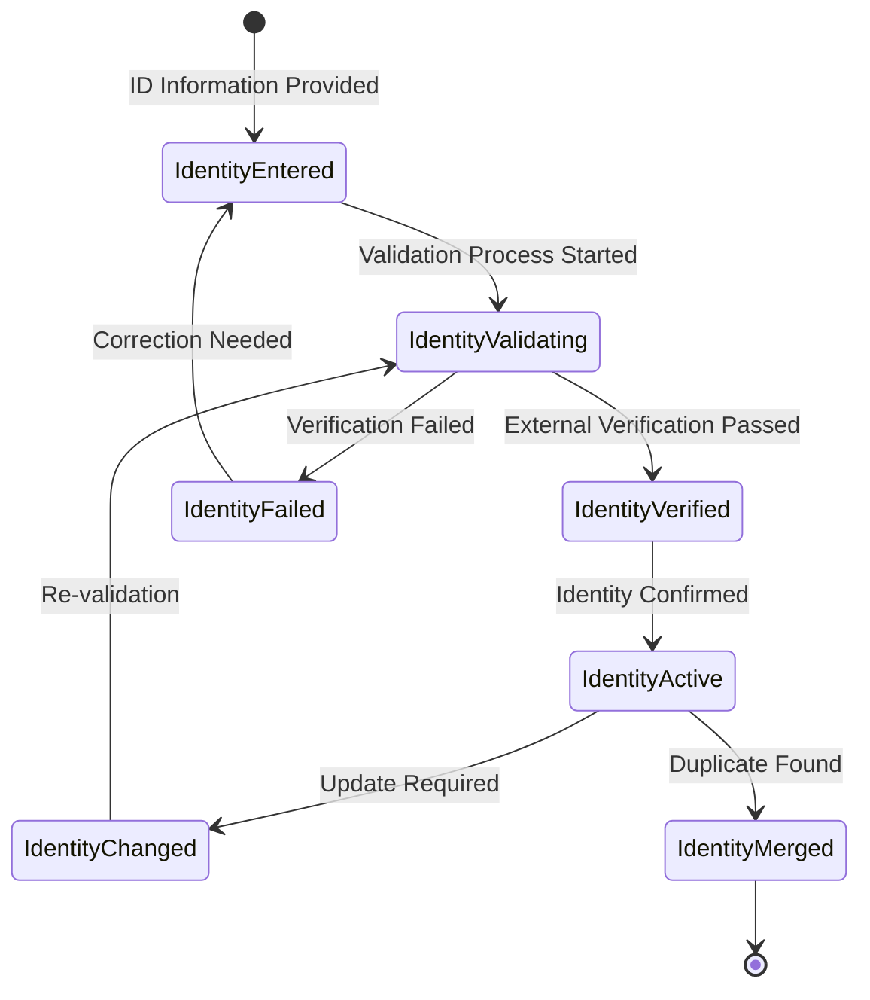
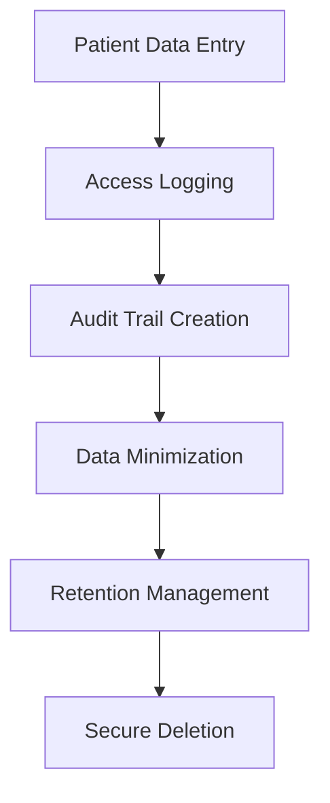
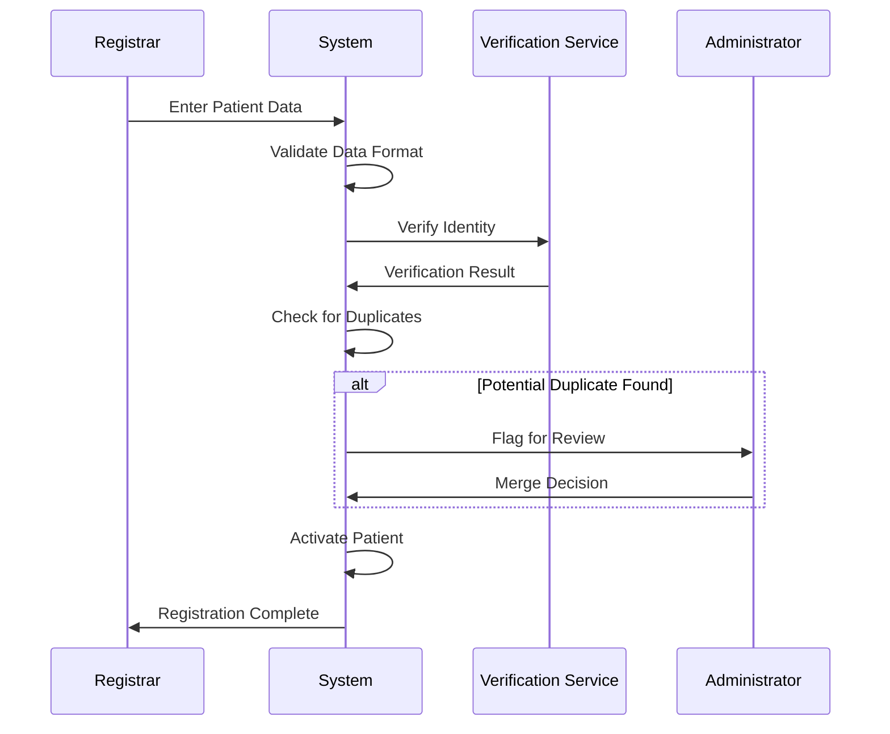
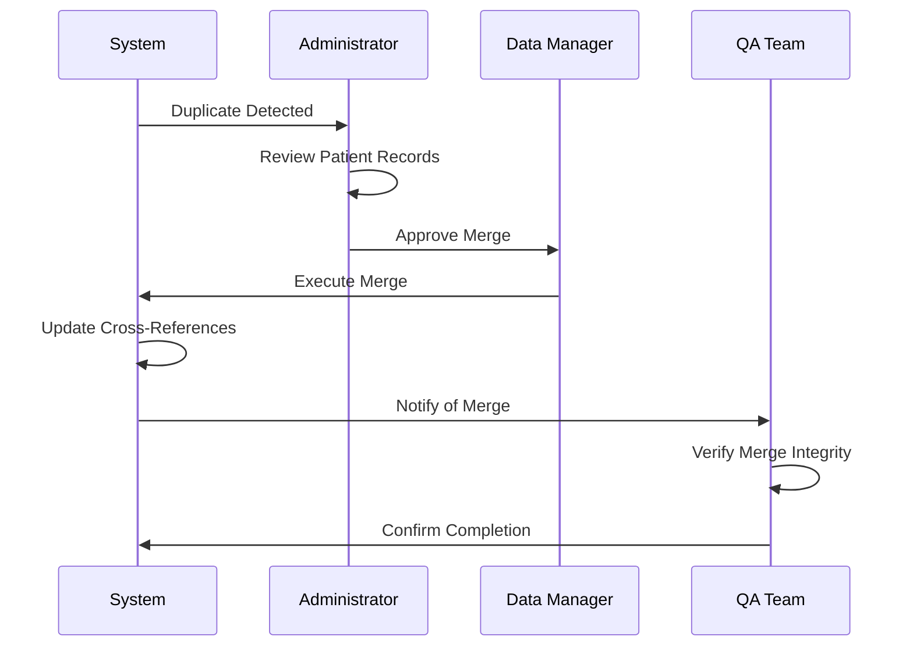
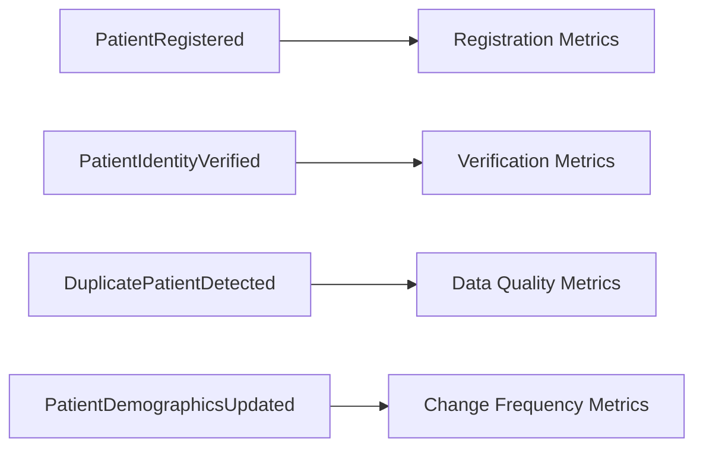
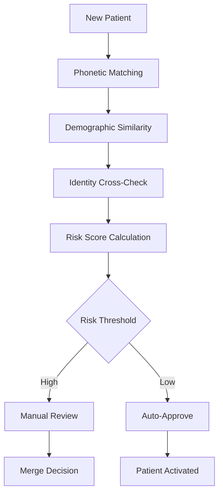

# Patient Aggregate Lifecycle Documentation

## Overview

The Patient Aggregate manages patient demographics, identity verification, and relationship tracking in OpenELIS-Global-2. It serves as the foundation for all laboratory activities and maintains comprehensive audit trails for privacy compliance and patient safety.

## Aggregate Components

### Core Entities
- **Patient** (`org.openelisglobal.patient.valueholder.Patient`)
  - Root aggregate entity
  - Core demographics and medical record number
  - Links to Person entity for detailed information
  
- **Person** (`org.openelisglobal.person.valueholder.Person`)
  - Detailed personal information
  - Name components, birth date, gender
  - Contact information and address

- **PatientIdentity** (`org.openelisglobal.patientidentity.valueholder.PatientIdentity`)
  - Multiple patient identifiers
  - National ID, external ID, study numbers
  - Identity verification status

- **ObservationHistory** (`org.openelisglobal.observationhistory.valueholder.ObservationHistory`)
  - Historical patient data changes
  - Sample-specific patient observations
  - Temporal demographic tracking

## State Machine



## Identity Management Workflow



## Domain Events

### Primary Patient Events

| Event | Trigger | State Transition | Business Rules | User Story |
|-------|---------|------------------|----------------|------------|
| **PatientRegistered** | Patient registration | null → ACTIVE | Unique identity verification, age/DOB validation | **PAT-001**: As a registration clerk I want to register new patients |
| **PatientDemographicsUpdated** | Standard demographics change | ACTIVE (no state change) | Verify authorization, validate data formats | **PAT-002**: As a registration clerk I want to update patient demographics |
| **PatientSensitiveDataUpdated** | Sensitive field changes | ACTIVE (enhanced audit) | Enhanced authorization, compliance flags | **PAT-002**: Sensitive data branch with enhanced compliance |
| **PatientIdentityAdded** | Standard identity addition | ACTIVE (no state change) | Identity type validation, no duplicates | **PAT-003**: As a registration clerk I want to add additional patient identities |
| **PatientNationalIDAdded** | National ID addition | ACTIVE (high confidence) | Government validation, official verification | **PAT-003**: National ID branch with official validation |
| **PatientsMerged** | Standard merge | Any → MERGED | Duplicate verification, preserve all identities | **PAT-004**: As a data manager I want to merge duplicate patient records |
| **PatientsMergedWithConflicts** | Complex merge with conflicts | Any → MERGED | Conflict resolution, manual review required | **PAT-004**: Complex merge branch with manual review |

### Privacy and Consent Events

| Event | Trigger | State Transition | Business Rules | User Story |
|-------|---------|------------------|----------------|------------|
| **PatientPrivacyUpdated** | Adult consent change | ACTIVE (privacy updated) | Valid consent types, legal compliance | **PAT-005**: As a privacy officer I want to update patient privacy consent |
| **MinorPatientConsentUpdated** | Minor consent change | ACTIVE (guardian consent) | Guardian authorization, special protection | **PAT-005**: Minor consent branch with guardian requirements |

### VIP Management Events

| Event | Trigger | State Transition | Business Rules | User Story |
|-------|---------|------------------|----------------|------------|
| **PatientVIPFlagged** | Standard VIP designation | ACTIVE → VIP_STANDARD | Authorization required, access logging | **PAT-006**: As a facility administrator I want to flag VIP patients |
| **PatientHighProfileFlagged** | High-profile VIP | ACTIVE → VIP_HIGH_PROFILE | Executive notification, maximum security | **PAT-006**: High-profile branch with maximum security |

### Death Recording Events

| Event | Trigger | State Transition | Business Rules | User Story |
|-------|---------|------------------|----------------|------------|
| **PatientDeathRecorded** | Natural death recording | Any → DECEASED | Official verification, block new samples | **PAT-007**: As a medical officer I want to record patient death |
| **PatientDeathLegalCase** | Legal case death | Any → DECEASED_LEGAL | Legal hold, investigation flag | **PAT-007**: Legal case branch with investigation hold |

### Demographics and Identity Events

| Event | Description | Branching Condition | Privacy/Security Impact |
|-------|-------------|--------------------|-----------------------|
| **PatientNameChanged** | Name modification | Standard name change | Identity verification may be required |
| **PatientAddressUpdated** | Standard address change | Standard address update | Geographic data updated |
| **PatientAddressHierarchyUpdated** | Hierarchical address change | Country/region/district/commune structure | Administrative boundaries updated |
| **PatientContactUpdated** | Phone/email change | Standard contact | Communication preferences affected |
| **PatientBirthDateCorrected** | DOB correction | Standard correction | Age-based validations updated |
| **PatientSearchIndexUpdated** | Search optimization | Search criteria change | Findability improved |
| **PatientAdvancedSearchEnabled** | Partial matching enabled | Complex search patterns | Search performance impact |
| **PatientIdentityVerified** | External verification | Standard verification | Trust level increased |
| **PatientIdentityFailed** | Verification failed | Verification failure | Manual review required |
| **PatientIdentityUpdated** | ID information changed | Standard update | Re-verification triggered |
| **DuplicatePatientDetected** | Potential duplicate found | Duplicate detection | Merge workflow initiated |

### VIP-Specific Events

| Event | Description | Security Level | Access Impact |
|-------|-------------|---------------|---------------|
| **VIPAccessLogged** | VIP patient accessed | Standard VIP | Enhanced audit trail |
| **VIPSecurityAlert** | Unauthorized access attempt | High-profile VIP | Security team notified |
| **VIPMediaAlert** | Media inquiry detected | High-profile VIP | Media protocol activated |
| **VIPExecutiveNotification** | Executive level alert | High-profile VIP | C-level notification |

### Death and Legal Events

| Event | Description | Legal Impact | Workflow Impact |
|-------|-------------|--------------|----------------|
| **PatientSampleAccessBlocked** | Death recorded | Deceased status | No new samples allowed |
| **PatientLegalHoldApplied** | Legal investigation | Legal case | Records preservation |
| **PatientInvestigationFlagged** | Investigation required | Legal case | Authority notification |
| **PatientRecordSealed** | Final disposition | Any death type | Access restricted |

## Business Rules

### Registration Rules
1. **Minimum Data**: Name, birth date, and gender required
2. **Unique Identifiers**: National ID must be unique if provided
3. **Age Validation**: Birth date must be reasonable (not future, not >150 years)
4. **Gender Validation**: Must be valid enumeration value

### Identity Management Rules
1. **Multiple IDs**: Patients can have multiple identity types
2. **Verification Requirement**: Critical IDs require external verification
3. **Uniqueness**: Each identity type must be unique across patients
4. **Format Validation**: IDs must conform to type-specific formats

### Privacy and Security Rules
1. **Audit Trail**: All changes must be logged with user attribution
2. **Data Retention**: Historical data preserved per regulations
3. **Access Control**: Demographic changes require appropriate permissions
4. **Consent Tracking**: Patient consent status tracked for data usage

### Merge and Deduplication Rules
1. **Duplicate Detection**: Algorithmic detection of potential duplicates
2. **Manual Review**: Human verification required before merge
3. **Data Preservation**: All historical data preserved in merge
4. **Audit Trail**: Complete merge history maintained

## Integration Points

### Upstream Dependencies
- **Identity Verification Services**: External ID validation
- **Address Validation**: Geographic data services
- **User Management**: Permission validation for changes

### Downstream Dependencies
- **Sample Aggregate**: Patient demographic changes affect samples
- **Order Processing**: Patient verification status affects orders
- **Reporting**: Demographics used in all laboratory reports
- **Billing**: Patient information drives billing processes

## Privacy and Compliance

### HIPAA Compliance


### GDPR Compliance Features
- **Right to Access**: Complete patient data export
- **Right to Rectification**: Controlled demographic updates
- **Right to Erasure**: Secure data deletion workflows
- **Data Portability**: Standardized data export formats
- **Consent Management**: Granular consent tracking

## Workflow Patterns

### Patient Registration Workflow


### Patient Merge Workflow


## Audit Trail Coverage

### Comprehensive Patient Tracking
- All demographic changes with timestamps
- Identity verification history
- Merge and deduplication activities
- Access logging for privacy compliance

### ObservationHistory Integration
```java
// Historical patient data tracking
@Override
@Transactional
public void updatePatientDemographics(Patient patient, String changes) {
    // Create observation history entry
    ObservationHistory history = new ObservationHistory();
    history.setPatientId(patient.getId());
    history.setValueType("DEMOGRAPHIC_CHANGE");
    history.setValue(changes);
    history.setLastUpdated(new Date());
    
    observationHistoryService.insert(history);
    
    // Standard audit trail
    auditTrailService.saveHistory(patient, "PATIENT", "Demographics Update", changes);
}
```

## Event Sourcing Mapping

### Aggregate Root
**Patient** serves as the aggregate root with strong consistency boundaries around:
- Patient demographic information
- Identity verification status
- Privacy consent and preferences
- Cross-reference integrity

### Event Stream Structure
```
PatientStream-{patientId}:
  1. PatientRegistered
  2. PatientIdentityAdded (optional, multiple)
      → PatientNationalIDAdded (if national ID)
  3. PatientIdentityVerified (optional)
  4. PatientDemographicsUpdated (optional, multiple)
      → PatientSensitiveDataUpdated (if sensitive fields)
  5. PatientPrivacyUpdated (optional)
      → MinorPatientConsentUpdated (if minor)
  6. PatientVIPFlagged (optional)
      → PatientHighProfileFlagged (if high-profile)
  7. PatientDeathRecorded | PatientDeathLegalCase (optional)
  8. PatientsMerged | PatientsMergedWithConflicts (optional)
      
VIP-specific events (if flagged):
  - VIPAccessLogged (ongoing)
  - VIPSecurityAlert (if unauthorized access)
  - VIPMediaAlert (if media inquiry)
      
Death-related events (if deceased):
  - PatientSampleAccessBlocked
  - PatientLegalHoldApplied (if legal case)
  - PatientRecordSealed (final)
```

### Snapshot Strategy
- Snapshot every 25 events
- Include current demographics, identity status, and active flags
- Preserve privacy consent settings

## Technical Implementation Notes

### Current Patient Management
```java
// PatientServiceImpl.java
@Override
@Transactional
public String insert(Patient patient) {
    // Validation and duplicate checking
    validatePatientData(patient);
    checkForDuplicates(patient);
    
    // Insert with audit trail
    String id = super.insert(patient);
    
    // Identity management
    processPatientIdentities(patient);
    
    return id;
}
```

### Recommended Event Store Schema
```sql
-- Event store table for Patient aggregate
CREATE TABLE patient_events (
    aggregate_id VARCHAR(50) NOT NULL,    -- patient_id
    sequence_number BIGINT NOT NULL,
    event_type VARCHAR(100) NOT NULL,
    event_data JSONB NOT NULL,
    metadata JSONB,
    privacy_level VARCHAR(20) DEFAULT 'STANDARD',
    created_at TIMESTAMP NOT NULL,
    created_by VARCHAR(50) NOT NULL,
    PRIMARY KEY (aggregate_id, sequence_number)
);

-- Index for privacy compliance queries
CREATE INDEX idx_patient_events_privacy 
ON patient_events(privacy_level, created_at);

-- Encrypted storage for sensitive data
CREATE TABLE patient_pii_events (
    aggregate_id VARCHAR(50) NOT NULL,
    sequence_number BIGINT NOT NULL,
    encrypted_data BYTEA NOT NULL,
    encryption_key_id VARCHAR(50) NOT NULL,
    created_at TIMESTAMP NOT NULL,
    PRIMARY KEY (aggregate_id, sequence_number)
);
```

## Metrics and Analytics

### Key Performance Indicators
- Patient registration completion rates (PatientRegistered events)
- Identity verification success rates (PatientIdentityVerified vs PatientIdentityFailed)
- Duplicate detection accuracy (DuplicatePatientDetected to successful merges)
- VIP patient access compliance (VIPAccessLogged events)
- Death recording timeliness (PatientDeathRecorded events)
- Legal case handling (PatientDeathLegalCase events)
- Privacy consent updates (PatientPrivacyUpdated events)
- Demographics update frequency (PatientDemographicsUpdated events)
- High-profile VIP security incidents (VIPSecurityAlert events)
- Minor consent management (MinorPatientConsentUpdated events)

### Event-Driven Analytics


## Migration Strategy

### Phase 1: Enhanced Privacy Compliance
- Strengthen audit trails for GDPR/HIPAA compliance
- Add event publishing for demographic changes
- Build privacy-focused read models

### Phase 2: Identity Management Enhancement
- Implement advanced duplicate detection
- Add external identity verification workflows
- Enhance merge capabilities

### Phase 3: Event Store Migration
- Migrate to event-sourced patient aggregate
- Implement privacy-compliant event storage
- Add real-time compliance monitoring

## Advanced Features

### Algorithmic Duplicate Detection


### Privacy-Preserving Analytics
- Differential privacy for research
- Anonymization for reporting
- Consent-based data usage
- Secure multi-party computation capabilities