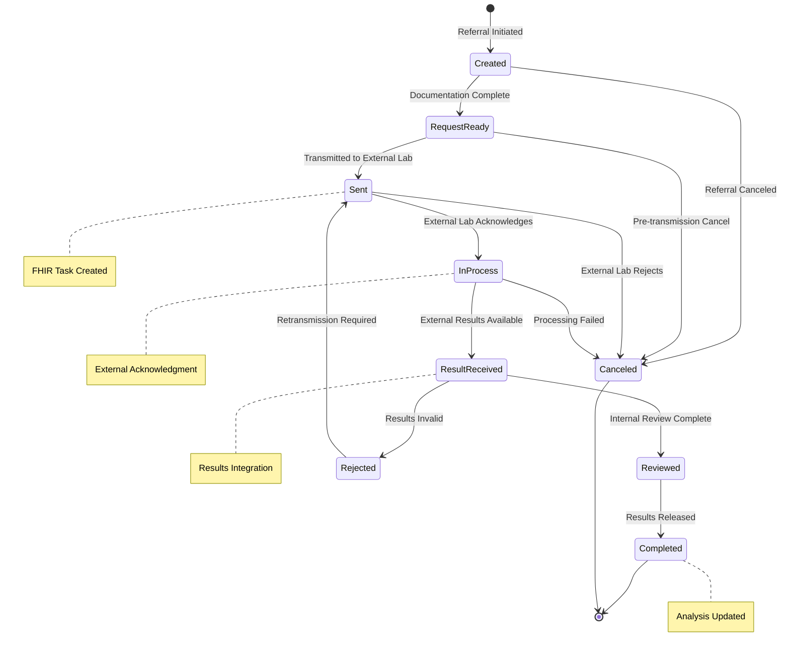
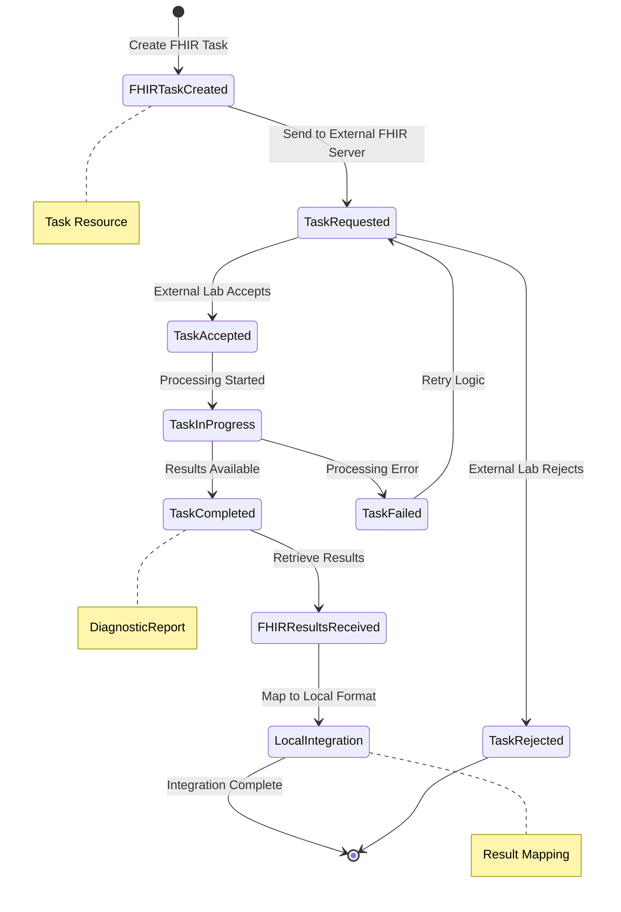
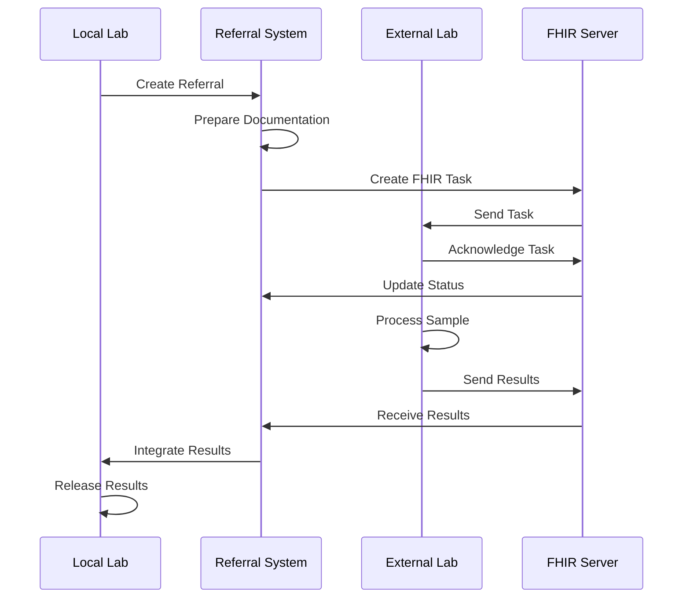
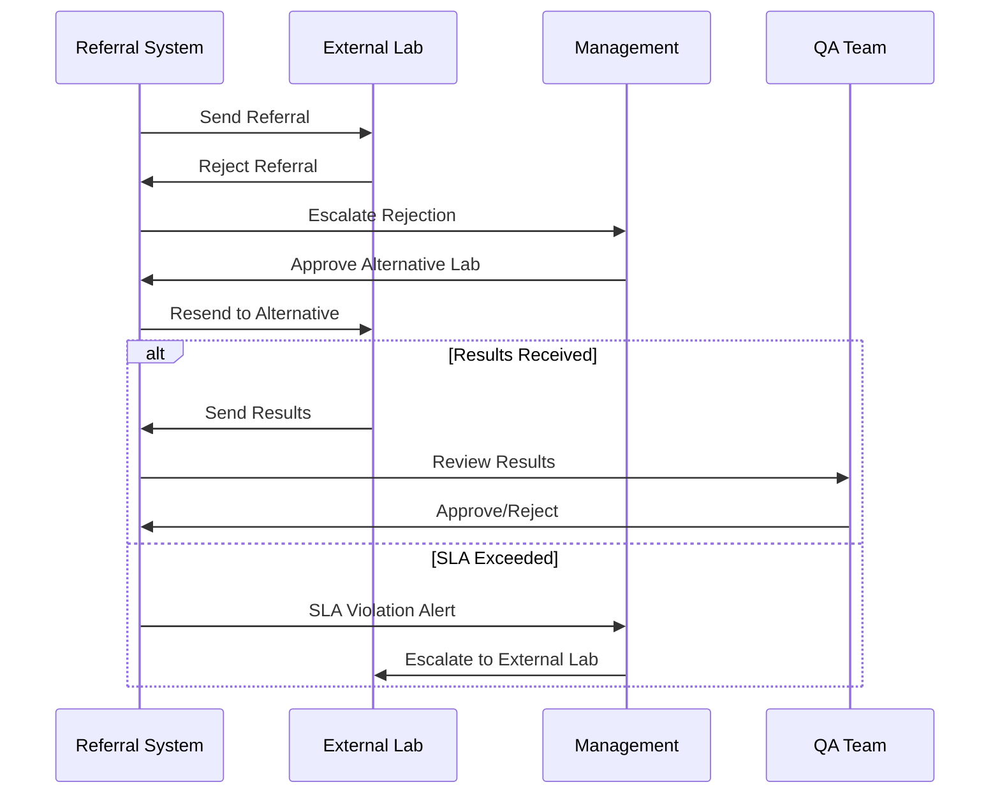
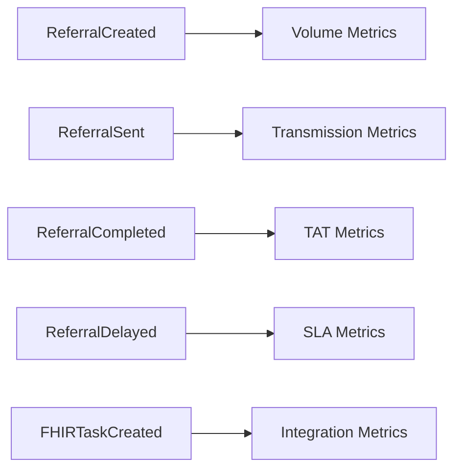
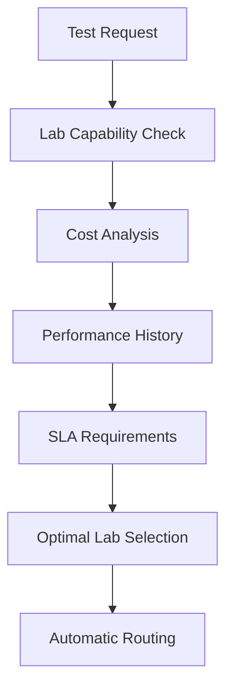

# Referral Aggregate Lifecycle Documentation

## Overview

The Referral Aggregate manages the complete external laboratory referral process in OpenELIS-Global-2. It handles test referrals to external laboratories, tracks transmission status, manages result reception, and integrates with FHIR R4 standards for interoperability. This aggregate is critical for laboratory network coordination and specialized testing capabilities.

## Aggregate Components

### Core Entities
- **Referral** (`org.openelisglobal.referral.valueholder.Referral`)
  - Root aggregate entity
  - Manages referral lifecycle and metadata
  - Links to analysis and external organizations
  
- **ReferralStatus** (`org.openelisglobal.referral.valueholder.ReferralStatus`)
  - Status definitions and workflow states
  - Controls referral progression
  - Manages timing and deadlines

- **ReferralResult** (`org.openelisglobal.referral.valueholder.ReferralResult`)
  - External laboratory results
  - Result interpretation and validation
  - Integration with local analysis workflow

- **ReferralType** (`org.openelisglobal.referral.valueholder.ReferralType`)
  - Categorization of referral types
  - Routing rules and procedures
  - SLA definitions

## State Machine



## FHIR Integration Workflow



## Domain Events

### Primary Referral Events

| Event | Trigger | State Transition | Audit Trail Location |
|-------|---------|------------------|---------------------|
| **ReferralCreated** | Test requires external lab | null → Created | `history.activity = 'I'` |
| **ReferralDocumentationComplete** | All required info gathered | Created → RequestReady | `history.activity = 'U'` |
| **ReferralSent** | Transmitted to external lab | RequestReady → Sent | `history.activity = 'U'` |
| **ReferralAcknowledged** | External lab confirms receipt | Sent → InProcess | `history.activity = 'U'` |
| **ReferralResultReceived** | External results available | InProcess → ResultReceived | `history.activity = 'U'` |
| **ReferralResultReviewed** | Internal review complete | ResultReceived → Reviewed | `history.activity = 'U'` |
| **ReferralCompleted** | Results released to patient | Reviewed → Completed | `history.activity = 'U'` |
| **ReferralCanceled** | Referral terminated | Any → Canceled | `history.activity = 'U'` |

### FHIR Integration Events

| Event | Description | FHIR Resource |
|-------|-------------|---------------|
| **FHIRTaskCreated** | FHIR Task resource created | Task |
| **FHIRTaskSent** | Task sent to external FHIR server | Task |
| **FHIRTaskStatusUpdated** | External status change received | Task |
| **FHIRResultsReceived** | DiagnosticReport received | DiagnosticReport |
| **FHIRResultsMapped** | External results mapped to local format | Various |

### Enhanced Quality and Exception Events

| Event | Description | Branching Condition | Impact |
|-------|-------------|--------------------|---------|
| **ReferralDelayed** | SLA deadline approaching | Standard warning | Escalation triggered |
| **ReferralExpired** | SLA deadline exceeded | Final warning | Management notification |
| **ReferralResultRejected** | Results fail validation | Quality failure | Re-processing required |
| **ReferralCommunicationError** | Transmission failure | Network/system error | Retry mechanism activated |
| **ReferralUrgentEscalation** | Critical SLA breach | Emergency escalation | Executive notification |
| **ReferralVendorIssue** | External lab problem | Vendor performance | Alternative routing |
| **ReferralBillingAlert** | Billing anomaly | Cost variance | Financial review |
| **ReferralIntegrationError** | FHIR mapping failure | Technical error | Manual intervention |

### Billing and Financial Events

| Event | Description | Financial Impact | Resolution Action |
|-------|-------------|------------------|-------------------|
| **ReferralCostEstimate** | Initial cost calculation | Budget planning | Pre-authorization |
| **ReferralInvoiceReceived** | External lab invoice | Payment due | Reconciliation process |
| **ReferralPaymentApproved** | Payment authorization | Cash flow | Invoice payment |
| **ReferralCostVariance** | Unexpected charges | Budget impact | Variance analysis |
| **ReferralRefundProcessed** | Credit received | Cost adjustment | Account reconciliation |
| **ReferralBillingAudit** | Financial review | Compliance check | Audit documentation |

## Business Rules

### Referral Creation Rules
1. **Analysis Dependency**: Must reference valid analysis
2. **External Lab Validation**: Receiving lab must be active and capable
3. **Test Compatibility**: External lab must support the test type
4. **Documentation Requirements**: Complete clinical information required

### Transmission Rules
1. **Format Validation**: Data must conform to receiving lab standards
2. **Security Requirements**: Encrypted transmission for PHI
3. **Acknowledgment**: Transmission confirmation required
4. **Timeout Handling**: Retry logic for failed transmissions

### Result Reception Rules
1. **Format Validation**: Results must be in expected format
2. **Clinical Validation**: Results must be clinically reasonable
3. **Completeness Check**: All ordered tests must have results
4. **Quality Assurance**: Results subject to QA review

### SLA Management Rules
1. **Timeline Tracking**: All deadlines monitored
2. **Escalation Procedures**: Overdue referrals escalated
3. **Performance Metrics**: External lab performance tracked
4. **Contract Compliance**: SLA violations reported

## Integration Points

### Upstream Dependencies
- **Analysis Aggregate**: Referral created from analysis
- **Organization Management**: External lab directory
- **User Management**: Referral authorization roles
- **Test Catalog**: Test compatibility matrix

### Downstream Dependencies
- **Result Management**: External results integration
- **Reporting**: Referral status in reports
- **Billing**: External lab billing coordination
- **Quality Metrics**: Referral performance tracking

## Workflow Patterns

### Standard Referral Workflow


### Exception Handling Workflow


## FHIR R4 Implementation

### Task Resource Management
```json
{
  "resourceType": "Task",
  "status": "requested",
  "intent": "order",
  "code": {
    "coding": [{
      "system": "http://loinc.org",
      "code": "laboratory-procedure"
    }]
  },
  "for": {
    "reference": "Patient/12345"
  },
  "requester": {
    "reference": "Organization/local-lab"
  },
  "owner": {
    "reference": "Organization/external-lab"
  }
}
```

### DiagnosticReport Integration
```java
// FHIR result processing
@Override
@Transactional
public void processFHIRDiagnosticReport(DiagnosticReport report, String referralId) {
    Referral referral = referralService.get(referralId);
    
    // Map FHIR results to local format
    ReferralResult result = fhirMappingService.mapDiagnosticReport(report);
    result.setReferral(referral);
    
    // Validate results
    validateExternalResults(result);
    
    // Update referral status
    referral.setStatus(ReferralStatus.RESULT_RECEIVED);
    referralService.update(referral);
    
    // Publish domain event
    eventPublisher.publishEvent(new ReferralResultReceived(referralId, result));
}
```

## Audit Trail Coverage

### Comprehensive Tracking
- All status transitions with timestamps
- Communication attempts and responses
- Result reception and validation
- Quality review decisions

### FHIR Audit Trail
- Task resource lifecycle
- Communication with external FHIR servers
- Result mapping and transformation
- Error handling and retry attempts

### Performance Monitoring
```java
// Referral performance tracking
@Override
public void trackReferralPerformance(Referral referral) {
    Duration turnaroundTime = Duration.between(
        referral.getSentDate().toInstant(),
        referral.getCompletedDate().toInstant()
    );
    
    // Update metrics
    referralMetricsService.recordTurnaroundTime(
        referral.getExternalOrganization(),
        referral.getTestType(),
        turnaroundTime
    );
}
```

## Event Sourcing Mapping

### Aggregate Root
**Referral** serves as the aggregate root with strong consistency boundaries around:
- Referral lifecycle and status progression
- Communication with external laboratories
- Result reception and validation
- SLA and performance tracking

### Event Stream Structure
```
ReferralStream-{referralId}:
  1. ReferralCreated
  2. ReferralDocumentationComplete
  3. ReferralSent
  4. FHIRTaskCreated
  5. ReferralAcknowledged
  6. ReferralResultReceived
  7. ReferralResultReviewed
  8. ReferralCompleted
```

### Snapshot Strategy
- Snapshot every 20 events
- Include current status, external lab info, and SLA metrics
- Preserve FHIR resource references

## Technical Implementation Notes

### Current Referral Management
```java
// FhirReferralServiceImpl.java
public class FhirReferralServiceImpl implements FhirReferralService {
    // FHIR Task management
    // Status tracking
    // Result integration
    // Error handling
}
```

### Recommended Event Store Schema
```sql
-- Event store table for Referral aggregate
CREATE TABLE referral_events (
    aggregate_id VARCHAR(50) NOT NULL,    -- referral_id
    sequence_number BIGINT NOT NULL,
    event_type VARCHAR(100) NOT NULL,
    event_data JSONB NOT NULL,
    metadata JSONB,
    external_org_id VARCHAR(50),          -- for filtering by external lab
    fhir_task_id VARCHAR(100),            -- FHIR Task reference
    sla_deadline TIMESTAMP,               -- for SLA monitoring
    created_at TIMESTAMP NOT NULL,
    created_by VARCHAR(50) NOT NULL,
    PRIMARY KEY (aggregate_id, sequence_number)
);

-- Index for SLA monitoring
CREATE INDEX idx_referral_events_sla 
ON referral_events(sla_deadline, event_type);

-- Index for external organization queries
CREATE INDEX idx_referral_events_external_org 
ON referral_events(external_org_id, created_at);
```

## Metrics and Analytics

### Key Performance Indicators
- Referral turnaround time by external lab
- Success rate of FHIR transmissions
- SLA compliance rates
- External lab performance rankings
- Cost per referral by test type

### Event-Driven Analytics


## Migration Strategy

### Phase 1: FHIR Enhancement
- Strengthen FHIR R4 compliance
- Add comprehensive event publishing
- Build performance monitoring dashboards

### Phase 2: Workflow Integration
- Implement Dapr workflows for complex referral processes
- Add automated retry and escalation patterns
- Enhance external lab integration

### Phase 3: Event Store Migration
- Migrate to event-sourced referral aggregate
- Implement real-time SLA monitoring
- Add predictive analytics for referral management

## Advanced Features

### Intelligent Routing


### Predictive Analytics
- Turnaround time prediction
- Capacity planning for external labs
- Cost optimization recommendations
- Quality score trending

### Integration Patterns
- Real-time status updates via webhooks
- Batch result processing
- Error recovery and compensation
- Multi-lab redundancy for critical tests