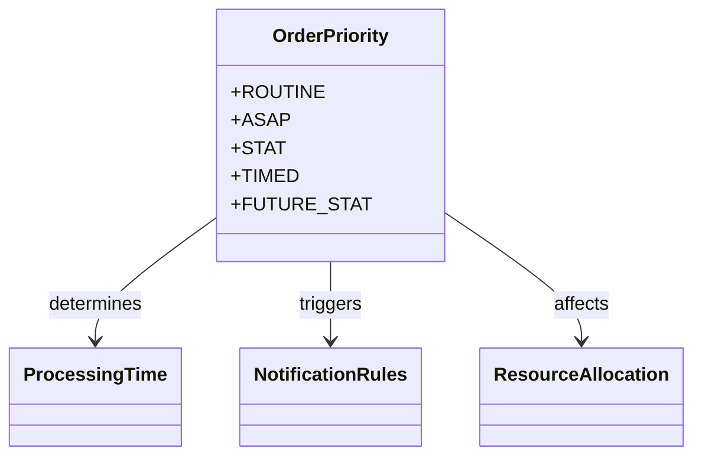
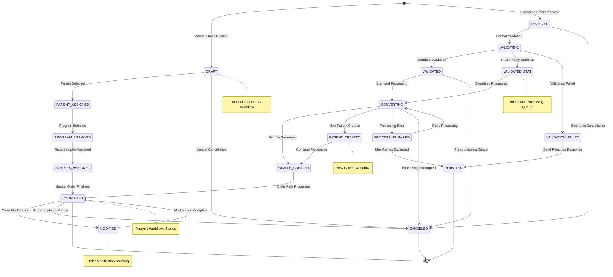
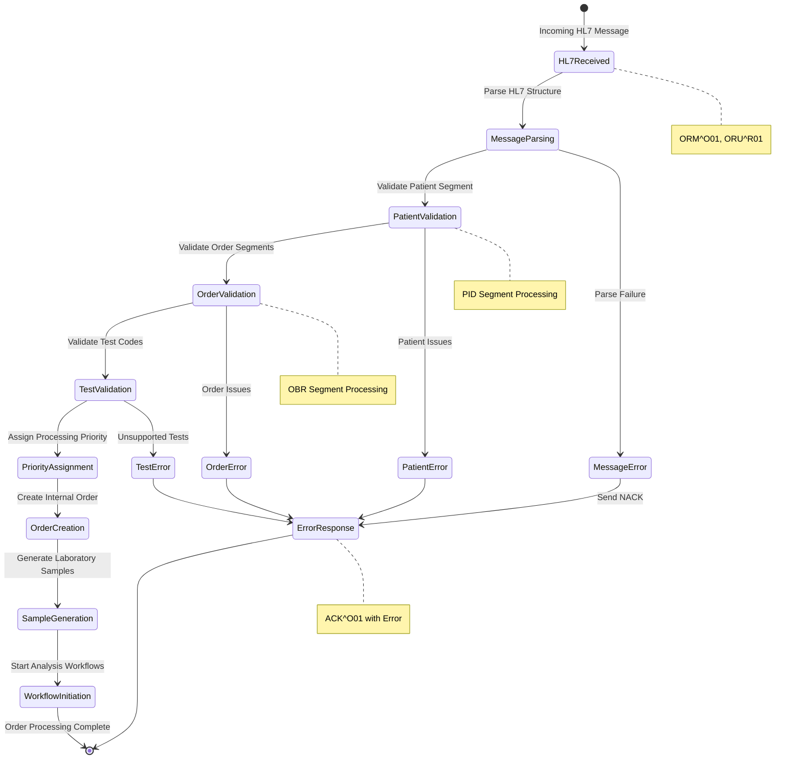
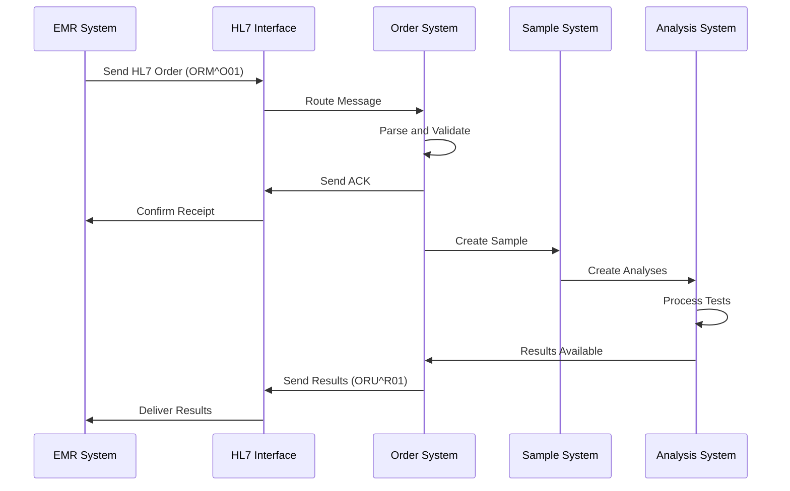
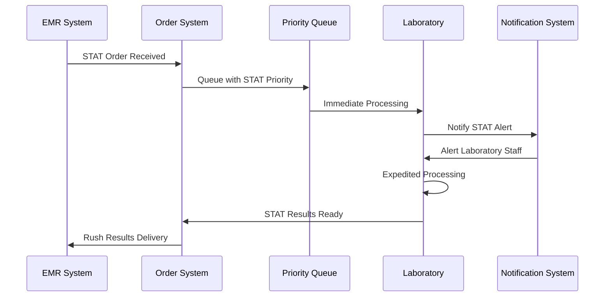
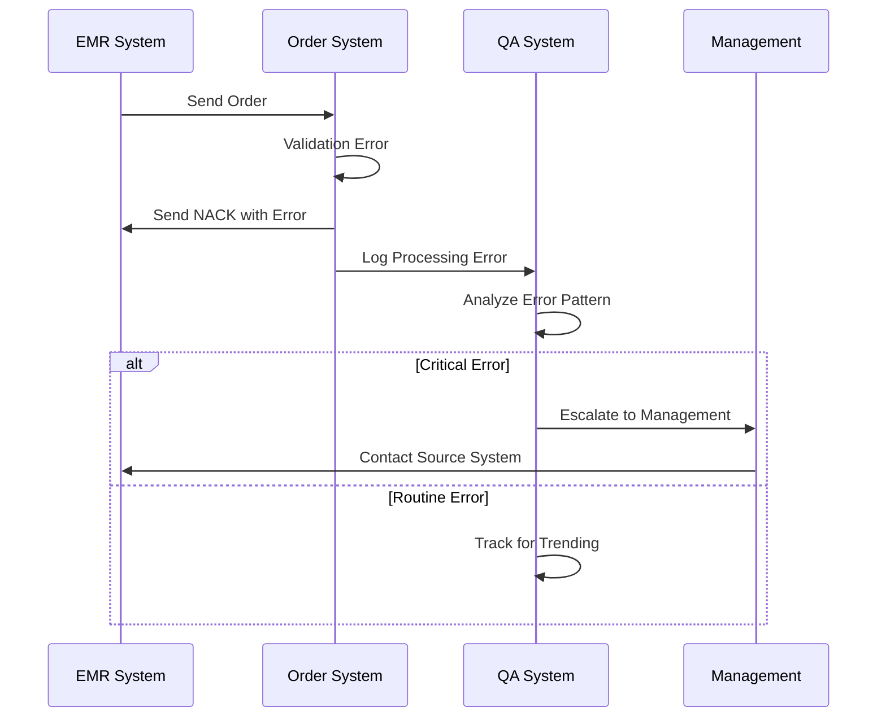
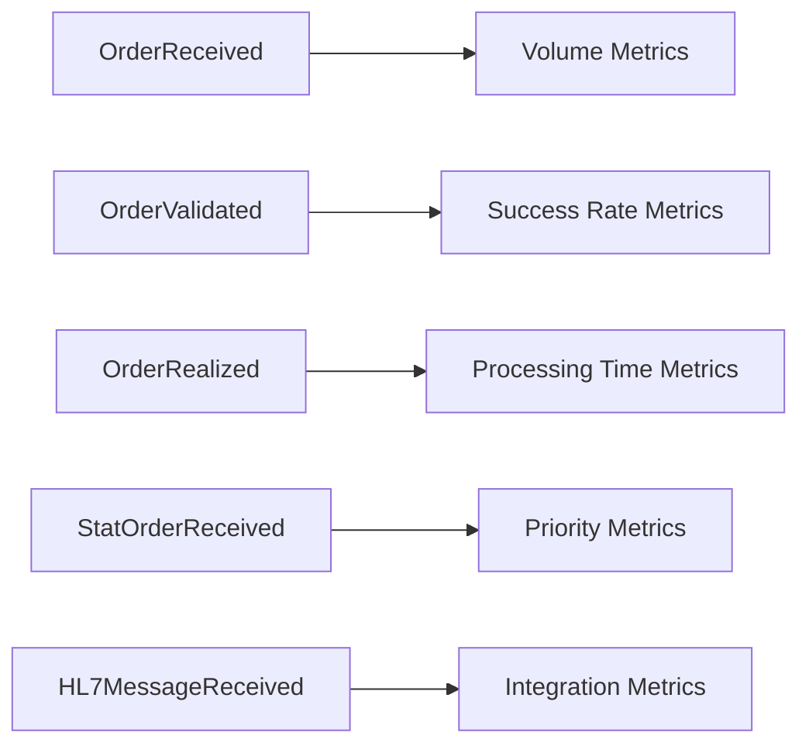
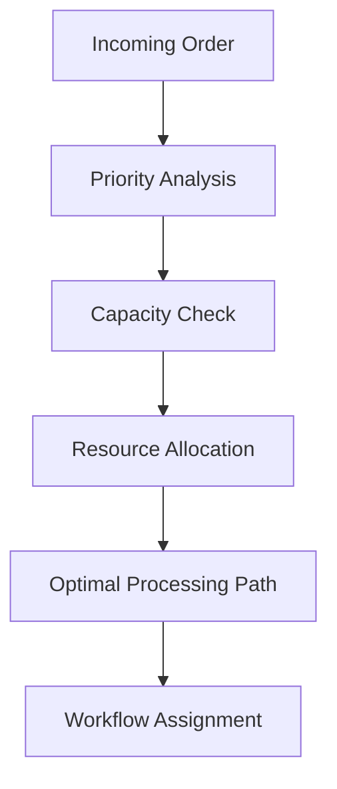

# Order Aggregate Lifecycle Documentation

## Overview

The Order Aggregate manages electronic laboratory orders received from external systems in OpenELIS-Global-2. It handles HL7 v2.5.1 message processing, order validation, priority management, and the conversion of external orders into internal laboratory workflows. This aggregate is essential for laboratory automation and healthcare system integration.

## Aggregate Components

### Core Entities
- **ElectronicOrder** (`org.openelisglobal.dataexchange.order.valueholder.ElectronicOrder`)
  - Root aggregate entity
  - Manages order lifecycle and metadata
  - Links to external systems and patients
  
- **OrderPriority** (`org.openelisglobal.sample.valueholder.OrderPriority`)
  - Priority definitions and processing rules
  - Controls workflow prioritization
  - Manages urgent and stat processing

- **ExternalOrderNumber** (Referenced in Sample)
  - External order tracking
  - Cross-system correlation
  - Duplicate order detection

## Order Priority Types



## State Machine



## HL7 Message Processing Workflow



## Domain Events

### Primary Order Events

| Event | Trigger | State Transition | Business Rules | User Story |
|-------|---------|------------------|----------------|------------|
| **ManualOrderCreated** | Manual order entry started | null → DRAFT | User-initiated order creation | **ORD-001**: As a lab technician I want to create manual orders |
| **OrderPatientSelected** | Patient assigned to order | DRAFT → PATIENT_ASSIGNED | Patient search/registration complete | **ORD-002**: As a lab technician I want to assign patients to orders |
| **OrderProgramSelected** | Program assigned | PATIENT_ASSIGNED → PROGRAM_ASSIGNED | Laboratory program selected (General/Pathology/etc.) | **ORD-003**: As a lab technician I want to select appropriate programs |
| **OrderSamplesAssigned** | Sample collection defined | PROGRAM_ASSIGNED → SAMPLES_ASSIGNED | Collection details, tests selected | **ORD-004**: As a lab technician I want to assign tests and samples |
| **ManualOrderFinalized** | Manual order complete | SAMPLES_ASSIGNED → COMPLETED | Laboratory number assigned, order submitted | **ORD-005**: As a lab technician I want to finalize manual orders |
| **ElectronicOrderReceived** | FHIR/HL7 order | null → RECEIVED | Valid message format, security validation | **ORD-006**: As an external system I want to send laboratory orders |
| **STATOrderReceived** | STAT priority order | null → RECEIVED | STAT priority detected, expedited processing | **ORD-006**: STAT priority branch with expedited processing |
| **ElectronicOrderValidated** | Standard validation | RECEIVED → VALIDATED | Patient exists, tests available | **ORD-007**: As a lab system I want to validate incoming orders |
| **STATOrderValidated** | STAT validation | RECEIVED → VALIDATED_STAT | STAT authorization, immediate processing | **ORD-007**: STAT validation branch with expedited workflow |
| **OrderValidationFailed** | Validation errors | RECEIVED → VALIDATION_FAILED | Errors documented, rejection prepared | **ORD-007**: Validation failure branch with error response |
| **OrderConvertedToSample** | Standard conversion | VALIDATED → SAMPLE_CREATED | Sample aggregate created successfully | **ORD-008**: As a lab system I want to convert orders to samples |
| **OrderPatientCreated** | New patient needed | VALIDATED → PATIENT_CREATED | Patient not found, new patient created | **ORD-008**: New patient branch with registration workflow |
| **OrderProcessingCompleted** | Processing finished | SAMPLE_CREATED → COMPLETED | All samples/analyses created | **ORD-008**: Order processing complete |

### Legacy HL7 Integration Events (for reference)

| Event | Description | HL7 Message Type | Status |
|-------|-------------|------------------|--------|
| **HL7MessageReceived** | Incoming HL7 message | ORM^O01, ORU^R01 | Enhanced above |
| **HL7MessageParsed** | Message structure validated | Any | Enhanced above |
| **HL7AcknowledgmentSent** | ACK message sent | ACK^O01 | Enhanced above |
| **HL7ErrorResponse** | NACK message sent | ACK^O01 with error | Enhanced above |
| **HL7ResultsSent** | Results transmitted | ORU^R01 | Enhanced above |

### Priority and Amendment Management Events

| Event | Description | Priority Impact | Amendment Impact |
|-------|-------------|-----------------|------------------|
| **OrderPriorityEscalated** | Priority upgrade | STAT processing activated | Workflow re-prioritized |
| **STATOrderAlert** | STAT order notification | Lab alerts triggered | Immediate processing |
| **OrderSTATAuthorized** | STAT authorization | Authorization documented | Premium processing |
| **OrderAmendmentValidated** | Amendment validation | Priority may change | Change validation complete |
| **OrderAmendmentApplied** | Amendment implementation | Processing updated | Changes implemented |
| **OrderAmendmentRejected** | Amendment rejection | No change | Rejection documented |
| **OrderChangeNotification** | Change notification | Stakeholders notified | External systems updated |
| **OrderVersionCreated** | Version tracking | History preserved | Amendment history |

### Enhanced HL7 Integration Events

| Event | Description | HL7 Message Type | Processing Impact |
|-------|-------------|------------------|-------------------|
| **HL7OrderMessageReceived** | Standard order message | ORM^O01 | Standard workflow |
| **HL7STATOrderReceived** | STAT order message | ORM^O01 (STAT) | Expedited workflow |
| **HL7AmendmentReceived** | Order amendment | ORM^O01 (amendment) | Change processing |
| **HL7CancellationReceived** | Order cancellation | ORM^O01 (cancel) | Workflow termination |
| **HL7AcknowledgmentSent** | Standard ACK | ACK^O01 (AA) | Confirmation sent |
| **HL7ErrorResponse** | Error NACK | ACK^O01 (AE/AR) | Error communicated |
| **HL7ResultsSent** | Results transmission | ORU^R01 | Results delivered |
| **HL7StatusUpdate** | Status notification | ORU^R01 (status) | Progress communicated |

| Event | Description | Processing Impact |
|-------|-------------|-------------------|
| **StatOrderReceived** | STAT priority order | Immediate processing |
| **ASAPOrderReceived** | ASAP priority order | Expedited processing |
| **TimedOrderReceived** | Timed collection order | Scheduled processing |
| **FutureStatOrderReceived** | Future STAT order | Scheduled urgent processing |
| **PriorityEscalated** | Priority upgraded | Workflow re-prioritization |

## Business Rules

### Order Reception Rules
1. **HL7 Compliance**: Messages must conform to v2.5.1 standard
2. **Patient Validation**: Patient must exist or be creatable
3. **Provider Validation**: Ordering provider must be valid
4. **Test Availability**: All ordered tests must be supported
5. **Duplicate Detection**: Prevent duplicate order processing

### Priority Processing Rules
1. **STAT Orders**: Process within 15 minutes
2. **ASAP Orders**: Process within 1 hour
3. **Timed Orders**: Process at specified collection time
4. **ROUTINE Orders**: Process in standard workflow
5. **Priority Escalation**: Automatic escalation for delays

### Validation Rules
1. **Required Fields**: MSH, PID, OBR segments mandatory
2. **Format Validation**: All fields must conform to HL7 data types
3. **Business Validation**: Clinical and laboratory business rules
4. **Security Validation**: Source system authentication

### Integration Rules
1. **Acknowledgment**: All messages require ACK/NACK response
2. **Error Handling**: Detailed error codes in NACK messages
3. **Retry Logic**: Failed processing attempts retried
4. **Audit Trail**: Complete message processing history

## Integration Points

### Upstream Dependencies
- **HL7 Interface Engine**: Message routing and transformation
- **EMR Systems**: Order origination systems
- **Patient Registry**: Patient identity verification
- **Provider Directory**: Ordering provider validation

### Downstream Dependencies
- **Sample Aggregate**: Order conversion to samples
- **Analysis Aggregate**: Test workflow initiation
- **Patient Aggregate**: Patient demographic updates
- **Reporting**: Order status and results reporting

## Workflow Patterns

### Standard Order Processing


### Priority Order Processing


### Error Handling Workflow


## HL7 Message Examples

### Order Message (ORM^O01)
```
MSH|^~\&|EMR|HOSPITAL|LIMS|LAB|20231215140000||ORM^O01|12345|P|2.5.1
PID|1||123456^^^MRN||PATIENT^TEST||19900101|M|||123 MAIN ST^^CITY^ST^12345
PV1|1|I|ICU^101^1|||DOC123^DOCTOR^ATTENDING|||MED||||2
ORC|NW|ORD789|||||^^^20231215150000||20231215140000|NURSE123
OBR|1|ORD789||CBC^COMPLETE BLOOD COUNT^LOCAL|||20231215150000|||||||DOC123
```

### Acknowledgment (ACK^O01)
```
MSH|^~\&|LIMS|LAB|EMR|HOSPITAL|20231215140100||ACK^O01|ACK12345|P|2.5.1
MSA|AA|12345|ORDER ACCEPTED
```

## Audit Trail Coverage

### Message Tracking
- Complete HL7 message logging
- Processing timestamps and outcomes
- Error conditions and retry attempts
- Acknowledgment transmission

### Order Lifecycle Tracking
```java
// Order processing audit trail
@Override
@Transactional
public void processElectronicOrder(String hl7Message) {
    ElectronicOrder order = parseHL7Message(hl7Message);
    
    // Log order reception
    auditTrailService.saveHistory(order, "ELECTRONIC_ORDER", 
        "Order Received", "HL7 message processed");
    
    try {
        validateOrder(order);
        auditTrailService.saveHistory(order, "ELECTRONIC_ORDER", 
            "Order Validated", "Validation successful");
            
        processOrder(order);
        auditTrailService.saveHistory(order, "ELECTRONIC_ORDER", 
            "Order Processed", "Sample creation complete");
            
    } catch (ValidationException e) {
        auditTrailService.saveHistory(order, "ELECTRONIC_ORDER", 
            "Order Rejected", e.getMessage());
        sendNACK(order, e.getErrorCode());
    }
}
```

## Event Sourcing Mapping

### Aggregate Root
**ElectronicOrder** serves as the aggregate root with strong consistency boundaries around:
- Order lifecycle and status progression
- HL7 message processing and validation
- Priority management and escalation
- Integration with downstream workflows

### Event Stream Structure
```
OrderStream-{orderId}:
  1. OrderReceived
  2. HL7MessageParsed
  3. OrderValidated | OrderRejected
  4. OrderProcessingStarted
  5. OrderSampleCreated
  6. OrderRealized | OrderFailed
```

### Snapshot Strategy
- Snapshot every 10 events
- Include current status, priority, and processing metadata
- Preserve HL7 message references and error history

## Technical Implementation Notes

### Current Order Management
```java
// OrderWorker.java
public class OrderWorker {
    // HL7 message processing
    // Order validation
    // Sample creation coordination
    // Error handling and retry logic
}
```

### Recommended Event Store Schema
```sql
-- Event store table for Order aggregate
CREATE TABLE order_events (
    aggregate_id VARCHAR(50) NOT NULL,    -- order_id
    sequence_number BIGINT NOT NULL,
    event_type VARCHAR(100) NOT NULL,
    event_data JSONB NOT NULL,
    metadata JSONB,
    hl7_message_id VARCHAR(100),          -- HL7 message reference
    priority VARCHAR(20),                 -- STAT, ASAP, ROUTINE, etc.
    source_system VARCHAR(50),            -- originating EMR system
    created_at TIMESTAMP NOT NULL,
    created_by VARCHAR(50) NOT NULL,
    PRIMARY KEY (aggregate_id, sequence_number)
);

-- Index for priority-based queries
CREATE INDEX idx_order_events_priority 
ON order_events(priority, created_at);

-- Index for source system analytics
CREATE INDEX idx_order_events_source 
ON order_events(source_system, created_at);
```

## Metrics and Analytics

### Key Performance Indicators
- Order processing time by priority
- HL7 message validation success rate
- Source system integration reliability
- Priority escalation frequency
- Error rate by message type

### Event-Driven Analytics


## Migration Strategy

### Phase 1: Enhanced Integration
- Strengthen HL7 v2.5.1 compliance
- Add comprehensive event publishing
- Build integration monitoring dashboards

### Phase 2: Workflow Automation
- Implement Dapr workflows for complex order processing
- Add automated retry and escalation patterns
- Enhance priority-based processing

### Phase 3: Event Store Migration
- Migrate to event-sourced order aggregate
- Implement real-time integration monitoring
- Add predictive analytics for order volume

## Advanced Features

### Intelligent Order Routing


### Predictive Analytics
- Order volume forecasting
- Priority pattern analysis
- Integration performance optimization
- Capacity planning recommendations

### Integration Enhancements
- Real-time status updates via HL7 v2.5.1
- Bidirectional result reporting
- Enhanced error recovery mechanisms
- Multi-facility order routing