# Cross-Aggregate Workflow Documentation

## Overview

This document outlines the complex cross-aggregate workflows in OpenELIS-Global-2 that span multiple domain aggregates. These workflows represent the core laboratory business processes and demonstrate how domain events flow between aggregates to orchestrate complete laboratory operations.

## Primary Laboratory Workflows

### 1. Pathology Program Cross-Aggregate Workflow

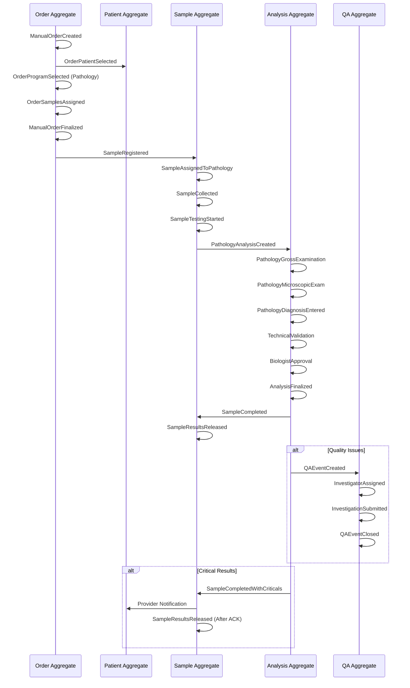
```mermaid
sequenceDiagram
    participant Order as Order Aggregate
    participant Patient as Patient Aggregate  
    participant Sample as Sample Aggregate
    participant Analysis as Analysis Aggregate
    participant QA as QA Aggregate
    
    %% Order and Sample Creation
    Order->>Order: ManualOrderCreated
    Order->>Patient: OrderPatientSelected
    Order->>Order: OrderProgramSelected (Pathology)
    Order->>Order: OrderSamplesAssigned
    Order->>Order: ManualOrderFinalized
    Order->>Sample: SampleRegistered
    Sample->>Sample: SampleAssignedToPathology
    Sample->>Sample: SampleCollected
    Sample->>Sample: SampleTestingStarted
    
    %% Pathology Analysis Workflow
    Sample->>Analysis: PathologyAnalysisCreated
    Analysis->>Analysis: PathologyGrossExamination
    Analysis->>Analysis: PathologyMicroscopicExam
    Analysis->>Analysis: PathologyDiagnosisEntered
    Analysis->>Analysis: TechnicalValidation
    Analysis->>Analysis: BiologistApproval
    Analysis->>Analysis: AnalysisFinalized
    
    %% Sample Completion
    Analysis->>Sample: SampleCompleted
    Sample->>Sample: SampleResultsReleased
    
    %% Error Scenarios
    alt Quality Issues
        Analysis->>QA: QAEventCreated
        QA->>QA: InvestigatorAssigned
        QA->>QA: InvestigationSubmitted
        QA->>QA: QAEventClosed
    end
    
    alt Critical Results
        Analysis->>Sample: SampleCompletedWithCriticals
        Sample->>Patient: Provider Notification
        Sample->>Sample: SampleResultsReleased (After ACK)
    end
```

### 2. Immunohistochemistry (IHC) Program Cross-Aggregate Workflow

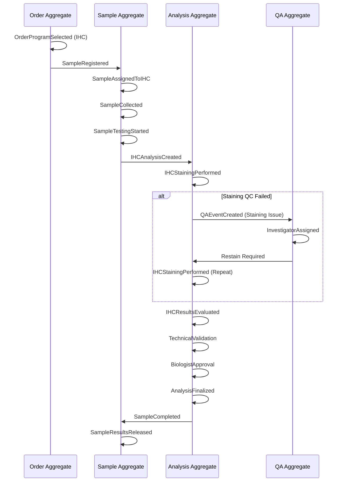
```mermaid
sequenceDiagram
    participant Order as Order Aggregate
    participant Sample as Sample Aggregate
    participant Analysis as Analysis Aggregate
    participant QA as QA Aggregate
    
    %% Order and Sample Creation
    Order->>Order: OrderProgramSelected (IHC)
    Order->>Sample: SampleRegistered
    Sample->>Sample: SampleAssignedToIHC
    Sample->>Sample: SampleCollected
    Sample->>Sample: SampleTestingStarted
    
    %% IHC Analysis Workflow  
    Sample->>Analysis: IHCAnalysisCreated
    Analysis->>Analysis: IHCStainingPerformed
    
    %% Quality Control Check
    alt Staining QC Failed
        Analysis->>QA: QAEventCreated (Staining Issue)
        QA->>QA: InvestigatorAssigned
        QA->>Analysis: Restain Required
        Analysis->>Analysis: IHCStainingPerformed (Repeat)
    end
    
    Analysis->>Analysis: IHCResultsEvaluated
    Analysis->>Analysis: TechnicalValidation
    Analysis->>Analysis: BiologistApproval
    Analysis->>Analysis: AnalysisFinalized
    
    %% Sample Completion
    Analysis->>Sample: SampleCompleted
    Sample->>Sample: SampleResultsReleased
```

### 3. Cytology Program Cross-Aggregate Workflow

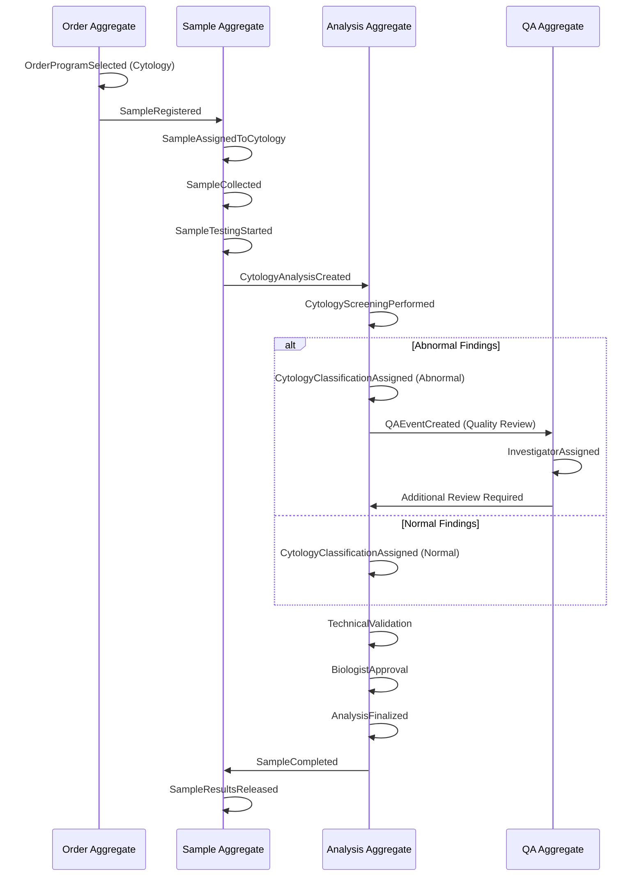
```mermaid
sequenceDiagram
    participant Order as Order Aggregate
    participant Sample as Sample Aggregate
    participant Analysis as Analysis Aggregate
    participant QA as QA Aggregate
    
    %% Order and Sample Creation
    Order->>Order: OrderProgramSelected (Cytology)
    Order->>Sample: SampleRegistered
    Sample->>Sample: SampleAssignedToCytology
    Sample->>Sample: SampleCollected
    Sample->>Sample: SampleTestingStarted
    
    %% Cytology Analysis Workflow
    Sample->>Analysis: CytologyAnalysisCreated
    Analysis->>Analysis: CytologyScreeningPerformed
    
    %% Screening Results
    alt Abnormal Findings
        Analysis->>Analysis: CytologyClassificationAssigned (Abnormal)
        Analysis->>QA: QAEventCreated (Quality Review)
        QA->>QA: InvestigatorAssigned
        QA->>Analysis: Additional Review Required
    else Normal Findings  
        Analysis->>Analysis: CytologyClassificationAssigned (Normal)
    end
    
    Analysis->>Analysis: TechnicalValidation
    Analysis->>Analysis: BiologistApproval
    Analysis->>Analysis: AnalysisFinalized
    
    %% Sample Completion
    Analysis->>Sample: SampleCompleted
    Sample->>Sample: SampleResultsReleased
```

### 4. General Laboratory Program Cross-Aggregate Workflow

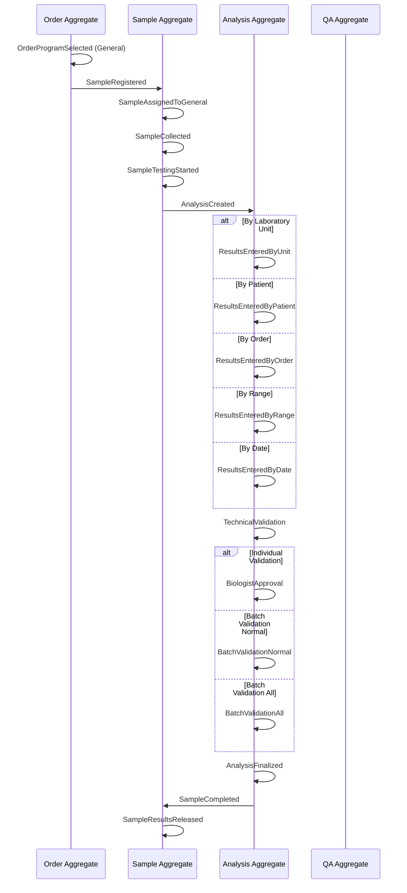
```mermaid
sequenceDiagram
    participant Order as Order Aggregate
    participant Sample as Sample Aggregate
    participant Analysis as Analysis Aggregate
    participant QA as QA Aggregate
    
    %% Standard Laboratory Workflow
    Order->>Order: OrderProgramSelected (General)
    Order->>Sample: SampleRegistered
    Sample->>Sample: SampleAssignedToGeneral
    Sample->>Sample: SampleCollected
    Sample->>Sample: SampleTestingStarted
    
    %% Standard Analysis Workflow
    Sample->>Analysis: AnalysisCreated
    
    %% Multiple Result Entry Methods
    alt By Laboratory Unit
        Analysis->>Analysis: ResultsEnteredByUnit
    else By Patient
        Analysis->>Analysis: ResultsEnteredByPatient  
    else By Order
        Analysis->>Analysis: ResultsEnteredByOrder
    else By Range
        Analysis->>Analysis: ResultsEnteredByRange
    else By Date
        Analysis->>Analysis: ResultsEnteredByDate
    end
    
    %% Validation Options
    Analysis->>Analysis: TechnicalValidation
    alt Individual Validation
        Analysis->>Analysis: BiologistApproval
    else Batch Validation Normal
        Analysis->>Analysis: BatchValidationNormal
    else Batch Validation All
        Analysis->>Analysis: BatchValidationAll
    end
    
    Analysis->>Analysis: AnalysisFinalized
    Analysis->>Sample: SampleCompleted
    Sample->>Sample: SampleResultsReleased
```

## Specialized Program Integration Patterns

### Cross-Program Quality Assurance

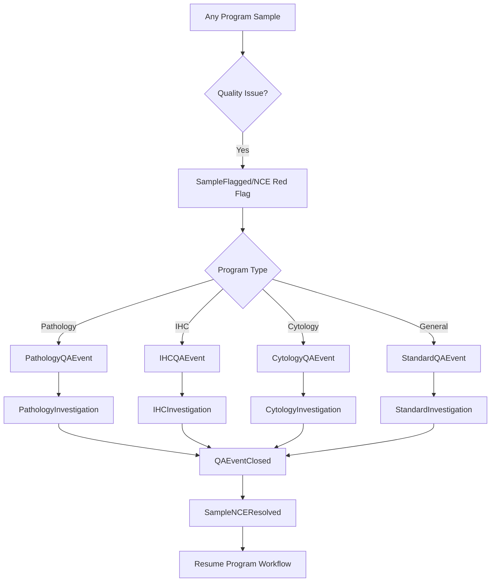
```mermaid
flowchart TD
    A[Any Program Sample] --> B{Quality Issue?}
    B -->|Yes| C[SampleFlagged/NCE Red Flag]
    C --> D{Program Type}
    D -->|Pathology| E[PathologyQAEvent]
    D -->|IHC| F[IHCQAEvent] 
    D -->|Cytology| G[CytologyQAEvent]
    D -->|General| H[StandardQAEvent]
    
    E --> I[PathologyInvestigation]
    F --> J[IHCInvestigation]
    G --> K[CytologyInvestigation]  
    H --> L[StandardInvestigation]
    
    I --> M[QAEventClosed]
    J --> M
    K --> M
    L --> M
    
    M --> N[SampleNCEResolved]
    N --> O[Resume Program Workflow]
```

### Program-Specific Error Handling

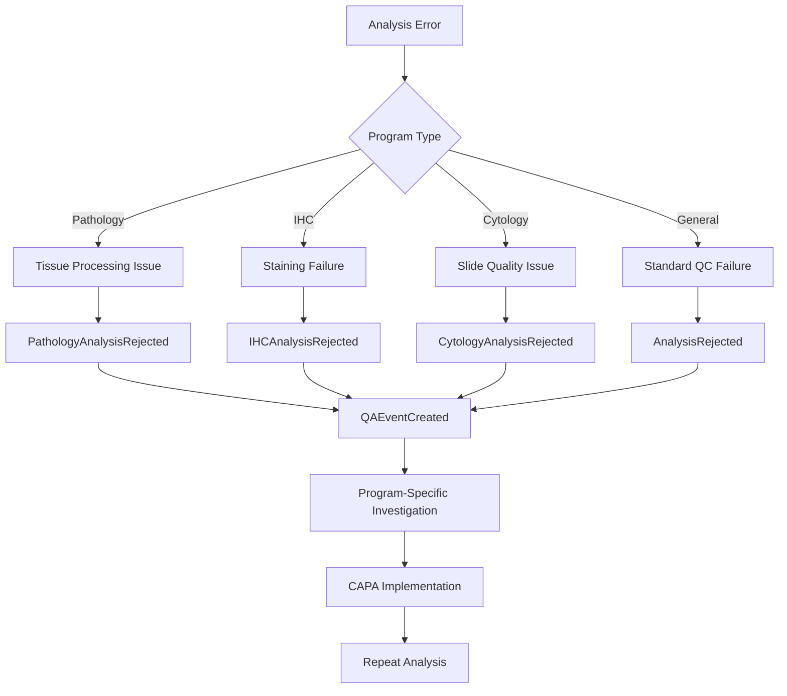
```mermaid
flowchart TD
    A[Analysis Error] --> B{Program Type}
    B -->|Pathology| C[Tissue Processing Issue]
    B -->|IHC| D[Staining Failure]
    B -->|Cytology| E[Slide Quality Issue]
    B -->|General| F[Standard QC Failure]
    
    C --> C1[PathologyAnalysisRejected]
    D --> D1[IHCAnalysisRejected] 
    E --> E1[CytologyAnalysisRejected]
    F --> F1[AnalysisRejected]
    
    C1 --> G[QAEventCreated]
    D1 --> G
    E1 --> G
    F1 --> G
    
    G --> H[Program-Specific Investigation]
    H --> I[CAPA Implementation]
    I --> J[Repeat Analysis]
```

## Comprehensive Specialized Program Workflows

### Pathology Program - Complete Workflow Documentation

Based on User Manual: **Case registration → Clinical history → Gross examination → Microscopic examination → Final diagnosis → Reporting**

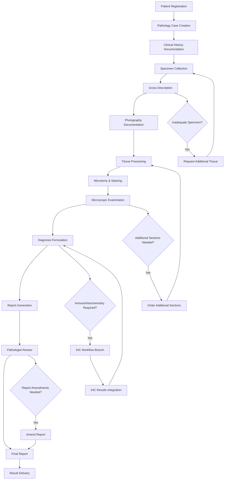
```mermaid
flowchart TD
    A[Patient Registration] --> B[Pathology Case Creation]
    B --> C[Clinical History Documentation]
    C --> D[Specimen Collection]
    D --> E[Gross Description]
    E --> F[Photography Documentation]
    F --> G[Tissue Processing]
    G --> H[Microtomy & Staining]
    H --> I[Microscopic Examination]
    I --> J[Diagnosis Formulation]
    J --> K[Report Generation]
    K --> L[Pathologist Review]
    L --> M[Final Report]
    M --> N[Result Delivery]
    
    %% Error Handling Branches
    E --> E1{Inadequate Specimen?}
    E1 -->|Yes| E2[Request Additional Tissue]
    E2 --> D
    
    I --> I1{Additional Sections Needed?}
    I1 -->|Yes| I2[Order Additional Sections]
    I2 --> G
    
    J --> J1{Immunohistochemistry Required?}
    J1 -->|Yes| J2[IHC Workflow Branch]
    J2 --> J3[IHC Results Integration]
    J3 --> J
    
    L --> L1{Report Amendments Needed?}
    L1 -->|Yes| L2[Amend Report]
    L2 --> M
```

#### Pathology Cross-Aggregate Event Flow

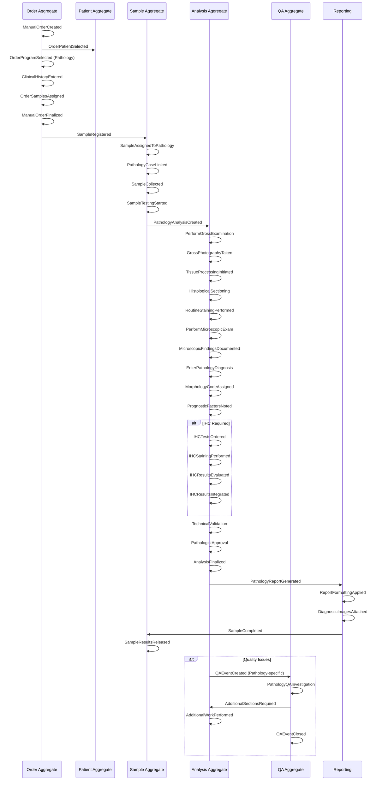
```mermaid
sequenceDiagram
    participant Order as Order Aggregate
    participant Patient as Patient Aggregate
    participant Sample as Sample Aggregate
    participant Analysis as Analysis Aggregate
    participant QA as QA Aggregate
    participant Report as Reporting
    
    %% Case Creation Phase
    Order->>Order: ManualOrderCreated
    Order->>Patient: OrderPatientSelected
    Order->>Order: OrderProgramSelected (Pathology)
    Order->>Order: ClinicalHistoryEntered
    Order->>Order: OrderSamplesAssigned
    Order->>Order: ManualOrderFinalized
    
    %% Sample Registration Phase  
    Order->>Sample: SampleRegistered
    Sample->>Sample: SampleAssignedToPathology
    Sample->>Sample: PathologyCaseLinked
    Sample->>Sample: SampleCollected
    Sample->>Sample: SampleTestingStarted
    
    %% Pathology Analysis Phase
    Sample->>Analysis: PathologyAnalysisCreated
    Analysis->>Analysis: PerformGrossExamination
    Analysis->>Analysis: GrossPhotographyTaken
    Analysis->>Analysis: TissueProcessingInitiated
    Analysis->>Analysis: HistologicalSectioning
    Analysis->>Analysis: RoutineStainingPerformed
    Analysis->>Analysis: PerformMicroscopicExam
    
    %% Diagnosis Phase
    Analysis->>Analysis: MicroscopicFindingsDocumented
    Analysis->>Analysis: EnterPathologyDiagnosis
    Analysis->>Analysis: MorphologyCodeAssigned
    Analysis->>Analysis: PrognosticFactorsNoted
    
    %% Optional IHC Branch
    alt IHC Required
        Analysis->>Analysis: IHCTestsOrdered
        Analysis->>Analysis: IHCStainingPerformed
        Analysis->>Analysis: IHCResultsEvaluated
        Analysis->>Analysis: IHCResultsIntegrated
    end
    
    %% Validation Phase
    Analysis->>Analysis: TechnicalValidation
    Analysis->>Analysis: PathologistApproval
    Analysis->>Analysis: AnalysisFinalized
    
    %% Reporting Phase
    Analysis->>Report: PathologyReportGenerated
    Report->>Report: ReportFormattingApplied
    Report->>Report: DiagnosticImagesAttached
    Report->>Sample: SampleCompleted
    Sample->>Sample: SampleResultsReleased
    
    %% Quality Assurance Integration
    alt Quality Issues
        Analysis->>QA: QAEventCreated (Pathology-specific)
        QA->>QA: PathologyQAInvestigation
        QA->>Analysis: AdditionalSectionsRequired
        Analysis->>Analysis: AdditionalWorkPerformed
        QA->>QA: QAEventClosed
    end
```

### Immunohistochemistry (IHC) Program - Complete Workflow Documentation

Based on User Manual: **Program selection → Specimen details → Test execution → Result capture → Validation → Reporting**

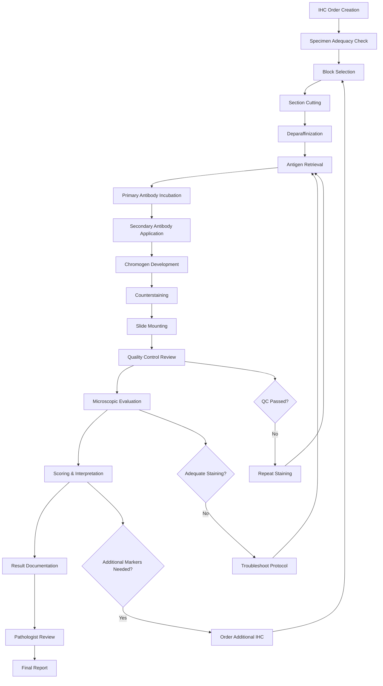
```mermaid
flowchart TD
    A[IHC Order Creation] --> B[Specimen Adequacy Check]
    B --> C[Block Selection]
    C --> D[Section Cutting]
    D --> E[Deparaffinization]
    E --> F[Antigen Retrieval]
    F --> G[Primary Antibody Incubation]
    G --> H[Secondary Antibody Application]
    H --> I[Chromogen Development]
    I --> J[Counterstaining]
    J --> K[Slide Mounting]
    K --> L[Quality Control Review]
    L --> M[Microscopic Evaluation]
    M --> N[Scoring & Interpretation]
    N --> O[Result Documentation]
    O --> P[Pathologist Review]
    P --> Q[Final Report]
    
    %% Quality Control Branches
    L --> L1{QC Passed?}
    L1 -->|No| L2[Repeat Staining]
    L2 --> F
    
    %% Inadequate Staining
    M --> M1{Adequate Staining?}
    M1 -->|No| M2[Troubleshoot Protocol]
    M2 --> F
    
    %% Additional Testing
    N --> N1{Additional Markers Needed?}
    N1 -->|Yes| N2[Order Additional IHC]
    N2 --> C
```

#### IHC Cross-Aggregate Event Flow

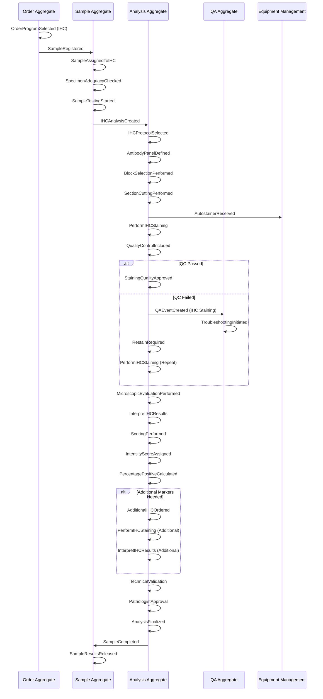
```mermaid
sequenceDiagram
    participant Order as Order Aggregate
    participant Sample as Sample Aggregate
    participant Analysis as Analysis Aggregate
    participant QA as QA Aggregate
    participant Equipment as Equipment Management
    
    %% Order Phase
    Order->>Order: OrderProgramSelected (IHC)
    Order->>Sample: SampleRegistered
    Sample->>Sample: SampleAssignedToIHC
    Sample->>Sample: SpecimenAdequacyChecked
    Sample->>Sample: SampleTestingStarted
    
    %% Pre-analytical Phase
    Sample->>Analysis: IHCAnalysisCreated
    Analysis->>Analysis: IHCProtocolSelected
    Analysis->>Analysis: AntibodyPanelDefined
    Analysis->>Analysis: BlockSelectionPerformed
    
    %% Staining Phase
    Analysis->>Analysis: SectionCuttingPerformed
    Analysis->>Equipment: AutostainerReserved
    Analysis->>Analysis: PerformIHCStaining
    Analysis->>Analysis: QualityControlIncluded
    
    %% Quality Control Phase
    alt QC Passed
        Analysis->>Analysis: StainingQualityApproved
    else QC Failed
        Analysis->>QA: QAEventCreated (IHC Staining)
        QA->>QA: TroubleshootingInitiated
        Analysis->>Analysis: RestainRequired
        Analysis->>Analysis: PerformIHCStaining (Repeat)
    end
    
    %% Interpretation Phase
    Analysis->>Analysis: MicroscopicEvaluationPerformed
    Analysis->>Analysis: InterpretIHCResults
    Analysis->>Analysis: ScoringPerformed
    Analysis->>Analysis: IntensityScoreAssigned
    Analysis->>Analysis: PercentagePositiveCalculated
    
    %% Additional Testing Decision
    alt Additional Markers Needed
        Analysis->>Analysis: AdditionalIHCOrdered
        Analysis->>Analysis: PerformIHCStaining (Additional)
        Analysis->>Analysis: InterpretIHCResults (Additional)
    end
    
    %% Finalization Phase
    Analysis->>Analysis: TechnicalValidation
    Analysis->>Analysis: PathologistApproval
    Analysis->>Analysis: AnalysisFinalized
    Analysis->>Sample: SampleCompleted
    Sample->>Sample: SampleResultsReleased
```

### Cytology Program - Complete Workflow Documentation

Based on User Manual: **Specimen collection → Slide preparation → Screening → Classification → Quality assurance → Reporting**

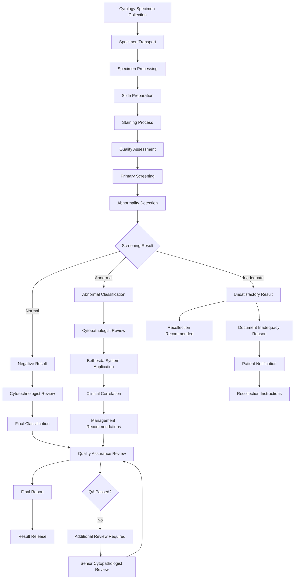
```mermaid
flowchart TD
    A[Cytology Specimen Collection] --> B[Specimen Transport]
    B --> C[Specimen Processing]
    C --> D[Slide Preparation]
    D --> E[Staining Process]
    E --> F[Quality Assessment]
    F --> G[Primary Screening]
    G --> H[Abnormality Detection]
    H --> I{Screening Result}
    I -->|Normal| J[Negative Result]
    I -->|Abnormal| K[Abnormal Classification]
    I -->|Inadequate| L[Unsatisfactory Result]
    
    J --> M[Cytotechnologist Review]
    K --> N[Cytopathologist Review]
    L --> O[Recollection Recommended]
    
    M --> P[Final Classification]
    N --> Q[Bethesda System Application]
    Q --> R[Clinical Correlation]
    R --> S[Management Recommendations]
    
    P --> T[Quality Assurance Review]
    S --> T
    T --> U[Final Report]
    U --> V[Result Release]
    
    %% Quality Assurance Branches
    T --> T1{QA Passed?}
    T1 -->|No| T2[Additional Review Required]
    T2 --> W[Senior Cytopathologist Review]
    W --> T
    
    %% Inadequate Specimen Handling
    L --> L1[Document Inadequacy Reason]
    L1 --> L2[Patient Notification]
    L2 --> L3[Recollection Instructions]
```

#### Cytology Cross-Aggregate Event Flow

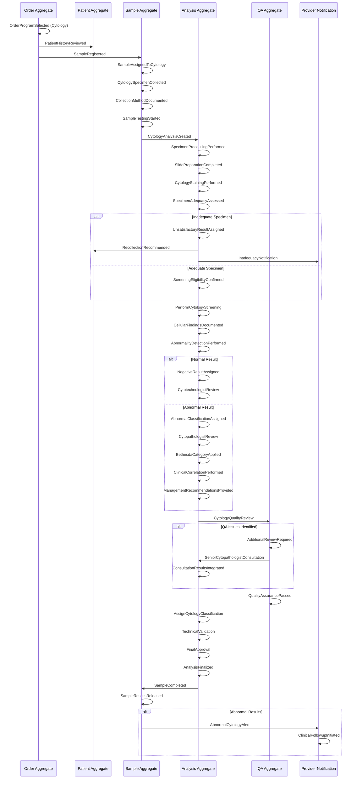
```mermaid
sequenceDiagram
    participant Order as Order Aggregate
    participant Patient as Patient Aggregate
    participant Sample as Sample Aggregate
    participant Analysis as Analysis Aggregate
    participant QA as QA Aggregate
    participant Provider as Provider Notification
    
    %% Collection Phase
    Order->>Order: OrderProgramSelected (Cytology)
    Order->>Patient: PatientHistoryReviewed
    Order->>Sample: SampleRegistered
    Sample->>Sample: SampleAssignedToCytology
    Sample->>Sample: CytologySpecimenCollected
    Sample->>Sample: CollectionMethodDocumented
    
    %% Processing Phase
    Sample->>Sample: SampleTestingStarted
    Sample->>Analysis: CytologyAnalysisCreated
    Analysis->>Analysis: SpecimenProcessingPerformed
    Analysis->>Analysis: SlidePreparationCompleted
    Analysis->>Analysis: CytologyStainingPerformed
    
    %% Quality Assessment Phase
    Analysis->>Analysis: SpecimenAdequacyAssessed
    alt Inadequate Specimen
        Analysis->>Analysis: UnsatisfactoryResultAssigned
        Analysis->>Patient: RecollectionRecommended
        Analysis->>Provider: InadequacyNotification
    else Adequate Specimen
        Analysis->>Analysis: ScreeningEligibilityConfirmed
    end
    
    %% Screening Phase
    Analysis->>Analysis: PerformCytologyScreening
    Analysis->>Analysis: CellularFindingsDocumented
    Analysis->>Analysis: AbnormalityDetectionPerformed
    
    %% Classification Phase
    alt Normal Result
        Analysis->>Analysis: NegativeResultAssigned
        Analysis->>Analysis: CytotechnologistReview
    else Abnormal Result
        Analysis->>Analysis: AbnormalClassificationAssigned
        Analysis->>Analysis: CytopathologistReview
        Analysis->>Analysis: BethesdaCategoryApplied
        Analysis->>Analysis: ClinicalCorrelationPerformed
        Analysis->>Analysis: ManagementRecommendationsProvided
    end
    
    %% Quality Assurance Phase
    Analysis->>QA: CytologyQualityReview
    alt QA Issues Identified
        QA->>QA: AdditionalReviewRequired
        QA->>Analysis: SeniorCytopathologistConsultation
        Analysis->>Analysis: ConsultationResultsIntegrated
    end
    QA->>QA: QualityAssurancePassed
    
    %% Finalization Phase
    Analysis->>Analysis: AssignCytologyClassification
    Analysis->>Analysis: TechnicalValidation
    Analysis->>Analysis: FinalApproval
    Analysis->>Analysis: AnalysisFinalized
    Analysis->>Sample: SampleCompleted
    Sample->>Sample: SampleResultsReleased
    
    %% Special Handling for Abnormal Results
    alt Abnormal Results
        Sample->>Provider: AbnormalCytologyAlert
        Provider->>Provider: ClinicalFollowupInitiated
    end
```

### 5. Enhanced Laboratory Testing Workflow with Error Handling

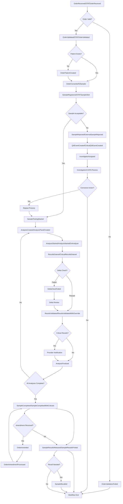
```mermaid
flowchart TD
    A[OrderReceived/STATOrderReceived] --> B{Order Valid?}
    B -->|No| C[OrderValidationFailed]
    B -->|Yes| D[OrderValidated/STATOrderValidated]
    D --> E{Patient Exists?}
    E -->|No| F[OrderPatientCreated]
    E -->|Yes| G[OrderConvertedToSample]
    F --> G
    G --> H[SampleRegistered/STATSampleAlert]
    H --> I{Sample Acceptable?}
    I -->|No| J[SampleRejected/ExternalSampleRejected]
    I -->|Yes| K[SampleTestingStarted]
    K --> L[AnalysisCreated/AnalysisPanelCreated]
    L --> M[AnalysisStarted/AnalysisStartedOnAnalyzer]
    M --> N[ResultsEntered/CriticalResultsEntered]
    N --> O{Delta Check?}
    O -->|Failed| P[DeltaCheckFailed]
    O -->|Passed| Q[ResultsValidated/ResultsValidatedWithOverride]
    P --> QA1[Delta Review]
    QA1 --> Q
    Q --> R{Critical Results?}
    R -->|Yes| S[Provider Notification]
    R -->|No| T[AnalysisFinalized]
    S --> T
    T --> U{All Analyses Complete?}
    U -->|No| L
    U -->|Yes| V[SampleCompleted/SampleCompletedWithCriticals]
    V --> W[SampleResultsReleased/SampleResultsPrinted]
    
    C --> END[Workflow End]
    J --> QA2[QAEventCreated/CriticalQAEventCreated]
    QA2 --> QA3[InvestigatorAssigned]
    QA3 --> QA4[Investigation/CAPA Process]
    QA4 --> QA5{Corrective Action?}
    QA5 -->|Yes| RETRY[Repeat Process]
    QA5 -->|No| END
    RETRY --> K
    W --> END
    
    %% Amendment handling
    V --> AME{Amendment Received?}
    AME -->|Yes| AME1[OrderAmended]
    AME1 --> AME2[OrderAmendmentProcessed]
    AME2 --> V
    AME -->|No| W
    
    %% Recall handling
    W --> REC{Recall Needed?}
    REC -->|Yes| REC1[SampleRecalled]
    REC1 --> END
    REC -->|No| END
```

### 2. Enhanced Referral Testing Workflow with Error Handling

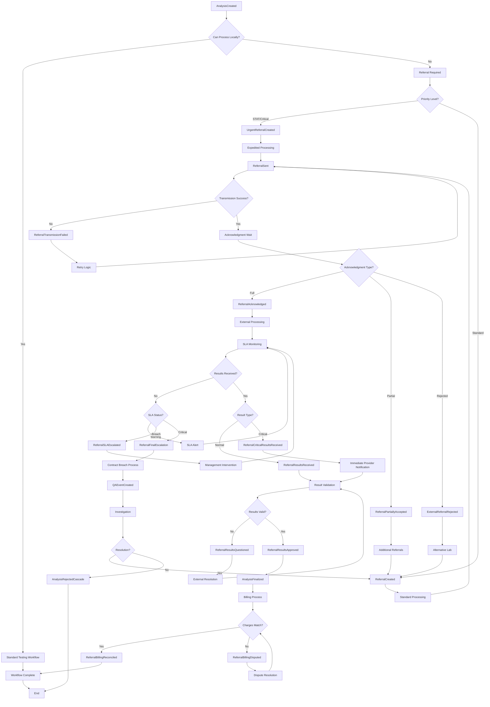
```mermaid
flowchart TD
    A[AnalysisCreated] --> B{Can Process Locally?}
    B -->|Yes| C[Standard Testing Workflow]
    B -->|No| D[Referral Required]
    D --> E{Priority Level?}
    E -->|STAT/Critical| F[UrgentReferralCreated]
    E -->|Standard| G[ReferralCreated]
    F --> H[Expedited Processing]
    G --> I[Standard Processing]
    H --> J[ReferralSent]
    I --> J
    J --> K{Transmission Success?}
    K -->|No| L[ReferralTransmissionFailed]
    K -->|Yes| M[Acknowledgment Wait]
    L --> RETRY1[Retry Logic]
    RETRY1 --> J
    M --> N{Acknowledgment Type?}
    N -->|Full| O[ReferralAcknowledged]
    N -->|Partial| P[ReferralPartiallyAccepted]
    N -->|Rejected| Q[ExternalReferralRejected]
    P --> SPLIT[Additional Referrals]
    Q --> ALT[Alternative Lab]
    SPLIT --> G
    ALT --> G
    O --> R[External Processing]
    R --> S[SLA Monitoring]
    S --> T{Results Received?}
    T -->|No| U{SLA Status?}
    U -->|Warning| V[SLA Alert]
    U -->|Breach| W[ReferralSLAEscalated]
    U -->|Critical| X[ReferralFinalEscalation]
    V --> S
    W --> Y[Management Intervention]
    X --> Z[Contract Breach Process]
    Y --> S
    T -->|Yes| AA{Result Type?}
    AA -->|Normal| BB[ReferralResultsReceived]
    AA -->|Critical| CC[ReferralCriticalResultsReceived]
    BB --> DD[Result Validation]
    CC --> EE[Immediate Provider Notification]
    EE --> DD
    DD --> FF{Results Valid?}
    FF -->|No| GG[ReferralResultsQuestioned]
    FF -->|Yes| HH[ReferralResultsApproved]
    GG --> II[External Resolution]
    II --> DD
    HH --> JJ[AnalysisFinalized]
    JJ --> KK[Billing Process]
    KK --> LL{Charges Match?}
    LL -->|Yes| MM[ReferralBillingReconciled]
    LL -->|No| NN[ReferralBillingDisputed]
    NN --> OO[Dispute Resolution]
    OO --> LL
    MM --> PP[Workflow Complete]
    
    C --> PP
    Z --> QQ[QAEventCreated]
    QQ --> RR[Investigation]
    RR --> SS{Resolution?}
    SS -->|Yes| G
    SS -->|No| TT[AnalysisRejectedCascade]
    PP --> END[End]
    TT --> END
```
```

### 3. Quality Assurance Workflow

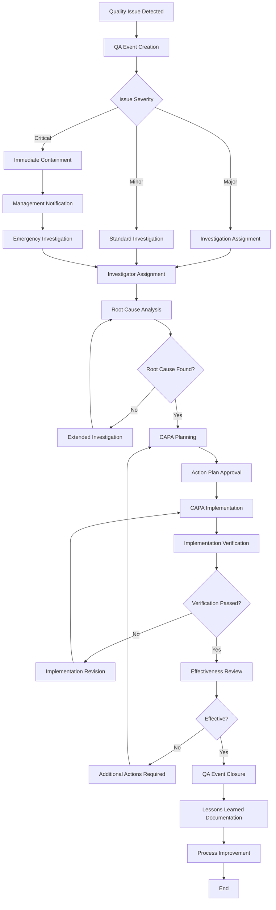
```mermaid
flowchart TD
    A[Quality Issue Detected] --> B[QA Event Creation]
    B --> C{Issue Severity}
    C -->|Critical| D[Immediate Containment]
    C -->|Major| E[Investigation Assignment]
    C -->|Minor| F[Standard Investigation]
    
    D --> G[Management Notification]
    G --> H[Emergency Investigation]
    
    E --> I[Investigator Assignment]
    F --> I
    H --> I
    
    I --> J[Root Cause Analysis]
    J --> K{Root Cause Found?}
    K -->|No| L[Extended Investigation]
    K -->|Yes| M[CAPA Planning]
    
    L --> J
    
    M --> N[Action Plan Approval]
    N --> O[CAPA Implementation]
    O --> P[Implementation Verification]
    P --> Q{Verification Passed?}
    Q -->|No| R[Implementation Revision]
    Q -->|Yes| S[Effectiveness Review]
    
    R --> O
    
    S --> T{Effective?}
    T -->|No| U[Additional Actions Required]
    T -->|Yes| V[QA Event Closure]
    
    U --> M
    V --> W[Lessons Learned Documentation]
    W --> X[Process Improvement]
    X --> Y[End]
```

## Cross-Aggregate Event Flows

### 1. Order to Results Flow

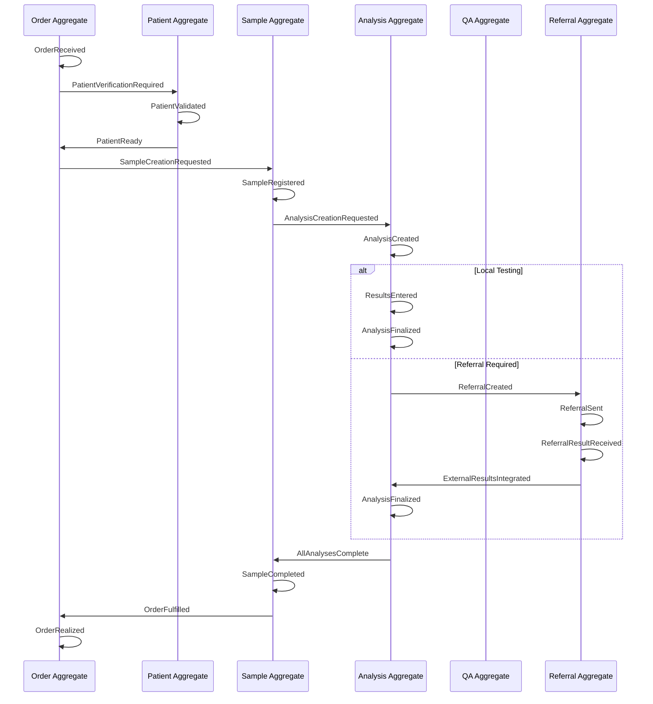
```mermaid
sequenceDiagram
    participant Order as Order Aggregate
    participant Patient as Patient Aggregate
    participant Sample as Sample Aggregate
    participant Analysis as Analysis Aggregate
    participant QA as QA Aggregate
    participant Referral as Referral Aggregate
    
    Order->>Order: OrderReceived
    Order->>Patient: PatientVerificationRequired
    Patient->>Patient: PatientValidated
    Patient->>Order: PatientReady
    Order->>Sample: SampleCreationRequested
    Sample->>Sample: SampleRegistered
    Sample->>Analysis: AnalysisCreationRequested
    Analysis->>Analysis: AnalysisCreated
    
    alt Local Testing
        Analysis->>Analysis: ResultsEntered
        Analysis->>Analysis: AnalysisFinalized
    else Referral Required
        Analysis->>Referral: ReferralCreated
        Referral->>Referral: ReferralSent
        Referral->>Referral: ReferralResultReceived
        Referral->>Analysis: ExternalResultsIntegrated
        Analysis->>Analysis: AnalysisFinalized
    end
    
    Analysis->>Sample: AllAnalysesComplete
    Sample->>Sample: SampleCompleted
    Sample->>Order: OrderFulfilled
    Order->>Order: OrderRealized
```

### 2. Quality Exception Flow

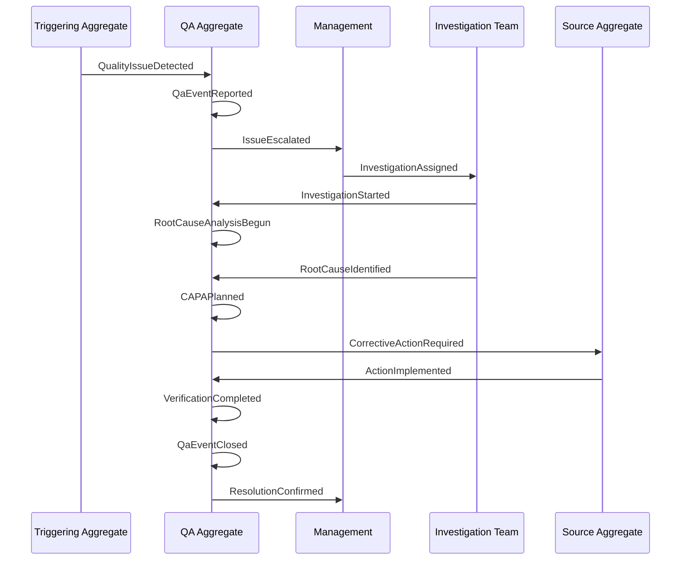
```mermaid
sequenceDiagram
    participant Trigger as Triggering Aggregate
    participant QA as QA Aggregate
    participant Management as Management
    participant Investigation as Investigation Team
    participant Source as Source Aggregate
    
    Trigger->>QA: QualityIssueDetected
    QA->>QA: QaEventReported
    QA->>Management: IssueEscalated
    Management->>Investigation: InvestigationAssigned
    Investigation->>QA: InvestigationStarted
    QA->>QA: RootCauseAnalysisBegun
    Investigation->>QA: RootCauseIdentified
    QA->>QA: CAPAPlanned
    QA->>Source: CorrectiveActionRequired
    Source->>QA: ActionImplemented
    QA->>QA: VerificationCompleted
    QA->>QA: QaEventClosed
    QA->>Management: ResolutionConfirmed
```

### 3. Patient Demographics Synchronization

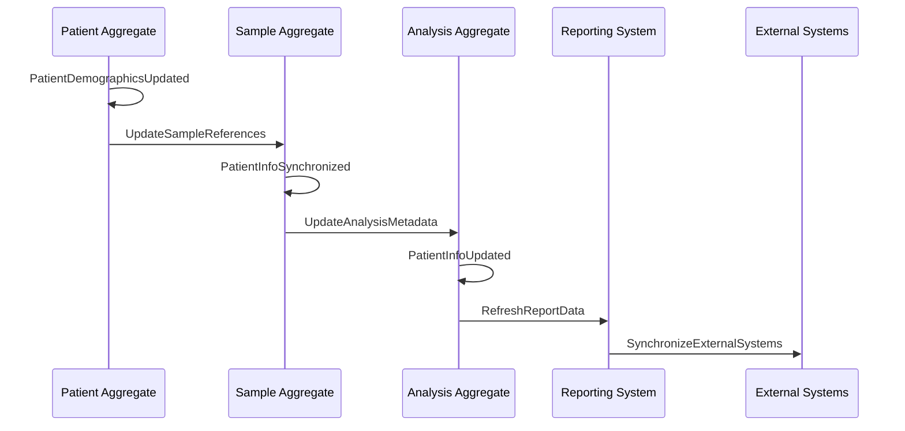
```mermaid
sequenceDiagram
    participant Patient as Patient Aggregate
    participant Sample as Sample Aggregate
    participant Analysis as Analysis Aggregate
    participant Report as Reporting System
    participant External as External Systems
    
    Patient->>Patient: PatientDemographicsUpdated
    Patient->>Sample: UpdateSampleReferences
    Sample->>Sample: PatientInfoSynchronized
    Sample->>Analysis: UpdateAnalysisMetadata
    Analysis->>Analysis: PatientInfoUpdated
    Analysis->>Report: RefreshReportData
    Report->>External: SynchronizeExternalSystems
```

## Saga Patterns for Cross-Aggregate Transactions

### 1. Sample Processing Saga

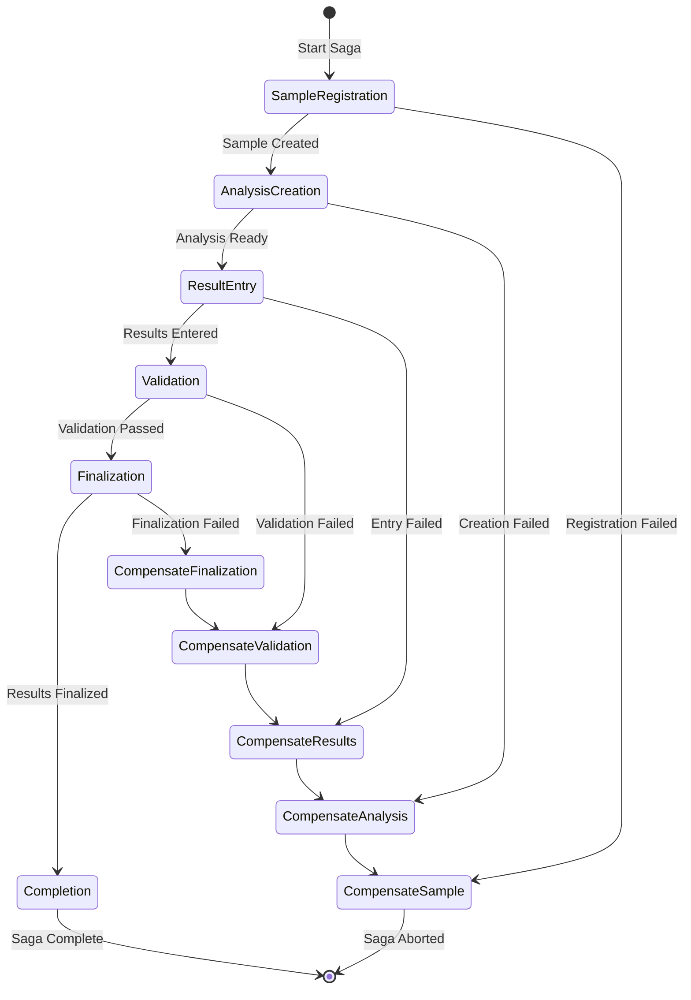
```mermaid
stateDiagram-v2
    [*] --> SampleRegistration : Start Saga
    SampleRegistration --> AnalysisCreation : Sample Created
    AnalysisCreation --> ResultEntry : Analysis Ready
    ResultEntry --> Validation : Results Entered
    Validation --> Finalization : Validation Passed
    Finalization --> Completion : Results Finalized
    Completion --> [*] : Saga Complete
    
    SampleRegistration --> CompensateSample : Registration Failed
    AnalysisCreation --> CompensateAnalysis : Creation Failed
    ResultEntry --> CompensateResults : Entry Failed
    Validation --> CompensateValidation : Validation Failed
    Finalization --> CompensateFinalization : Finalization Failed
    
    CompensateSample --> [*] : Saga Aborted
    CompensateAnalysis --> CompensateSample
    CompensateResults --> CompensateAnalysis
    CompensateValidation --> CompensateResults
    CompensateFinalization --> CompensateValidation
```

### 2. Referral Processing Saga

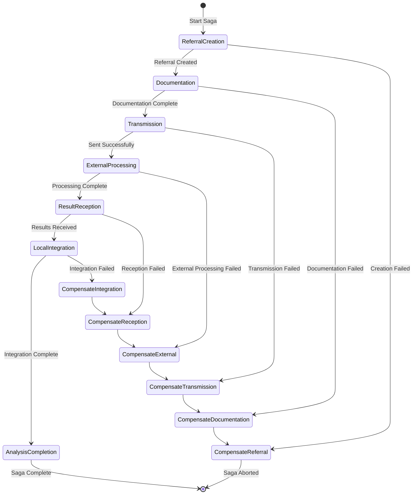
```mermaid
stateDiagram-v2
    [*] --> ReferralCreation : Start Saga
    ReferralCreation --> Documentation : Referral Created
    Documentation --> Transmission : Documentation Complete
    Transmission --> ExternalProcessing : Sent Successfully
    ExternalProcessing --> ResultReception : Processing Complete
    ResultReception --> LocalIntegration : Results Received
    LocalIntegration --> AnalysisCompletion : Integration Complete
    AnalysisCompletion --> [*] : Saga Complete
    
    ReferralCreation --> CompensateReferral : Creation Failed
    Documentation --> CompensateDocumentation : Documentation Failed
    Transmission --> CompensateTransmission : Transmission Failed
    ExternalProcessing --> CompensateExternal : External Processing Failed
    ResultReception --> CompensateReception : Reception Failed
    LocalIntegration --> CompensateIntegration : Integration Failed
    
    CompensateReferral --> [*] : Saga Aborted
    CompensateDocumentation --> CompensateReferral
    CompensateTransmission --> CompensateDocumentation
    CompensateExternal --> CompensateTransmission
    CompensateReception --> CompensateExternal
    CompensateIntegration --> CompensateReception
```

## Event Choreography Patterns

### 1. Event-Driven Sample Lifecycle

```mermaid
graph LR
    A[OrderReceived] --> B[SampleRegistered]
    B --> C[AnalysisCreated]
    C --> D[ResultsEntered]
    D --> E[TechnicalValidation]
    E --> F[BiologistApproval]
    F --> G[AnalysisFinalized]
    G --> H[SampleCompleted]
    H --> I[ReportGenerated]
    
    D --> J[TechnicalRejection]
    F --> K[BiologistRejection]
    J --> L[QaEventCreated]
    K --> L
    L --> M[QaInvestigationStarted]
    M --> N[CorrectiveActionPlanned]
    N --> O[CAPAImplemented]
    O --> P[QaEventClosed]
    P --> Q[RetestRequired]
    Q --> C
```

### 2. Priority-Based Processing

```mermaid
graph TD
    A[StatOrderReceived] --> B[UrgentSampleRegistered]
    B --> C[PriorityAnalysisCreated]
    C --> D[ExpeditedProcessing]
    D --> E[RushResultValidation]
    E --> F[ImmediateReporting]
    
    G[RoutineOrderReceived] --> H[StandardSampleRegistered]
    H --> I[RoutineAnalysisCreated]
    I --> J[StandardProcessing]
    J --> K[NormalValidation]
    K --> L[StandardReporting]
    
    M[ASAPOrderReceived] --> N[ExpeditedSampleRegistered]
    N --> O[ASAPAnalysisCreated]
    O --> P[AcceleratedProcessing]
    P --> Q[FastTrackValidation]
    Q --> R[PriorityReporting]
```

## Consistency Patterns

### 1. Eventual Consistency with Compensation

```java
// Example: Sample completion with analysis dependencies
@EventHandler
public void on(AnalysisFinalized event) {
    // Check if all analyses for sample are complete
    Sample sample = sampleRepository.get(event.getSampleId());
    List<Analysis> analyses = analysisRepository.getBySampleId(event.getSampleId());
    
    boolean allComplete = analyses.stream()
        .allMatch(analysis -> analysis.getStatus() == AnalysisStatus.FINALIZED);
    
    if (allComplete) {
        // Eventual consistency - sample completion
        eventBus.publish(new SampleCompleted(sample.getId()));
    }
}

@EventHandler
public void on(AnalysisRejected event) {
    // Compensation - sample cannot be completed
    Sample sample = sampleRepository.get(event.getSampleId());
    if (sample.getStatus() == SampleStatus.COMPLETED) {
        // Compensate - revert sample status
        eventBus.publish(new SampleStatusReverted(sample.getId()));
    }
}
```

### 2. Distributed Locks for Critical Sections

```java
// Example: Patient merge operation across aggregates
@Transactional
public void mergePatients(String primaryPatientId, String duplicatePatientId) {
    // Acquire distributed locks
    DistributedLock patientLock = lockService.acquire("patient:" + primaryPatientId);
    DistributedLock sampleLock = lockService.acquire("samples:" + duplicatePatientId);
    
    try {
        // Atomic cross-aggregate operation
        Patient primary = patientRepository.get(primaryPatientId);
        Patient duplicate = patientRepository.get(duplicatePatientId);
        
        // Merge patient data
        primary.merge(duplicate);
        patientRepository.save(primary);
        
        // Update sample references
        List<Sample> samples = sampleRepository.getByPatientId(duplicatePatientId);
        samples.forEach(sample -> {
            sample.setPatientId(primaryPatientId);
            sampleRepository.save(sample);
        });
        
        // Soft delete duplicate
        duplicate.markAsDeleted();
        patientRepository.save(duplicate);
        
        // Publish merge event
        eventBus.publish(new PatientMerged(primaryPatientId, duplicatePatientId));
        
    } finally {
        patientLock.release();
        sampleLock.release();
    }
}
```

## Dapr Workflow Integration Points

### 1. Complex Sample Processing Workflow

```yaml
# Dapr workflow definition for sample processing
name: SampleProcessingWorkflow
version: 1.0
spec:
  activities:
    - name: ValidateSample
      type: activity
      input: sampleData
      timeout: 5m
      
    - name: CreateAnalyses
      type: activity
      input: sampleId
      timeout: 10m
      
    - name: ProcessResults
      type: parallel
      branches:
        - name: TechnicalValidation
          activities:
            - ValidateResults
            - CheckQC
        - name: BiologistReview
          activities:
            - ReviewResults
            - ApproveResults
            
    - name: FinalizeResults
      type: activity
      input: analysisResults
      timeout: 5m
      
  error_handling:
    - activity: ValidateSample
      retry:
        max_attempts: 3
        backoff: exponential
      compensation: RejectSample
      
    - activity: ProcessResults
      timeout: 2h
      compensation: CancelProcessing
```

### 2. QA Investigation Workflow

```yaml
# Dapr workflow for QA investigation process
name: QAInvestigationWorkflow
version: 1.0
spec:
  activities:
    - name: AssignInvestigator
      type: human_task
      assignee: qa_team
      timeout: 1h
      
    - name: ConductRCA
      type: activity
      input: qaEventId
      timeout: 48h
      
    - name: PlanCAPA
      type: human_task
      assignee: qa_manager
      timeout: 24h
      
    - name: ImplementActions
      type: parallel
      branches:
        - name: ImmediateActions
          timeout: 4h
        - name: LongTermActions
          timeout: 30d
          
    - name: VerifyEffectiveness
      type: activity
      input: capaResults
      timeout: 7d
      
  escalation:
    - condition: timeout
      escalate_to: qa_director
      notification: immediate
```

## Performance Considerations

### 1. Event Ordering Guarantees

```java
// Ensure proper event ordering for sample lifecycle
@Component
public class SampleEventOrdering {
    
    @EventHandler
    @Order(1)
    public void handleSampleRegistered(SampleRegistered event) {
        // Process first
    }
    
    @EventHandler
    @Order(2)
    public void handleAnalysisCreated(AnalysisCreated event) {
        // Process after sample registration
    }
    
    @EventHandler
    @Order(3)
    public void handleSampleCompleted(SampleCompleted event) {
        // Process last
    }
}
```

### 2. Batch Processing for High Volume

```java
// Batch processing for high-volume order processing
@Service
public class BatchOrderProcessor {
    
    @Scheduled(fixedDelay = 30000) // Every 30 seconds
    public void processBatchOrders() {
        List<ElectronicOrder> pendingOrders = orderRepository
            .findByStatus(OrderStatus.PENDING)
            .limit(100); // Process in batches of 100
            
        for (ElectronicOrder order : pendingOrders) {
            processOrderAsync(order);
        }
    }
    
    @Async
    public CompletableFuture<Void> processOrderAsync(ElectronicOrder order) {
        // Asynchronous order processing
        return CompletableFuture.runAsync(() -> {
            orderProcessingService.process(order);
        });
    }
}
```

## Monitoring and Observability

### 1. Cross-Aggregate Tracing

```java
// Distributed tracing for cross-aggregate workflows
@Component
public class WorkflowTracing {
    
    @EventHandler
    public void handleSampleRegistered(SampleRegistered event) {
        try (Scope scope = tracer.spanBuilder("sample-processing")
                .setParent(Context.current())
                .startScopedSpan()) {
            
            Span.current().setAttribute("sample.id", event.getSampleId());
            Span.current().setAttribute("workflow.stage", "registration");
            
            // Process event
            sampleProcessingService.process(event);
        }
    }
}
```

### 2. Workflow Health Monitoring

```java
// Health checks for cross-aggregate workflows
@Component
public class WorkflowHealthIndicator implements HealthIndicator {
    
    @Override
    public Health health() {
        // Check critical workflow components
        boolean samplesProcessing = checkSampleProcessingHealth();
        boolean qaWorkflowHealthy = checkQAWorkflowHealth();
        boolean referralsWorking = checkReferralWorkflowHealth();
        
        if (samplesProcessing && qaWorkflowHealthy && referralsWorking) {
            return Health.up()
                .withDetail("workflows", "All workflows operational")
                .build();
        } else {
            return Health.down()
                .withDetail("sample_processing", samplesProcessing)
                .withDetail("qa_workflow", qaWorkflowHealthy)
                .withDetail("referral_workflow", referralsWorking)
                .build();
        }
    }
}
```

## Migration Strategy

### Phase 1: Event Publishing
- Add event publishing to existing cross-aggregate operations
- Implement event handlers for workflow coordination
- Build monitoring and tracing capabilities

### Phase 2: Saga Implementation
- Replace synchronous cross-aggregate calls with saga patterns
- Implement compensation logic for failed workflows
- Add distributed transaction management

### Phase 3: Dapr Workflow Integration
- Migrate complex workflows to Dapr workflow engine
- Implement human task integration
- Add advanced workflow patterns and error handling