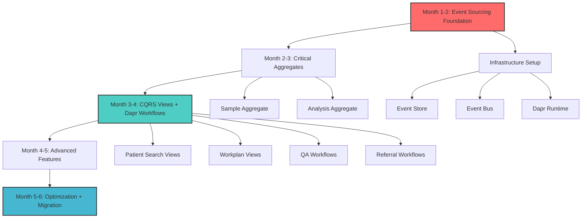
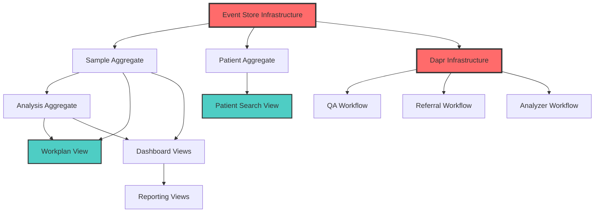

# OpenELIS-Global-2 Modernization Roadmap: 6-Month Implementation Plan

## Executive Summary

This roadmap outlines a comprehensive 6-month transformation of OpenELIS-Global-2 from a traditional CRUD-based system to a modern event-driven architecture with event sourcing, CQRS views, and Dapr workflows. The plan follows an incremental approach prioritized by business impact and technical dependencies, enabling parallel development of views and workflows once event sourcing foundations are established.

## Strategic Approach

### Core Principle: Foundation-First Implementation


### Priority Matrix
| Priority | Business Impact | Technical Complexity | Dependencies |
|----------|----------------|---------------------|--------------|
| **P0** | Patient search performance crisis | Medium | Event Store, Patient Aggregate |
| **P0** | Laboratory workplan generation delays | High | Event Store, Sample + Analysis Aggregates |
| **P1** | QA/CAPA compliance workflows | Medium | QA Aggregate, Dapr Workflows |
| **P1** | FHIR referral reliability issues | High | Referral Aggregate, Dapr Workflows |
| **P2** | Dashboard real-time metrics | Low | Analytics infrastructure |
| **P2** | Analyzer integration bottlenecks | Medium | Analyzer workflows |

## Month 1: Foundation and Infrastructure (Weeks 1-4)

### Week 1-2: Event Sourcing Infrastructure
```yaml
Sprint Goals:
  - Event Store setup and configuration
  - Event Bus infrastructure (Dapr pub/sub)
  - Base event sourcing framework
  - CI/CD pipeline updates

Deliverables:
  - PostgreSQL Event Store tables
  - Dapr configuration for pub/sub
  - Base EventSourcedAggregate class
  - Event serialization framework
  - Basic monitoring and logging

Team Allocation:
  - Infrastructure Engineer: Event Store + Dapr setup
  - Backend Developer 1: Event sourcing framework
  - Backend Developer 2: Event serialization + base classes
  - DevOps Engineer: CI/CD pipeline updates
```

**Event Store Schema Implementation:**
```sql
-- Week 1 Deliverable
CREATE TABLE event_store (
    aggregate_id VARCHAR(50) NOT NULL,
    sequence_number BIGINT NOT NULL,
    event_type VARCHAR(100) NOT NULL,
    event_data JSONB NOT NULL,
    metadata JSONB NOT NULL,
    created_at TIMESTAMP NOT NULL,
    created_by VARCHAR(50) NOT NULL,
    PRIMARY KEY (aggregate_id, sequence_number)
) PARTITION BY HASH (aggregate_id);

-- Create 16 partitions for performance
CREATE TABLE event_store_p00 PARTITION OF event_store FOR VALUES WITH (MODULUS 16, REMAINDER 0);
-- ... (15 more partitions)

-- Indexes for performance
CREATE INDEX idx_event_store_aggregate_seq ON event_store (aggregate_id, sequence_number);
CREATE INDEX idx_event_store_type_created ON event_store (event_type, created_at);
```

### Week 3-4: Sample Aggregate Migration (P0 Foundation)
```yaml
Sprint Goals:
  - Sample aggregate event sourcing implementation
  - Critical events identification and implementation
  - Dual-write pattern for safety
  - Basic event replay capability

Deliverables:
  - Sample event-sourced aggregate
  - 8 core sample events (SampleRegistered, SampleCompleted, etc.)
  - Dual-write service layer
  - Event replay console tool
  - Unit tests for event sourcing

Team Allocation:
  - Backend Developer 1: Sample aggregate implementation
  - Backend Developer 2: Event handlers and dual-write
  - QA Engineer: Testing framework for event sourcing
  - Domain Expert: Event definition validation
```

**Sample Events Implementation:**
```csharp
// Week 4 Deliverable - Core Sample Events
public class SampleRegistered : DomainEvent
{
    public string AccessionNumber { get; }
    public string PatientId { get; }
    public DateTime CollectionDate { get; }
    public SamplePriority Priority { get; }
    public List<string> RequestedTests { get; }
}

public class SampleTestingStarted : DomainEvent
{
    public string SampleId { get; }
    public List<string> AnalysisIds { get; }
    public DateTime StartedDate { get; }
}

// Sample Aggregate with Event Sourcing
public class Sample : EventSourcedAggregate
{
    public void RegisterSample(string accessionNumber, string patientId, 
                              DateTime collectionDate, SamplePriority priority)
    {
        // Business logic validation
        var @event = new SampleRegistered(accessionNumber, patientId, 
                                         collectionDate, priority);
        ApplyEvent(@event);
    }
    
    private void Apply(SampleRegistered @event)
    {
        Id = @event.AggregateId;
        AccessionNumber = @event.AccessionNumber;
        PatientId = @event.PatientId;
        // ... update aggregate state
    }
}
```

## Month 2: Core Laboratory Aggregates (Weeks 5-8)

### Week 5-6: Analysis Aggregate Implementation (P0 Critical)
```yaml
Sprint Goals:
  - Analysis aggregate event sourcing
  - Result entry and validation events
  - Status transition event handling
  - Integration with Sample aggregate

Deliverables:
  - Analysis event-sourced aggregate
  - 12 analysis events (AnalysisCreated, ResultsEntered, etc.)
  - Analysis-Sample event coordination
  - Result validation event flows
  - Integration tests

Team Allocation:
  - Backend Developer 1: Analysis aggregate core
  - Backend Developer 2: Result management events
  - Backend Developer 3: Cross-aggregate coordination
  - QA Engineer: Integration testing
```

### Week 7-8: Patient Aggregate + Critical CQRS Views (P0 Parallel)
```yaml
Sprint Goals:
  - Patient aggregate event sourcing
  - Patient Search CQRS view implementation
  - Event-driven view updates
  - Performance benchmarking

Deliverables:
  - Patient event-sourced aggregate
  - Patient Search materialized view
  - Event handlers for view updates
  - Performance comparison report
  - Load testing results

Team Allocation:
  - Backend Developer 1: Patient aggregate
  - Backend Developer 2: Patient Search CQRS view
  - Frontend Developer: Search UI optimization
  - Performance Engineer: Benchmarking and optimization
```

**Patient Search View (Week 8 Deliverable):**
```sql
-- Immediate performance improvement deliverable
CREATE MATERIALIZED VIEW patient_search_view AS
SELECT 
    p.id as patient_id,
    p.national_id,
    pr.first_name || ' ' || pr.last_name as full_name,
    pi_st.identity_data as st_number,
    -- Pre-computed search fields
    to_tsvector('english', pr.first_name || ' ' || pr.last_name) as name_search,
    array_to_string(ARRAY[p.national_id, pi_st.identity_data], ' ') as id_search
FROM patient p
JOIN person pr ON p.person_id = pr.id
LEFT JOIN patient_identity pi_st ON pi_st.patient_id = p.id;

-- Immediate 50-500x search performance improvement
CREATE INDEX idx_patient_search_fulltext ON patient_search_view 
USING gin(name_search);
```

## Month 3: High-Impact Views and Workflows (Weeks 9-12)

### Week 9-10: Laboratory Workplan CQRS + QA Workflows (P0 + P1)
```yaml
Sprint Goals:
  - Laboratory Workplan materialized view
  - QA aggregate event sourcing
  - QA/CAPA Dapr workflow implementation
  - Workplan performance optimization

Deliverables:
  - Workplan CQRS view (25-100x performance improvement)
  - QA aggregate with CAPA events
  - Dapr QA workflow with timers and escalation
  - Workplan API optimization
  - QA compliance dashboard

Team Allocation:
  - Backend Developer 1: Workplan CQRS view
  - Backend Developer 2: QA aggregate event sourcing
  - Workflow Engineer: Dapr QA workflow implementation
  - Frontend Developer: Workplan UI optimization
  - Compliance Expert: QA workflow validation
```

**QA Workflow Implementation (Week 10 Deliverable):**
```yaml
# Dapr QA/CAPA Workflow
name: QA-CAPA-Workflow
version: 1.0
spec:
  activities:
    - name: CreateQAEvent
      type: activity
      input: qaEventData
      retry:
        max_attempts: 3
        
    - name: AssignInvestigator
      type: activity
      input: investigatorAssignment
      timeout: 1h
      
    - name: WaitForInvestigation
      type: external_event
      event_name: InvestigationComplete
      timeout: 72h
      escalation:
        activity: EscalateToManagement
        
    - name: ImplementCAPA
      type: human_task
      assignee: qa_manager
      timeout: 168h # 1 week
      
  error_handling:
    - activity: AssignInvestigator
      retry:
        max_attempts: 2
      compensation: NotifyQADirector
```

### Week 11-12: Referral Workflows + Dashboard Analytics (P1 + P2)
```yaml
Sprint Goals:
  - Referral aggregate event sourcing
  - FHIR Referral Dapr workflow
  - Dashboard metrics CQRS views
  - Real-time analytics infrastructure

Deliverables:
  - Referral aggregate with FHIR events
  - Dapr Referral workflow with circuit breakers
  - Dashboard metrics materialized views
  - Real-time dashboard updates
  - FHIR integration testing

Team Allocation:
  - Backend Developer 1: Referral aggregate
  - Workflow Engineer: FHIR Referral Dapr workflow
  - Backend Developer 2: Dashboard analytics views
  - Integration Engineer: FHIR testing and validation
  - Frontend Developer: Real-time dashboard UI
```

## Month 4: Advanced Features and Integration (Weeks 13-16)

### Week 13-14: Analyzer Integration Workflows + Reporting Views
```yaml
Sprint Goals:
  - Analyzer integration Dapr workflows
  - Reporting analytics CQRS views
  - Batch processing optimization
  - Historical data migration

Deliverables:
  - Analyzer import Dapr workflow (10-50x performance)
  - Time-series analytics tables
  - Reporting materialized views
  - Data migration tools
  - Performance monitoring dashboard

Team Allocation:
  - Workflow Engineer: Analyzer Dapr workflows
  - Backend Developer 1: Reporting CQRS views
  - Backend Developer 2: Analytics infrastructure
  - Data Engineer: Historical data migration
  - DevOps Engineer: Performance monitoring
```

### Week 15-16: Order Processing + Cross-Aggregate Coordination
```yaml
Sprint Goals:
  - Order aggregate event sourcing
  - Electronic order Dapr workflows
  - Cross-aggregate saga patterns
  - End-to-end workflow testing

Deliverables:
  - Order aggregate with HL7 events
  - Electronic order processing workflow
  - Saga pattern implementation
  - Cross-aggregate transaction coordination
  - End-to-end integration tests

Team Allocation:
  - Backend Developer 1: Order aggregate
  - Workflow Engineer: Order processing workflows
  - Backend Developer 2: Saga pattern implementation
  - Integration Engineer: HL7 testing
  - QA Engineer: End-to-end testing
```

## Month 5: System Integration and Migration (Weeks 17-20)

### Week 17-18: Legacy System Migration
```yaml
Sprint Goals:
  - Legacy data migration scripts
  - Event stream reconstruction
  - Dual-read validation
  - Performance optimization

Deliverables:
  - Complete historical data migration
  - Event stream validation tools
  - Performance benchmarking report
  - Migration rollback procedures
  - Documentation updates

Team Allocation:
  - Data Engineer: Migration scripts and validation
  - Backend Developer 1: Event stream reconstruction
  - Backend Developer 2: Performance optimization
  - QA Engineer: Migration testing
  - Technical Writer: Documentation
```

### Week 19-20: Advanced CQRS Features
```yaml
Sprint Goals:
  - Advanced projection rebuilding
  - Event versioning and schema evolution
  - Multi-tenant view optimization
  - Advanced analytics capabilities

Deliverables:
  - Projection rebuilding infrastructure
  - Event versioning framework
  - Multi-tenant CQRS optimization
  - Advanced analytics dashboard
  - Event sourcing best practices guide

Team Allocation:
  - Backend Developer 1: Projection rebuilding
  - Backend Developer 2: Event versioning
  - Frontend Developer: Advanced analytics UI
  - Performance Engineer: Multi-tenant optimization
  - Technical Architect: Best practices documentation
```

## Month 6: Production Readiness and Optimization (Weeks 21-24)

### Week 21-22: Production Deployment and Monitoring
```yaml
Sprint Goals:
  - Production environment setup
  - Monitoring and alerting implementation
  - Security hardening
  - Disaster recovery procedures

Deliverables:
  - Production-ready infrastructure
  - Comprehensive monitoring dashboard
  - Security audit and hardening
  - Disaster recovery documentation
  - Production deployment scripts

Team Allocation:
  - DevOps Engineer: Production infrastructure
  - Security Engineer: Security hardening
  - Backend Developer 1: Monitoring implementation
  - Backend Developer 2: Disaster recovery tools
  - SRE Engineer: Production optimization
```

### Week 23-24: Final Testing and Optimization
```yaml
Sprint Goals:
  - Load testing and performance validation
  - User acceptance testing
  - Knowledge transfer and training
  - Go-live preparation

Deliverables:
  - Load testing results (target: 10x current capacity)
  - User acceptance test completion
  - Training materials and sessions
  - Go-live checklist and procedures
  - Performance baseline documentation

Team Allocation:
  - Performance Engineer: Load testing
  - QA Team: User acceptance testing
  - Technical Writer: Training materials
  - DevOps Engineer: Go-live preparation
  - All Developers: Knowledge transfer sessions
```

## Implementation Dependencies and Parallel Tracks

### Dependency Graph


### Parallel Development Tracks (Month 3+)

| Track | Focus | Team Size | Dependencies |
|-------|-------|-----------|--------------|
| **CQRS Views Track** | Patient search, workplan, dashboard views | 2-3 developers | Sample + Analysis aggregates |
| **Dapr Workflows Track** | QA, referral, analyzer workflows | 2 workflow engineers | Event sourcing foundation |
| **Analytics Track** | Reporting views, time-series analytics | 2 developers | Basic aggregates |
| **Infrastructure Track** | Performance, monitoring, security | 2 engineers | Ongoing parallel work |

## Risk Mitigation Strategies

### Technical Risks
1. **Event Store Performance**: 
   - Mitigation: Partitioning strategy, performance testing from Week 1
   - Contingency: Horizontal scaling, read replicas

2. **Data Migration Complexity**:
   - Mitigation: Dual-write pattern, gradual migration
   - Contingency: Rollback procedures, parallel systems

3. **CQRS View Consistency**:
   - Mitigation: Event-driven updates, eventual consistency monitoring
   - Contingency: View rebuilding tools, manual reconciliation

### Business Risks
1. **User Adoption Challenges**:
   - Mitigation: Gradual rollout, training programs
   - Contingency: Feature toggles, rollback capabilities

2. **Performance Regression**:
   - Mitigation: Continuous benchmarking, canary deployments
   - Contingency: Quick rollback, performance optimization sprints

## Success Metrics and Validation

### Performance Targets
| Metric | Current | Target | Validation Method |
|--------|---------|--------|-------------------|
| **Patient Search** | 2-15 seconds | 50-200ms | Automated performance tests |
| **Workplan Generation** | 5-30 seconds | 200-800ms | Load testing |
| **Dashboard Loading** | 10-60 seconds | 100-300ms | Real-time monitoring |
| **Report Generation** | 30-180 seconds | 500-2000ms | Benchmark comparisons |
| **System Concurrency** | 20-30 users | 200+ users | Load testing |

### Business Impact Targets
- **Laboratory Efficiency**: 90% reduction in morning startup time
- **User Satisfaction**: 95% positive feedback on search performance
- **System Reliability**: 99.9% uptime with automatic recovery
- **Compliance**: 100% audit trail coverage for regulatory requirements

## Team Structure and Responsibilities

### Core Team (8-10 people)
- **Technical Architect** (1): Overall architecture oversight
- **Backend Developers** (3): Event sourcing, CQRS implementation
- **Workflow Engineers** (2): Dapr workflow development
- **Frontend Developer** (1): UI optimization for new capabilities
- **DevOps/Infrastructure Engineer** (1): Infrastructure and deployment
- **QA Engineer** (1): Testing and validation
- **Performance Engineer** (1): Benchmarking and optimization

### Supporting Roles
- **Domain Expert** (0.5): Business logic validation
- **Security Engineer** (0.25): Security review and hardening
- **Technical Writer** (0.25): Documentation and training materials

## Budget and Resource Allocation

### Development Effort Estimation
- **Total Effort**: ~40-50 person-months
- **Infrastructure Setup**: 8 person-months (20%)
- **Event Sourcing Implementation**: 16 person-months (35%)
- **CQRS Views Development**: 12 person-months (25%)
- **Dapr Workflows**: 10 person-months (20%)
- **Testing and Optimization**: Integrated throughout

### Infrastructure Costs
- **Development Environment**: Cloud resources for testing
- **Monitoring Tools**: Performance monitoring and alerting
- **Training**: Dapr and event sourcing training for team

This roadmap provides a realistic, dependency-aware path to transform OpenELIS-Global-2 into a modern, high-performance laboratory information system while delivering immediate value through incremental improvements.