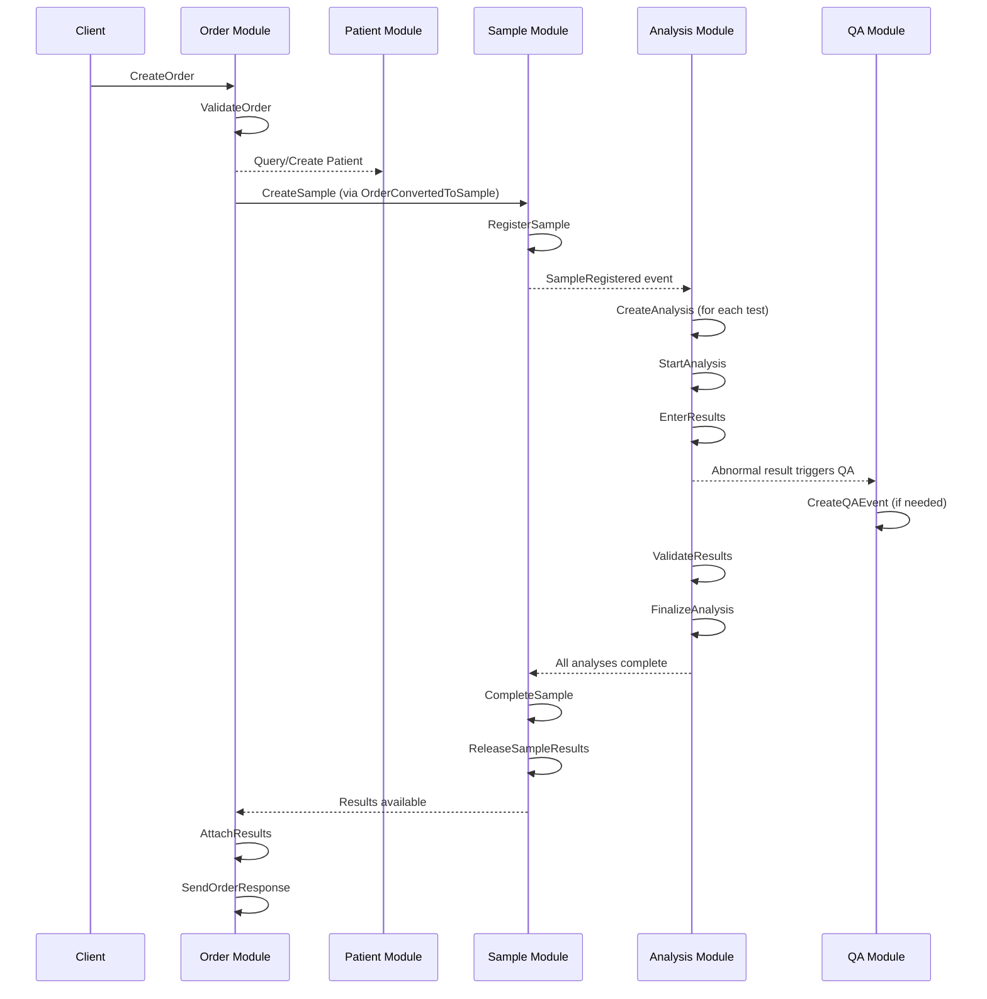
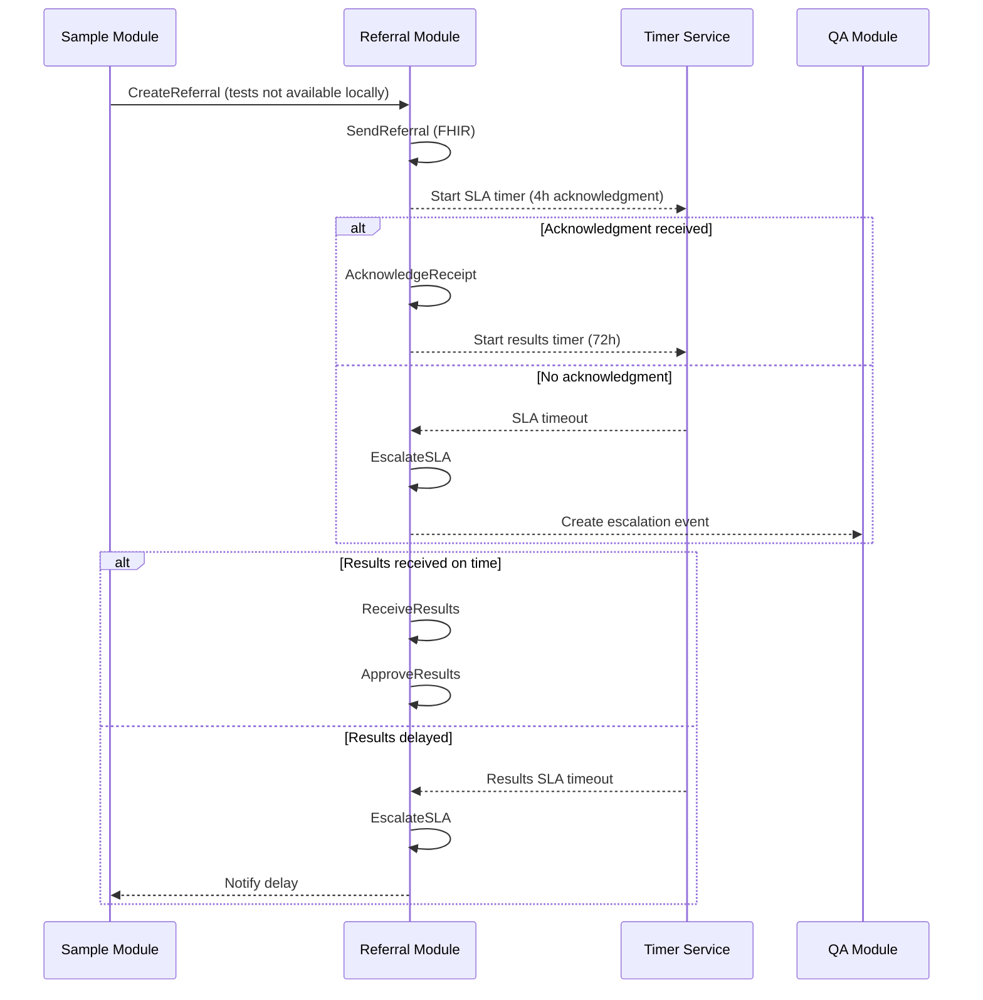
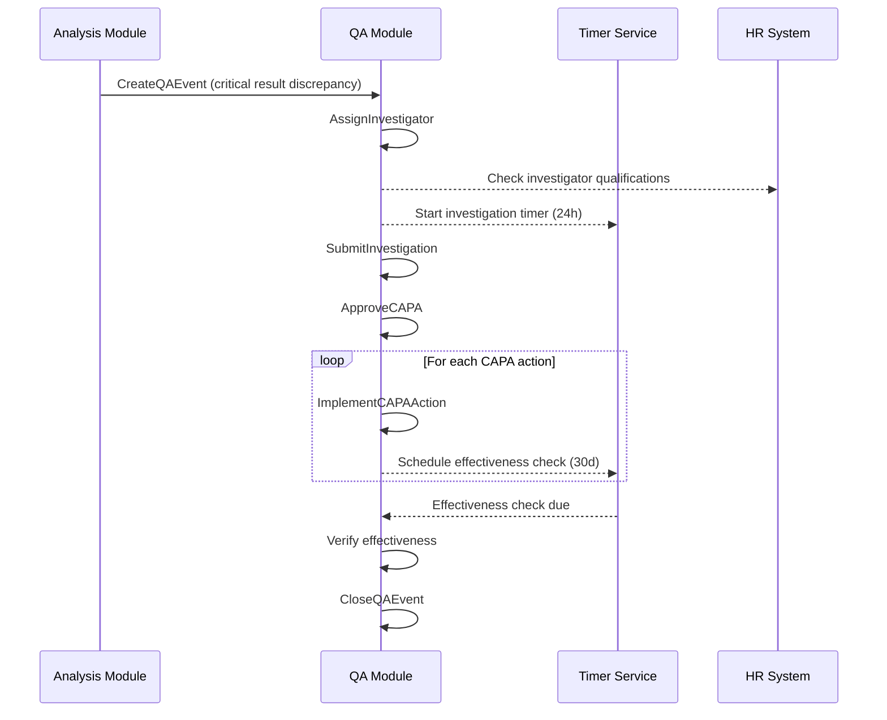

# Aggregate Messaging API Contracts

This document defines the messaging API for each aggregate module, including commands accepted, business rules enforced, and events emitted. This contract-based approach enables loose coupling between aggregates and supports both event-driven architectures and workflow orchestration.

**Note**: Commands may produce different events based on branching conditions. The "Branching Condition" column describes when each specific event is emitted. When a command has multiple possible events, the command and business rules cells are merged across rows.

## Table of Contents
- [Sample Aggregate Module](#sample-aggregate-module)
- [Analysis Aggregate Module](#analysis-aggregate-module)
- [Patient Aggregate Module](#patient-aggregate-module)
- [QA Aggregate Module](#qa-aggregate-module)
- [Referral Aggregate Module](#referral-aggregate-module)
- [Order Aggregate Module](#order-aggregate-module)
- [Cross-Aggregate Workflow Examples](#cross-aggregate-workflow-examples)

---

## Sample Aggregate Module

### Module Responsibilities
Manages the lifecycle of laboratory samples from registration through completion, including priority handling, collection validation, and status tracking.

### Messaging API

| User Story | Command | Business Rules | Branching Condition | Events Emitted | Outcomes |
|------------|---------|---------------|---------------------|----------------|----------|
| **SAM-001**<br>As a lab technician<br>I want to register a new sample<br>So that testing can begin on patient specimens | **RegisterSample** | • Unique accession number required<br>• Valid patient ID must exist<br>• Collection date cannot be future<br>• Priority must be STAT/ASAP/TIMED/ROUTINE | Always (success) | **SampleRegistered**<br>• accessionNumber<br>• patientId<br>• collectionDate<br>• priority<br>• requestedTests[] | • Sample state: REGISTERED<br>• Accession number assigned<br>• Sample linked to patient<br>• Priority set for processing<br>• Available for testing |
| | | | If priority = STAT | **STATSampleAlert**<br>• sampleId<br>• accessionNumber<br>• alertedUsers[]<br>• escalationLevel | • STAT alert triggered<br>• Supervisors notified<br>• Dashboard highlighted<br>• Priority queue updated |
| **SAM-002**<br>As a lab technician<br>I want to start testing on a sample<br>So that analyses can be performed | **StartSampleTesting** | • Sample must be in REGISTERED status<br>• At least one analysis must be created<br>• Cannot start if sample rejected | Always (success) | **SampleTestingStarted**<br>• sampleId<br>• analysisIds[]<br>• startedBy<br>• startedDate | • Sample state: IN_PROGRESS<br>• Testing start time recorded<br>• Analyses activated<br>• Workflow initiated<br>• TAT clock started |
| **SAM-003**<br>As a lab supervisor<br>I want to complete sample processing<br>So that results can be released to providers | **CompleteSample** | • All analyses must be completed<br>• No open QA events<br>• Results must be validated | All results normal | **SampleCompleted**<br>• sampleId<br>• completedDate<br>• totalAnalyses<br>• turnaroundTime | • Sample state: COMPLETED<br>• All results finalized<br>• TAT calculated<br>• Ready for release<br>• Billing enabled |
| | | | Any critical results | **SampleCompletedWithCriticals**<br>• sampleId<br>• completedDate<br>• criticalResults[]<br>• notificationRequired | • Sample state: COMPLETED_CRITICAL<br>• Critical alerts sent<br>• Provider notified<br>• Release restricted<br>• Acknowledgment required |
| **SAM-004**<br>As a sample receiver<br>I want to reject unsuitable samples<br>So that quality standards are maintained | **RejectSample** | • Must provide rejection reason<br>• Cannot reject if testing started<br>• Must notify referring facility if external | Internal sample | **SampleRejected**<br>• sampleId<br>• rejectionReason<br>• rejectedBy<br>• requiresRecollection | • Sample state: REJECTED<br>• Testing blocked<br>• Reason documented<br>• Recollection flag set<br>• Patient notified |
| | | | External referral | **ExternalSampleRejected**<br>• sampleId<br>• rejectionReason<br>• referringLab<br>• notificationSent | • Sample state: REJECTED_EXTERNAL<br>• Referring lab notified<br>• Return shipping arranged<br>• SLA impacted<br>• Billing cancelled |
| **SAM-005**<br>As a lab supervisor<br>I want to change sample priority<br>So that urgent cases get expedited processing | **UpdateSamplePriority** | • New priority must be valid<br>• STAT priority requires authorization<br>• Must cascade to all analyses | Always (success) | **SamplePriorityUpdated**<br>• sampleId<br>• oldPriority<br>• newPriority<br>• reason | • Priority changed<br>• Processing order updated<br>• Analyses re-prioritized<br>• Workflow adjusted<br>• SLA timers reset |
| | | | Escalated to STAT | **SampleEscalatedToSTAT**<br>• sampleId<br>• escalationReason<br>• authorizedBy<br>• affectedAnalyses[] | • STAT workflow activated<br>• Lab alerted<br>• Queue jumping enabled<br>• TAT targets changed<br>• Critical tracking on |
| **SAM-006**<br>As a lab technician<br>I want to add notes to samples<br>So that important information is documented | **AddSampleNote** | • Note cannot exceed 1000 chars<br>• Must be associated with user<br>• Certain notes trigger notifications | Regular note | **SampleNoteAdded**<br>• sampleId<br>• noteType<br>• noteText<br>• addedBy | • Note appended to history<br>• Audit trail updated<br>• Timestamp recorded |
| | | | Critical/Safety note | **SampleCriticalNoteAdded**<br>• sampleId<br>• noteType: CRITICAL<br>• noteText<br>• alertedRoles[]<br>• escalationRequired | • Critical flag set<br>• Supervisors alerted<br>• Work paused if safety<br>• Investigation triggered<br>• Visibility elevated |
| **SAM-007**<br>As a result validator<br>I want to release sample results<br>So that providers receive patient test results | **ReleaseSampleResults** | • All required analyses completed<br>• QA review if applicable<br>• Patient notification consent checked | Electronic release | **SampleResultsReleased**<br>• sampleId<br>• releasedTo<br>• releaseMethod: ELECTRONIC<br>• portalNotificationSent | • Sample state: RELEASED<br>• Portal updated<br>• Patient notified<br>• Access logged<br>• Billing finalized |
| | | | Paper/Fax release | **SampleResultsPrinted**<br>• sampleId<br>• printedBy<br>• numberOfCopies<br>• deliveryMethod | • Sample state: RELEASED<br>• Print job logged<br>• Delivery tracked<br>• HIPAA compliance noted<br>• Manual process flagged |
| **SAM-008**<br>As a lab director<br>I want to recall released results<br>So that errors can be corrected | **RecallSample** | • Can only recall released samples<br>• Must provide recall reason<br>• Triggers patient notification | Always (success) | **SampleRecalled**<br>• sampleId<br>• recallReason<br>• recalledBy<br>• notificationSent | • Sample state: RECALLED<br>• Previous results invalidated<br>• Recall notice generated<br>• Access restricted<br>• Investigation required |

### Module Configuration
```yaml
sample-module:
  commands:
    timeout: 30s
    retry: 3
  events:
    retention: 7 years
    partition-key: patientId
  business-rules:
    max-analyses-per-sample: 50
    priority-change-auth-required: STAT
    rejection-window: 24h
```

---

## Analysis Aggregate Module

### Module Responsibilities
Manages individual test analyses within a sample, including result entry, validation, reflex testing, and analyzer integration.

### Messaging API

| User Story | Command | Business Rules | Branching Condition | Events Emitted | Outcomes |
|------------|---------|---------------|---------------------|----------------|----------|
| **ANA-001**<br>As a lab technician<br>I want to create an analysis for a test<br>So that specific testing can be performed | **CreateAnalysis** | • Valid test ID required<br>• Sample must be registered<br>• Test must be orderable<br>• Check test/sample type compatibility | Standard test | **AnalysisCreated**<br>• analysisId<br>• sampleId<br>• testId<br>• testSectionId<br>• revision: 1 | • Analysis state: NOT_STARTED<br>• Analysis linked to sample<br>• Test section assigned<br>• Revision set to 1<br>• Available for processing |
| | | | Panel/Profile test | **AnalysisPanelCreated**<br>• parentAnalysisId<br>• panelTestId<br>• childAnalyses[]<br>• autoExpanded | • Panel expanded to tests<br>• Child analyses created<br>• Parent tracking enabled<br>• Results will aggregate<br>• Billing as panel |
| **ANA-002**<br>As a lab technician<br>I want to start performing an analysis<br>So that testing begins on the specimen | **StartAnalysis** | • Must be in NOT_STARTED status<br>• Analyzer or manual method selected<br>• Technician assignment required | Manual method | **AnalysisStarted**<br>• analysisId<br>• startMethod: MANUAL<br>• technicianId<br>• workstation | • Analysis state: IN_PROGRESS<br>• Manual workflow<br>• Technician assigned<br>• Workstation logged<br>• Timer started |
| | | | Analyzer method | **AnalysisStartedOnAnalyzer**<br>• analysisId<br>• analyzerId<br>• position<br>• batchId | • Analysis state: PENDING_ANALYZER<br>• Analyzer queued<br>• Position assigned<br>• Batch tracked<br>• Auto-result expected |
| **ANA-003**<br>As a lab technician<br>I want to enter test results<br>So that analysis data is captured | **EnterResults** | • Results within valid range<br>• Abnormal results flagged<br>• Critical values identified<br>• Delta check performed | Normal range | **ResultsEntered**<br>• analysisId<br>• results[]<br>• normalFlags[] | • Analysis state: RESULTS_ENTERED<br>• Normal results stored<br>• No alerts needed<br>• Awaiting validation |
| | | Abnormal/Critical | **CriticalResultsEntered**<br>• analysisId<br>• results[]<br>• criticalValues[]<br>• notificationSent<br>• acknowledgeRequired | • Analysis state: CRITICAL_ENTERED<br>• Critical alerts fired<br>• Provider called<br>• Acknowledgment pending<br>• Validation blocked |
| | | Delta check failure | **DeltaCheckFailed**<br>• analysisId<br>• currentValue<br>• previousValue<br>• deltaPercent<br>• reviewRequired | • Analysis state: DELTA_REVIEW<br>• Previous value shown<br>• Review required<br>• Possible error flagged<br>• Investigation needed |
| **ANA-004**<br>As a senior technician<br>I want to validate test results<br>So that accuracy is confirmed before reporting | **ValidateResults** | • Technician cannot validate own results<br>• QC must be current<br>• Reference range verification | Standard validation | **ResultsValidated**<br>• analysisId<br>• validatedBy<br>• validationMethod<br>• qcStatus | • Analysis state: VALIDATED<br>• Results verified<br>• Validator recorded<br>• QC status confirmed<br>• Ready for finalization |
| | | | Supervisor override | **ResultsValidatedWithOverride**<br>• analysisId<br>• validatedBy<br>• overrideReason<br>• originalConcern | • Analysis state: VALIDATED<br>• Override documented<br>• Supervisor authority<br>• Audit emphasized<br>• Special tracking |
| **ANA-005**<br>As a lab supervisor<br>I want to reject problematic analyses<br>So that quality issues are addressed | **RejectAnalysis** | • Must provide rejection reason<br>• Cannot reject if validated<br>• May trigger sample rejection | Isolated rejection | **AnalysisRejected**<br>• analysisId<br>• rejectionReason<br>• requiresRepeat<br>• sampleImpact: NONE | • Analysis state: REJECTED<br>• Single test affected<br>• Repeat scheduled<br>• Sample continues<br>• Partial results OK |
| | | | Cascade rejection | **AnalysisRejectedCascade**<br>• analysisId<br>• rejectionReason<br>• affectedAnalyses[]<br>• sampleRejected | • Analysis state: REJECTED<br>• Sample rejected too<br>• All tests stopped<br>• Recollection needed<br>• Full workflow restart |
| **ANA-006**<br>As a lab technician<br>I want to repeat failed analyses<br>So that accurate results can be obtained | **RepeatAnalysis** | • Previous analysis must exist<br>• Increment revision number<br>• Link to original analysis | Always (success) | **AnalysisRepeated**<br>• originalAnalysisId<br>• newAnalysisId<br>• revision<br>• repeatReason | • New analysis created<br>• Revision incremented<br>• Original linked<br>• History preserved<br>• New workflow started |
| **ANA-007**<br>As a laboratory system<br>I want to trigger reflex tests automatically<br>So that additional testing occurs when needed | **TriggerReflexTest** | • Result must meet reflex criteria<br>• Reflex test must be configured<br>• Auto-create new analysis | Single reflex | **ReflexTestTriggered**<br>• triggerAnalysisId<br>• reflexTestId<br>• triggerValue<br>• newAnalysisId | • Reflex analysis created<br>• Trigger documented<br>• Parent-child linked<br>• Auto-ordered<br>• Workflow expanded |
| | | | Cascade reflexes | **ReflexCascadeTriggered**<br>• triggerAnalysisId<br>• reflexTests[]<br>• triggerCondition<br>• clinicalAlert | • Multiple reflexes created<br>• Complex logic noted<br>• Clinical review flagged<br>• Cost pre-authorized<br>• Special tracking |
| **ANA-008**<br>As an analyzer interface<br>I want to import analyzer results<br>So that manual data entry is minimized | **ImportAnalyzerResult** | • Analyzer must be registered<br>• Result format validation<br>• Automatic QC check<br>• Delta check if configured | QC passed | **AnalyzerResultImported**<br>• analysisId<br>• analyzerId<br>• rawResult<br>• interpretedResult<br>• qcStatus: PASS | • Results auto-entered<br>• QC validated<br>• Auto-validation eligible<br>• Raw data stored<br>• Fast track enabled |
| | | | QC failed | **AnalyzerQCFailed**<br>• analysisId<br>• analyzerId<br>• qcFailureType<br>• maintenanceAlert<br>• resultsQuarantined | • Results quarantined<br>• Analyzer flagged<br>• Maintenance alerted<br>• Rerun required<br>• Batch affected |
| **ANA-009**<br>As a lab director<br>I want to finalize analyses<br>So that results are locked and reportable | **FinalizeAnalysis** | • Results must be validated<br>• No open QA events<br>• Billing information complete | Standard finalize | **AnalysisFinalized**<br>• analysisId<br>• finalResult<br>• turnaroundTime<br>• billable | • Analysis state: FINALIZED<br>• Results immutable<br>• TAT recorded<br>• Billing enabled<br>• Sample notified |
| | | | Amended after release | **AnalysisAmended**<br>• analysisId<br>• amendmentReason<br>• previousResult<br>• newResult<br>• notificationsRequired | • Amendment tracked<br>• Previous preserved<br>• Providers notified<br>• Audit highlighted<br>• Legal documented |

### Module Configuration
```yaml
analysis-module:
  commands:
    timeout: 30s
    retry: 3
  events:
    retention: 7 years
    partition-key: sampleId
  business-rules:
    result-validation-window: 72h
    critical-value-notification: immediate
    delta-check-enabled: true
    reflex-test-auto-approval: false
```

---

## Patient Aggregate Module

### Module Responsibilities
Manages patient identity, demographics, privacy preferences, and consent. Ensures HIPAA/GDPR compliance and maintains multiple identity types.

### Messaging API

| User Story | Command | Business Rules | Branching Condition | Events Emitted | Outcomes |
|------------|---------|---------------|---------------------|----------------|----------|
| **PAT-001**<br>As a registration clerk<br>I want to register new patients<br>So that their information is available for testing | **RegisterPatient** | • Unique identity verification<br>• Age/DOB validation<br>• Duplicate check performed<br>• Privacy preferences set | Always (success) | **PatientRegistered**<br>• patientId<br>• identities[]<br>• demographics<br>• registrationDate | • Patient state: ACTIVE<br>• Unique ID assigned<br>• Demographics stored<br>• Identities indexed<br>• Available for samples |
| **PAT-002**<br>As a registration clerk<br>I want to update patient demographics<br>So that patient records remain current and accurate | **UpdateDemographics** | • Verify authorization<br>• Validate data formats<br>• Check for conflicts<br>• Audit trail required | Standard update | **PatientDemographicsUpdated**<br>• patientId<br>• changedFields[]<br>• previousValues[]<br>• updatedBy | • Demographics updated<br>• Change history recorded<br>• Audit trail created<br>• Conflicts resolved<br>• Notifications sent |
| | | | Sensitive field changes | **PatientSensitiveDataUpdated**<br>• patientId<br>• sensitiveFields[]<br>• authorizationLevel<br>• complianceFlags[] | • Enhanced audit created<br>• Compliance checking<br>• Access logging active<br>• HIPAA tracking on<br>• Supervisor notified |
| **PAT-003**<br>As a registration clerk<br>I want to add additional patient identities<br>So that patients can be found using multiple ID types | **AddPatientIdentity** | • Identity type must be valid<br>• No duplicate identities<br>• Format validation per type<br>• Authority verification | Standard identity | **PatientIdentityAdded**<br>• patientId<br>• identityType<br>• identityValue<br>• issuingAuthority | • New identity added<br>• Identity indexed<br>• Search updated<br>• Authority recorded<br>• Duplicate check passed |
| | | | National ID addition | **PatientNationalIDAdded**<br>• patientId<br>• nationalId<br>• countryCode<br>• verificationStatus<br>• governmentValidated | • Official ID registered<br>• Government validated<br>• High confidence ID<br>• Search priority set<br>• Legal identity confirmed |
| **PAT-004**<br>As a data manager<br>I want to merge duplicate patient records<br>So that patient data integrity is maintained | **MergePatients** | • Duplicate verification complete<br>• No active samples on source<br>• Preserve all identities<br>• Create audit trail | Standard merge | **PatientsMerged**<br>• survivingPatientId<br>• mergedPatientId<br>• mergedIdentities[]<br>• mergeReason | • Records consolidated<br>• Source deactivated<br>• History preserved<br>• Identities merged<br>• References updated |
| | | | Complex merge conflict | **PatientsMergedWithConflicts**<br>• survivingPatientId<br>• mergedPatientId<br>• conflictResolutions[]<br>• manualReviewRequired | • Conflicts documented<br>• Resolution recorded<br>• Manual review flagged<br>• Supervisor notified<br>• Enhanced audit trail |
| **PAT-005**<br>As a privacy officer<br>I want to update patient privacy consent<br>So that patient preferences are respected and compliance is maintained | **UpdatePrivacyConsent** | • Valid consent types<br>• Cannot retroactively deny<br>• Special handling for minors<br>• Legal guardian check | Adult consent change | **PatientPrivacyUpdated**<br>• patientId<br>• consentType<br>• consentStatus<br>• effectiveDate | • Consent recorded<br>• Privacy flags updated<br>• Access rules changed<br>• Legal compliance met<br>• Effective date set |
| | | | Minor consent change | **MinorPatientConsentUpdated**<br>• patientId<br>• guardianId<br>• consentType<br>• guardianAuthorization<br>• legalDocumentation | • Guardian consent logged<br>• Minor protection active<br>• Legal documentation<br>• Special access rules<br>• Compliance verified |
| **PAT-006**<br>As a facility administrator<br>I want to flag VIP patients<br>So that they receive appropriate special handling | **FlagPatientVIP** | • Authorization required<br>• Access logging enabled<br>• Special handling rules<br>• Notification list updated | Standard VIP | **PatientVIPFlagged**<br>• patientId<br>• vipLevel<br>• accessRestrictions[]<br>• authorizedBy | • VIP status active<br>• Access logging on<br>• Restrictions applied<br>• Alert list updated<br>• Special workflow enabled |
| | | | High-profile VIP | **PatientHighProfileFlagged**<br>• patientId<br>• securityLevel<br>• restrictedAccess[]<br>• executiveNotification<br>• mediaAlert | • Maximum security enabled<br>• Executive notification<br>• Media protocol active<br>• Restricted access list<br>• Special handling protocol |
| **PAT-007**<br>As a medical officer<br>I want to record patient death<br>So that the system prevents inappropriate future orders | **RecordPatientDeath** | • Official verification required<br>• Block new sample registration<br>• Preserve historical data<br>• Notify active providers | Natural death | **PatientDeathRecorded**<br>• patientId<br>• dateOfDeath<br>• verificationSource<br>• activeSamplesHandled | • Patient state: DECEASED<br>• New samples blocked<br>• Active work completed<br>• Providers notified<br>• Record sealed |
| | | | Legal case death | **PatientDeathLegalCase**<br>• patientId<br>• dateOfDeath<br>• legalHold<br>• investigationFlag<br>• preservationOrder | • Legal hold applied<br>• Investigation flagged<br>• Records preserved<br>• Access restricted<br>• Authority notified |

### Module Configuration
```yaml
patient-module:
  commands:
    timeout: 30s
    retry: 3
  events:
    retention: lifetime
    partition-key: patientId
    encryption: at-rest
  business-rules:
    identity-types: [NATIONAL_ID, ST_NUMBER, GUID, MRN]
    minor-age-threshold: 18
    vip-authorization-role: ADMIN
    gdpr-compliance: enabled
```

---

## QA Aggregate Module

### Module Responsibilities
Manages quality assurance events, non-conformances, CAPA processes, and compliance workflows with automatic escalation and tracking.

### Messaging API

| User Story | Command | Business Rules | Branching Condition | Events Emitted | Outcomes |
|------------|---------|---------------|---------------------|----------------|----------|
| **QA-001**<br>As a lab technician<br>I want to report quality issues<br>So that problems are tracked and resolved | **CreateQAEvent** | • Valid QA category required<br>• Associated entity must exist<br>• Severity assessment mandatory<br>• Auto-assign if critical | Minor/Major severity | **QAEventCreated**<br>• qaEventId<br>• category<br>• severity<br>• associatedEntity<br>• assignmentPending | • QA state: OPEN<br>• Event cataloged<br>• SLA timer started<br>• Assignment queue<br>• Standard process |
| | | | Critical severity | **CriticalQAEventCreated**<br>• qaEventId<br>• category<br>• severity: CRITICAL<br>• autoAssignedTo<br>• escalatedTo[]<br>• emergencyProtocol | • QA state: CRITICAL_OPEN<br>• Auto-assigned to senior<br>• Management alerted<br>• 24hr SLA activated<br>• Emergency protocol on |
| **QA-002**<br>As a QA manager<br>I want to assign investigators to QA events<br>So that issues are properly investigated | **AssignInvestigator** | • Investigator must be qualified<br>• Cannot self-assign critical<br>• Workload balancing<br>• Conflict of interest check | Always (success) | **InvestigatorAssigned**<br>• qaEventId<br>• investigatorId<br>• assignmentMethod<br>• dueDate | • QA state: INVESTIGATING<br>• Owner assigned<br>• Due date set<br>• Workload updated<br>• Reminder scheduled |
| **QA-003**<br>As a QA investigator<br>I want to submit investigation findings<br>So that root causes are documented | **SubmitInvestigation** | • Root cause required<br>• Evidence must be attached<br>• Timeline must be complete<br>• Corrective actions proposed | No CAPA needed | **InvestigationSubmitted**<br>• qaEventId<br>• rootCause<br>• evidence[]<br>• noActionRequired<br>• justification | • QA state: REVIEW<br>• RCA documented<br>• No further action<br>• Closure eligible<br>• Lessons learned |
| | | CAPA required | **InvestigationWithCAPA**<br>• qaEventId<br>• rootCause<br>• evidence[]<br>• proposedActions[]<br>• riskAssessment | • QA state: PENDING_CAPA<br>• RCA documented<br>• Actions proposed<br>• Risk assessed<br>• Approval needed |
| **QA-004**<br>As a QA manager<br>I want to approve CAPA actions<br>So that corrective measures can be implemented | **ApproveCAPA** | • Manager approval required<br>• Budget verification if needed<br>• Timeline realistic<br>• Success metrics defined | Standard approval | **CAPAApproved**<br>• qaEventId<br>• capaId<br>• approvedActions[]<br>• timeline<br>• budget | • QA state: CAPA_ACTIVE<br>• Actions approved<br>• Timeline set<br>• Budget allocated<br>• Tracking enabled |
| | | | Conditional approval | **CAPAConditionallyApproved**<br>• qaEventId<br>• capaId<br>• conditions[]<br>• reviewDate<br>• provisionalBudget | • QA state: CAPA_CONDITIONAL<br>• Conditions documented<br>• Review scheduled<br>• Limited budget<br>• Pilot phase |
| **QA-005**<br>As a process owner<br>I want to implement CAPA actions<br>So that corrective measures are put in place | **ImplementCAPAAction** | • Prerequisites met<br>• Resources available<br>• Documentation complete<br>• Training if required | Standard implementation | **CAPAActionImplemented**<br>• capaId<br>• actionId<br>• implementationEvidence<br>• effectivenessDate | • Action completed<br>• Evidence recorded<br>• Progress updated<br>• Effectiveness pending<br>• Metrics captured |
| | | | Implementation with issues | **CAPAActionPartiallyImplemented**<br>• capaId<br>• actionId<br>• implementationIssues[]<br>• revisedTimeline<br>• additionalResources | • Partial completion<br>• Issues documented<br>• Timeline adjusted<br>• Resources requested<br>• Escalation may be needed |
| **QA-006**<br>As a QA supervisor<br>I want to escalate overdue QA events<br>So that management attention is focused on critical issues | **EscalateQAEvent** | • Escalation criteria met<br>• Next level identified<br>• Notification sent<br>• SLA timer reset | Standard escalation | **QAEventEscalated**<br>• qaEventId<br>• escalationLevel<br>• escalationReason<br>• newOwner | • Escalation level increased<br>• New owner assigned<br>• SLA reset<br>• Management notified<br>• Priority elevated |
| | | | Executive escalation | **QAEventExecutiveEscalation**<br>• qaEventId<br>• executiveLevel<br>• complianceRisk<br>• businessImpact<br>• immediateAction | • Executive attention<br>• Compliance risk noted<br>• Business impact assessed<br>• Immediate action required<br>• Crisis protocol active |
| **QA-007**<br>As a QA manager<br>I want to close completed QA events<br>So that the quality issue lifecycle is finalized | **CloseQAEvent** | • All actions completed<br>• Effectiveness verified<br>• Documentation complete<br>• Approval obtained | Standard closure | **QAEventClosed**<br>• qaEventId<br>• closureEvidence<br>• effectivenessScore<br>• lessonsLearned | • QA state: CLOSED<br>• Event archived<br>• Metrics recorded<br>• Lessons documented<br>• Compliance met |
| | | | Closure with concerns | **QAEventClosedWithConcerns**<br>• qaEventId<br>• remainingConcerns[]<br>• monitoringRequired<br>• reviewScheduled | • QA state: CLOSED_MONITORED<br>• Concerns documented<br>• Monitoring enabled<br>• Review scheduled<br>• Preventive watch active |
| **QA-008**<br>As a QA investigator<br>I want to reopen closed QA events<br>So that new evidence can be properly addressed | **ReopenQAEvent** | • Valid reopen reason<br>• New evidence provided<br>• Previous actions reviewed<br>• Re-assignment required | Standard reopen | **QAEventReopened**<br>• qaEventId<br>• reopenReason<br>• newEvidence<br>• previousClosureId | • QA state: REOPENED<br>• Investigation resumed<br>• History linked<br>• New owner assigned<br>• SLA restarted |
| | | | Urgent reopen | **QAEventUrgentReopen**<br>• qaEventId<br>• urgentReason<br>• potentialHarm<br>• immediateActions[]<br>• executiveNotified | • QA state: URGENT_REOPENED<br>• Immediate investigation<br>• Potential harm assessed<br>• Urgent actions taken<br>• Executive informed |

### Module Configuration
```yaml
qa-module:
  commands:
    timeout: 60s
    retry: 3
  events:
    retention: 10 years
    partition-key: qaEventId
  business-rules:
    investigation-sla:
      critical: 24h
      major: 72h
      minor: 7d
    escalation-levels: 3
    capa-approval-threshold: MAJOR
    effectiveness-check-period: 30d
```

---

## Referral Aggregate Module

### Module Responsibilities
Manages external laboratory referrals, including FHIR communication, result integration, SLA monitoring, and billing reconciliation.

### Messaging API

| User Story | Command | Business Rules | Branching Condition | Events Emitted | Outcomes |
|------------|---------|---------------|---------------------|----------------|----------|
| **REF-001**<br>As a lab supervisor<br>I want to create referrals to external labs<br>So that tests not available locally can be performed | **CreateReferral** | • Target lab must be active<br>• Tests must be referrable<br>• Patient consent verified<br>• Insurance pre-auth check | Standard referral | **ReferralCreated**<br>• referralId<br>• targetLab<br>• tests[]<br>• priority<br>• insuranceStatus | • Referral state: CREATED<br>• Target lab assigned<br>• Tests reserved<br>• Insurance noted<br>• Ready to send |
| | | | STAT/Critical referral | **UrgentReferralCreated**<br>• referralId<br>• targetLab<br>• urgencyLevel<br>• expediteFeesApproved<br>• specialHandling | • Referral state: URGENT_CREATED<br>• Expedited processing<br>• Special shipping arranged<br>• Premium costs approved<br>• Direct contact initiated |
| **REF-002**<br>As a lab coordinator<br>I want to send referrals via FHIR<br>So that external labs receive complete patient data | **SendReferral** | • FHIR bundle validated<br>• Secure channel verified<br>• Acknowledgment required<br>• Retry policy configured | Standard transmission | **ReferralSent**<br>• referralId<br>• fhirBundleId<br>• transmissionMethod<br>• acknowledgedAt | • Referral state: SENT<br>• Transmission logged<br>• SLA timer started<br>• Retry scheduled<br>• Awaiting ACK |
| | | | Transmission failure | **ReferralTransmissionFailed**<br>• referralId<br>• failureReason<br>• retryAttempt<br>• backoffDelay | • Referral state: SEND_FAILED<br>• Error documented<br>• Retry scheduled<br>• Alert generated<br>• Manual intervention may be needed |
| **REF-003**<br>As a referral coordinator<br>I want to track acknowledgments<br>So that I know referrals were received | **AcknowledgeReceipt** | • Within SLA window<br>• Valid reference number<br>• Expected tests confirmed<br>• Timeline communicated | Standard ACK | **ReferralAcknowledged**<br>• referralId<br>• externalRefNumber<br>• expectedTurnaround<br>• acceptedTests[] | • Referral state: ACKNOWLEDGED<br>• External ref stored<br>• Timeline tracked<br>• Tests confirmed<br>• Results expected |
| | | | Partial acceptance | **ReferralPartiallyAccepted**<br>• referralId<br>• acceptedTests[]<br>• rejectedTests[]<br>• alternativeOffered | • Referral state: PARTIAL_ACK<br>• Some tests accepted<br>• Others need rerouting<br>• Additional referrals needed<br>• Cost adjustments required |
| **REF-004**<br>As a lab technologist<br>I want to receive external results<br>So that they can be integrated with local data | **ReceiveResults** | • Result authentication valid<br>• Patient matching confirmed<br>• Units conversion applied<br>• QC documentation received | Normal results | **ReferralResultsReceived**<br>• referralId<br>• results[]<br>• receivedFormat<br>• qcDocumentation | • Referral state: RESULTS_RECEIVED<br>• Results staged<br>• QC documented<br>• Units converted<br>• Review required |
| | | | Critical results | **ReferralCriticalResultsReceived**<br>• referralId<br>• criticalResults[]<br>• providerNotified<br>• acknowledgeRequired | • Referral state: CRITICAL_RECEIVED<br>• Critical alerts fired<br>• Provider contacted<br>• Immediate review required<br>• Hold pending ACK |
| **REF-005**<br>As a pathologist<br>I want to approve external results<br>So that they become part of the patient record | **ApproveResults** | • Technical review complete<br>• Critical values handled<br>• Billing information verified<br>• Integration authorized | Standard approval | **ReferralResultsApproved**<br>• referralId<br>• approvedBy<br>• criticalHandled<br>• billableAmount | • Referral state: COMPLETED<br>• Results integrated<br>• Billing captured<br>• Critical handled<br>• Sample updated |
| | | | Results questioned | **ReferralResultsQuestioned**<br>• referralId<br>• concerns[]<br>• reviewRequested<br>• contactInitiated | • Referral state: UNDER_REVIEW<br>• Concerns documented<br>• External lab contacted<br>• Resolution pending<br>• Results on hold |
| **REF-006**<br>As a lab director<br>I want to reject unsuitable referrals<br>So that quality standards are maintained | **RejectReferral** | • Valid rejection reason<br>• Alternative lab suggested<br>• Patient notification required<br>• Sample disposition planned | Internal rejection | **ReferralRejected**<br>• referralId<br>• rejectionReason<br>• alternativeLabId<br>• sampleDisposition | • Referral state: REJECTED<br>• Alternative noted<br>• Sample returned<br>• Patient notified<br>• Workflow stopped |
| | | | External rejection | **ExternalReferralRejected**<br>• referralId<br>• externalReason<br>• receivedTimestamp<br>• alternativeNeeded | • Referral state: EXT_REJECTED<br>• External refusal noted<br>• New referral needed<br>• Time lost tracked<br>• Urgent re-routing |
| **REF-007**<br>As a lab manager<br>I want to escalate SLA breaches<br>So that delays are addressed promptly | **EscalateSLA** | • SLA threshold exceeded<br>• Contact attempts documented<br>• Management notified<br>• Alternative plan ready | First escalation | **ReferralSLAEscalated**<br>• referralId<br>• slaType<br>• exceededBy<br>• escalationActions[] | • SLA breach recorded<br>• Escalation active<br>• Management alerted<br>• Alternative considered<br>• Priority raised |
| | | | Final escalation | **ReferralFinalEscalation**<br>• referralId<br>• contractBreach<br>• alternativeLabActivated<br>• penaltiesApplied | • Referral state: FINAL_ESCALATION<br>• Contract violation noted<br>• Backup lab activated<br>• Penalties triggered<br>• Vendor review needed |
| **REF-008**<br>As a billing coordinator<br>I want to reconcile referral charges<br>So that payments are accurate | **ReconcileBilling** | • Charges match agreement<br>• Discrepancies documented<br>• Approval for variances<br>• Payment authorized | Charges match | **ReferralBillingReconciled**<br>• referralId<br>• expectedCharges<br>• actualCharges<br>• approved | • Billing reconciled<br>• Payment approved<br>• Invoice closed<br>• Audit complete |
| | | | Discrepancies found | **ReferralBillingDisputed**<br>• referralId<br>• discrepancies[]<br>• disputeRaised<br>• resolutionPending | • Billing disputed<br>• Discrepancies documented<br>• Vendor contacted<br>• Payment held<br>• Resolution required |

### Module Configuration
```yaml
referral-module:
  commands:
    timeout: 120s
    retry: 5
    circuit-breaker: enabled
  events:
    retention: 7 years
    partition-key: targetLab
  business-rules:
    sla-thresholds:
      acknowledgment: 4h
      results: 72h
    fhir-version: R4
    retry-policy: exponential-backoff
    max-retry-attempts: 5
```

---

## Order Aggregate Module

### Module Responsibilities
Manages electronic orders from external systems, including HL7 processing, clinical decision support, and order tracking.

### Messaging API

| User Story | Command | Business Rules | Branching Condition | Events Emitted | Outcomes |
|------------|---------|---------------|---------------------|----------------|----------|
| **ORD-001**<br>As a healthcare provider<br>I want to create electronic orders<br>So that laboratory tests can be requested efficiently | **CreateOrder** | • Valid ordering provider<br>• Test codes mapped<br>• Insurance verified<br>• Clinical info complete | Standard order | **OrderCreated**<br>• orderId<br>• providerId<br>• tests[]<br>• priority<br>• clinicalInfo | • Order state: PENDING<br>• Order ID assigned<br>• Provider linked<br>• Tests queued<br>• Awaiting validation |
| | | | STAT order | **STATOrderCreated**<br>• orderId<br>• providerId<br>• urgencyLevel<br>• alertsTriggered<br>• expediteApproved | • Order state: STAT_PENDING<br>• High priority queued<br>• Lab alerted<br>• Fast-track enabled<br>• Special handling |
| **ORD-002**<br>As a clinical decision support system<br>I want to validate orders<br>So that appropriate tests are ordered | **ValidateOrder** | • Diagnosis supports tests<br>• No contraindications<br>• Frequency limits checked<br>• Medical necessity met | Validation passed | **OrderValidated**<br>• orderId<br>• validationResults[]<br>• warnings[]<br>• medicalNecessity | • Order state: VALIDATED<br>• CDS checks passed<br>• Warnings recorded<br>• Necessity confirmed<br>• Ready to process |
| | | | Validation failed | **OrderValidationFailed**<br>• orderId<br>• validationErrors[]<br>• criticalIssues[]<br>• overrideRequired | • Order state: VALIDATION_FAILED<br>• Errors documented<br>• Manual review required<br>• Override needed<br>• Processing blocked |
| **ORD-003**<br>As a sample processor<br>I want to convert orders to samples<br>So that laboratory work can begin | **ConvertToSample** | • Patient matched/created<br>• Accession number assigned<br>• Collection requirements set<br>• Labels generated | Standard conversion | **OrderConvertedToSample**<br>• orderId<br>• sampleId<br>• accessionNumber<br>• labelsPrinted | • Order state: IN_PROCESS<br>• Sample created<br>• Accession assigned<br>• Labels printed<br>• Collection pending |
| | | | Patient not found | **OrderPatientCreated**<br>• orderId<br>• newPatientId<br>• demographicsUsed<br>• verificationNeeded | • Order state: PATIENT_PENDING<br>• New patient created<br>• Verification required<br>• Sample creation delayed<br>• Manual review needed |
| **ORD-004**<br>As a lab information system<br>I want to update order status<br>So that providers track progress | **UpdateOrderStatus** | • Valid status transition<br>• Results available check<br>• Provider notification<br>• Billing status update | Always (success) | **OrderStatusUpdated**<br>• orderId<br>• previousStatus<br>• newStatus<br>• notificationsSent[] | • Status changed<br>• History updated<br>• Notifications sent<br>• Billing adjusted<br>• Provider informed |
| **ORD-005**<br>As a result validator<br>I want to attach results to orders<br>So that providers receive complete information | **AttachResults** | • Results finalized<br>• Order tests matched<br>• Abnormal flags set<br>• Critical values handled | Normal results | **OrderResultsAttached**<br>• orderId<br>• resultIds[]<br>• abnormalCount<br>• criticalCount | • Order state: RESULTED<br>• Results linked<br>• Flags calculated<br>• Ready to send |
| | | | Critical results | **OrderCriticalResultsAttached**<br>• orderId<br>• criticalResults[]<br>• providerCalled<br>• acknowledgmentRequired | • Order state: CRITICAL_RESULTED<br>• Critical alerts fired<br>• Provider contacted<br>• ACK pending<br>• Send delayed until ACK |
| **ORD-006**<br>As an interface engine<br>I want to send HL7 responses<br>So that providers receive results electronically | **SendOrderResponse** | • HL7 ACK generated<br>• Results formatted<br>• Transmission logged<br>• Delivery confirmed | Successful transmission | **OrderResponseSent**<br>• orderId<br>• messageType<br>• hl7MessageId<br>• deliveryStatus | • Order state: COMPLETED<br>• Response sent<br>• HL7 logged<br>• Delivery tracked<br>• Order closed |
| | | | Transmission failed | **OrderResponseFailed**<br>• orderId<br>• failureReason<br>• retryScheduled<br>• alternativeMethod | • Order state: SEND_FAILED<br>• Error documented<br>• Retry queued<br>• Alert generated<br>• Alternative options |
| **ORD-007**<br>As a healthcare provider<br>I want to cancel orders<br>So that unnecessary work is stopped | **CancelOrder** | • Cancellation allowed<br>• No results released<br>• Provider notified<br>• Billing reversed | Early cancellation | **OrderCancelled**<br>• orderId<br>• cancellationReason<br>• cancelledBy<br>• billingReversed | • Order state: CANCELLED<br>• Work stopped<br>• Provider notified<br>• Billing reversed<br>• Audit logged |
| | | | Late cancellation | **OrderLateCancellation**<br>• orderId<br>• workInProgress<br>• partialCharges<br>• wastageRecorded | • Order state: LATE_CANCELLED<br>• Partial work completed<br>• Charges adjusted<br>• Waste documented<br>• Special handling |
| **ORD-008**<br>As a healthcare provider<br>I want to amend orders<br>So that test requirements can be updated | **AmendOrder** | • Amendment window open<br>• Changes documented<br>• Additional tests valid<br>• Billing adjusted | Minor amendment | **OrderAmended**<br>• orderId<br>• amendments[]<br>• addedTests[]<br>• removedTests[] | • Order state: AMENDED<br>• Changes applied<br>• Tests updated<br>• Billing adjusted<br>• History preserved |
| | | | Major amendment | **OrderMajorAmendment**<br>• orderId<br>• significantChanges[]<br>• revalidationRequired<br>• impactAssessment | • Order state: MAJOR_AMENDED<br>• Significant changes noted<br>• Re-validation triggered<br>• Impact assessed<br>• Review required |

### Module Configuration
```yaml
order-module:
  commands:
    timeout: 30s
    retry: 3
  events:
    retention: 7 years
    partition-key: providerId
  business-rules:
    hl7-version: 2.5.1
    amendment-window: 24h
    duplicate-check-window: 48h
    critical-value-notification: immediate
```

---

## Cross-Aggregate Workflow Examples

### Workflow: Complete Sample Testing Process



### Workflow: External Referral with SLA Monitoring



### Workflow: QA Event with CAPA Process



## Module Integration Patterns

### Event-Driven Integration
- Modules communicate primarily through domain events
- Each module maintains its own state and consistency boundary
- Events are immutable and represent facts that have occurred
- Subscribers handle events asynchronously

### Command Processing
- Commands are validated within the module boundary
- Business rules are enforced before events are emitted
- Command handlers return success/failure with specific errors
- Idempotency is maintained through command deduplication

### Workflow Orchestration
- Complex workflows use Dapr workflow orchestration
- Each module exposes its commands as workflow activities
- Compensation logic is built into workflow definitions
- State is maintained by the workflow engine

### Data Consistency
- Each module is eventually consistent with others
- Sagas handle distributed transactions across modules
- Compensating events reverse failed operations
- Read models are updated asynchronously from events

## Benefits of This Architecture

1. **Loose Coupling**: Modules only depend on message contracts, not implementations
2. **Scalability**: Each module can be scaled independently based on load
3. **Testability**: Modules can be tested in isolation with message stubs
4. **Flexibility**: New workflows can be composed from existing module capabilities
5. **Auditability**: Complete event history provides natural audit trail
6. **Resilience**: Circuit breakers and retries handle module failures gracefully